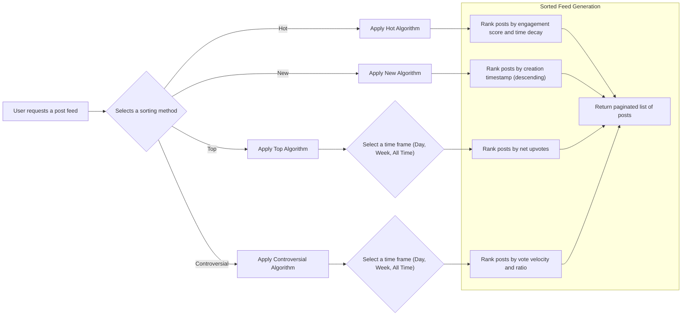

# 08. Content Sorting and Discovery

## 1. Introduction

This document specifies the business requirements for the various algorithms used to sort posts within the community platform. Effective content sorting is the cornerstone of a compelling user experience, directly influencing user engagement, content discovery, and retention. A well-designed sorting system ensures that users are consistently presented with content that is relevant, fresh, and engaging. The goal is to empower users to explore the platform's content in a way that best suits their immediate interests, whether they are looking for the newest submissions, the most popular posts, or the most debated topics.

Backend developers must use this document to implement the server-side logic required for each sorting mechanism. The requirements focus on the specific, unambiguous rules of each algorithm to ensure consistent and predictable behavior across the platform. All sorting calculations are to be performed on the server side to deliver a pre-ranked and paginated list of posts to the client.

## 2. General Sorting Principles

Users can dynamically switch between different sorting methods to explore content. This choice is presented on all feeds that display a list of posts, such as the main homepage, community-specific pages, and search results.

## 3. Sorting Algorithm: "New"

This is the most straightforward sorting method. It provides an unfiltered, chronological feed of the very latest content submitted to a community. This is essential for users who want to see what is happening right now and for moderators monitoring new submissions.

### 3.1. Logic

Posts are ordered strictly by their creation timestamp in descending order (newest first). This method does not consider votes, comments, or any other user interaction.

### 3.2. Requirements

- **[EARS-SORT-01]** WHEN a user selects the "New" sort option, THE system SHALL display posts in reverse chronological order based on their creation time.

## 4. Sorting Algorithm: "Hot"

The "Hot" algorithm is the default sorting method and is designed to surface posts that are currently trending. It strikes a balance between a post's popularity (vote score) and its age, ensuring that new, rapidly-engaging content is prioritized over older posts that have simply accumulated a large number of votes over time. This creates a vibrant and dynamic front page.

### 4.1. Logic

The "Hot" score is calculated using a formula that incorporates both vote score and time decay. A simplified but effective implementation is based on the original Reddit algorithm.

The conceptual formula is: `Hot Score = log10(score) + (creation_date_in_seconds / 45000)`

| Component | Description |
| :--- | :--- |
| **log10(score)** | The base-10 logarithm of the post's `score` (upvotes - downvotes). Using a logarithm dampens the effect of extremely high vote counts, making the first few hundred votes far more impactful than later ones. A minimum score of 1 is used for the log calculation to avoid errors with zero or negative scores. |
| **creation\_date\_in\_seconds** | The post's creation timestamp, represented as Unix time in seconds. This component ensures that newer posts have a higher score. |
| **45000** | A constant divisor (approximately 12.5 hours in seconds) that determines the rate of time decay. A larger divisor means a slower decay. |

### 4.2. Requirements

- **[EARS-SORT-02]** WHEN a user selects the "Hot" sort option, THE system SHALL calculate a "Hot" score for each post and display them in descending order of that score.
- **[EARS-SORT-03]** THE "Hot" score calculation SHALL factor in the net vote count (upvotes minus downvotes) of the post. It SHALL use a logarithmic function on the vote count to ensure that early votes have more weight than later votes.
- **[EARS-SORT-04]** IF a post's net vote count is less than 1, THEN THE system SHALL use a value of 1 for the logarithmic calculation to prevent mathematical errors.
- **[EARS-SORT-05]** THE "Hot" score calculation SHALL incorporate the post's creation timestamp, giving a higher score to more recent posts.

## 5. Sorting Algorithm: "Top"

The "Top" sort option allows users to find the highest-rated posts based purely on net vote count, without any time decay. It is the best way to find the most popular content within a specific time frame.

### 5.1. Logic

Posts are sorted in descending order of their net vote count (`score` = total upvotes minus total downvotes). Users must be able to select a time frame to filter the posts they are ranking.

### 5.2. Time Frames

The system must support the following time frames for "Top" sorting:

- **Today**: Posts created in the last 24 hours.
- **This Week**: Posts created in the last 7 days.
- **This Month**: Posts created in the last 30 days.
- **All Time**: All posts, regardless of their creation date.

### 5.3. Requirements

- **[EARS-SORT-06]** WHEN a user selects the "Top" sort option, THE system SHALL display posts in descending order of their net vote count (upvotes - downvotes).
- **[EARS-SORT-07]** WHERE the "Top" sort option is selected, THE system SHALL provide time filter options including "Today", "This Week", "This Month", and "All Time".
- **[EARS-SORT-08]** IF a time filter is applied to the "Top" sort, THEN THE system SHALL only include posts created within the selected time window for the ranking.

## 6. Sorting Algorithm: "Controversial"

The "Controversial" sorting method is designed to highlight posts that are receiving a high volume of both upvotes and downvotes. This is a strong indicator of a divisive topic that is generating significant discussion and disagreement, which can be highly engaging for users.

### 6.1. Logic

Controversial posts are identified by two key metrics: high vote velocity (total votes) and a close vote ratio (upvotes vs. downvotes).

A conceptual formula to calculate a "Controversy Score" is: `Controversy Score = log(total_votes) * (min(upvotes, downvotes) / max(upvotes, downvotes))`

| Component | Description |
| :--- | :--- |
| **log(total\_votes)** | The logarithm of the sum of upvotes and downvotes. This prioritizes posts with high overall engagement. |
| **min/max ratio** | The ratio of the smaller vote count to the larger one. This value approaches 1.0 as the upvote and downvote counts become more balanced, and approaches 0 as they become more one-sided. |

This formula ensures that a post with 500 upvotes and 500 downvotes is ranked as more controversial than a post with 1000 upvotes and 10 downvotes.

### 6.2. Time Frames

Like "Top," this sort should also be filterable by time to see what is controversial *now*.

- **Today**: Posts created in the last 24 hours.
- **This Week**: Posts created in the last 7 days.
- **This Month**: Posts created in the last 30 days.
- **All Time**: All posts, regardless of creation date.

### 6.3. Requirements

- **[EARS-SORT-09]** WHEN a user selects the "Controversial" sort option, THE system SHALL calculate a "Controversy Score" for each post.
- **[EARS-SORT-10]** THE "Controversy Score" calculation SHALL prioritize posts that have both a high total number of votes (upvotes + downvotes) and a balanced ratio of upvotes to downvotes.
- **[EARS-SORT-11]** IF a post has zero upvotes or zero downvotes, THEN THE system SHALL assign it a controversy score of zero.
- **[EARS-SORT-12]** WHERE the "Controversial" sort option is selected, THE system SHALL provide time filter options including "Today", "This Week", "This Month", and "All Time".

## 7. Default Sorting Behavior and User Preferences

To ensure a consistent and engaging experience, the platform will have a default sorting behavior. However, registered users will have the ability to customize this.

### 7.1. Logic

For all guest users (not logged in), and for authenticated users who have not set a custom preference, the default sort order for all post feeds will be "Hot". Authenticated members can change this default in their profile settings. The system must remember and apply this preference across all their future sessions.

### 7.2. Requirements

- **[EARS-SORT-13]** THE system SHALL use "Hot" as the default sorting method for all post feeds for non-authenticated (guest) users.
- **[EARS-SORT-14]** THE system SHALL use "Hot" as the default sorting method for authenticated users who have not specified a preference.
- **[EARS-SORT-15]** WHERE a `member` is authenticated, THE system SHALL allow them to set a personal default sort preference ("Hot", "New", "Top", or "Controversial") in their user profile settings.
- **[EARS-SORT-16]** IF a logged-in `member` has set a default sort preference, THEN THE system SHALL apply that preference by default to all post feeds they view.

## 8. Functional Requirements Summary

This section consolidates all EARS requirements for content sorting and discovery.

| ID | Requirement |
|---|---|
| EARS-SORT-01 | WHEN a user selects the "New" sort option, THE system SHALL display posts in reverse chronological order based on their creation time. |
| EARS-SORT-02 | WHEN a user selects the "Hot" sort option, THE system SHALL calculate a "Hot" score for each post and display them in descending order of that score. |
| EARS-SORT-03 | THE "Hot" score calculation SHALL factor in the net vote count (upvotes minus downvotes) of the post. It SHALL use a logarithmic function on the vote count to ensure that early votes have more weight than later votes. |
| EARS-SORT-04 | IF a post's net vote count is less than 1, THEN THE system SHALL use a value of 1 for the logarithmic calculation to prevent mathematical errors. |
| EARS-SORT-05 | THE "Hot" score calculation SHALL incorporate the post's creation timestamp, giving a higher score to more recent posts. |
| EARS-SORT-06 | WHEN a user selects the "Top" sort option, THE system SHALL display posts in descending order of their net vote count (upvotes - downvotes). |
| EARS-SORT-07 | WHERE the "Top" sort option is selected, THE system SHALL provide time filter options including "Today", "This Week", "This Month", and "All Time". |
| EARS-SORT-08 | IF a time filter is applied to the "Top" sort, THEN THE system SHALL only include posts created within the selected time window for the ranking. |
| EARS-SORT-09 | WHEN a user selects the "Controversial" sort option, THE system SHALL calculate a "Controversy Score" for each post. |
| EARS-SORT-10 | THE "Controversy Score" calculation SHALL prioritize posts that have both a high total number of votes (upvotes + downvotes) and a balanced ratio of upvotes to downvotes. |
| EARS-SORT-11 | IF a post has zero upvotes or zero downvotes, THEN THE system SHALL assign it a controversy score of zero. |
| EARS-SORT-12 | WHERE the "Controversial" sort option is selected, THE system SHALL provide time filter options including "Today", "This Week", "This Month", and "All Time". |
| EARS-SORT-13 | THE system SHALL use "Hot" as the default sorting method for all post feeds for non-authenticated (guest) users. |
| EARS-SORT-14 | THE system SHALL use "Hot" as the default sorting method for authenticated users who have not specified a preference. |
| EARS-SORT-15 | WHERE a `member` is authenticated, THE system SHALL allow them to set a personal default sort preference ("Hot", "New", "Top", or "Controversial") in their user profile settings. |
| EARS-SORT-16 | IF a logged-in `member` has set a default sort preference, THEN THE system SHALL apply that preference by default to all post feeds they view. |
