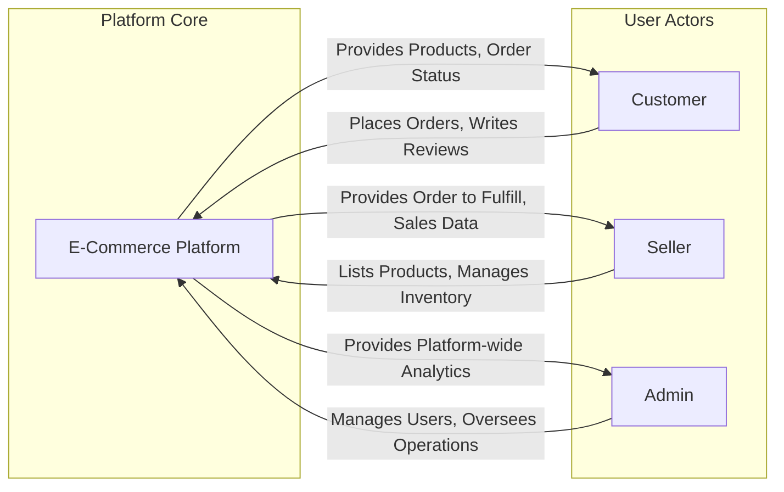

# 1. Service Overview: E-Commerce Shopping Mall Platform

## 1.1. Introduction

This document provides a high-level, strategic overview of the E-Commerce Shopping Mall Platform. Its purpose is to establish the foundational vision, business objectives, target users, and core value proposition that will guide the design and development of the entire system. By defining the "why" behind the project, this document ensures that all subsequent technical specifications and development efforts are aligned with the overarching business goals.

The platform is envisioned as a comprehensive, multi-vendor marketplace designed to connect a diverse range of sellers with a broad customer base. It will provide a robust set of tools for sellers to manage their products and orders, a seamless and secure shopping experience for customers, and powerful administrative capabilities for platform operators. This document intentionally avoids technical implementation details, focusing instead on the business requirements and strategic context necessary for backend developers to build a successful and scalable platform.

## 1.2. Business Goals and Objectives

The primary motivation for this platform is to create a dynamic and thriving online marketplace that delivers value to all participants. The success of this endeavor will be measured against the following goals and objectives.

### Primary Business Goals

-   **Establish a Scalable and Vibrant Marketplace:** Create a robust and reliable platform capable of attracting a critical mass of both sellers and customers, facilitating a high volume of transactions and fostering a competitive and diverse product ecosystem.
-   **Empower Independent Sellers and Entrepreneurs:** Provide small to medium-sized businesses and individual entrepreneurs with a low-barrier, feature-rich environment to sell their products online, enabling them to compete effectively in the digital marketplace.
-   **Deliver a Superior and Trustworthy Customer Experience:** Offer end-users a convenient, secure, and engaging shopping journey that encourages repeat business, fosters customer loyalty, and establishes the platform as a preferred shopping destination.

### Secondary Objectives

-   **Drive Engagement Through Community Features:** Foster a sense of community and trust through transparent features like product reviews and seller ratings, helping customers make informed purchasing decisions.
-   **Ensure Operational Efficiency and Automation:** Develop efficient, self-service workflows and dashboards for sellers and administrators to manage products, inventory, and orders with minimal friction, reducing operational overhead.
-   **Build a Trusted and Secure Brand:** Achieve a market reputation for reliability, security, and excellent customer service for all user groups, making the platform a benchmark for online marketplace safety.
-   **Facilitate Data-Driven Decision-Making:** Implement comprehensive analytics and reporting that provide actionable insights into sales trends, customer behavior, and platform performance to guide future business strategy and product development.

## 1.3. Target Audience

The platform is designed to serve three distinct user groups (actors), each with unique needs and motivations. A deep understanding of these actors is critical to building a system that delivers exceptional value to all participants.

-   **Customers**: The end-users who browse the platform to discover, purchase, and review products. They are authenticated members seeking a seamless and secure shopping journey. Their primary interactions involve searching for items, managing a shopping cart and wishlist, placing orders, and tracking their purchases.
-   **Sellers**: Authenticated members, typically small to medium-sized businesses or individual entrepreneurs, who use the platform to list, manage, and sell their products. They require a dedicated dashboard to handle their virtual storefront, including product listings, inventory management, and order fulfillment.
-   **Administrators**: Privileged internal users responsible for the overall health, integrity, and operation of the platform. They have comprehensive oversight of all activities, including user management, product catalog curation, order monitoring, and system configuration.

## 1.4. Core Value Proposition

The platform's value is defined by how well it serves the distinct needs of its target audience, creating a symbiotic ecosystem where each actor benefits.

-   **For Customers:** We offer a **trusted and convenient one-stop marketplace**. Customers gain access to a diverse range of products from numerous sellers, all within a single, secure, and user-friendly environment. The integrated review and rating system empowers them to shop with confidence and discover high-quality products.

-   **For Sellers:** We provide an **accessible and powerful e-commerce engine**. Sellers can launch their online business with minimal upfront investment, leveraging our built-in tools for product management, inventory control, and order fulfillment to reach a large, established customer base they could not otherwise access.

-   **For Platform Operators:** The platform serves as a **scalable and self-sustaining economic hub**. By facilitating transactions and providing essential value to both customers and sellers, it creates a flywheel effect that generates revenue through commissions and fees, fostering a vibrant and growing online economy.

## 1.5. Business Model

To ensure the long-term sustainability and growth of the platform, a multi-faceted business model will be adopted. This model is designed to align the platform's success directly with the success of its sellers.

### Revenue Streams

1.  **Commission on Sales (Primary):** The primary revenue source will be a percentage-based commission fee charged on the total value of each successfully completed transaction. This model creates a direct partnership where the platform is incentivized to provide tools and features that help sellers succeed.

2.  **Seller Subscription Tiers (Optional):** A tiered subscription model could be offered to sellers seeking enhanced capabilities. A free tier would provide basic selling functionality, while premium tiers (e.g., "Pro," "Enterprise") would offer benefits such as lower commission rates, a higher number of product listings, advanced analytics, and access to promotional tools.

3.  **Promotional and Marketing Services (Value-Add):** Sellers will have the option to pay for enhanced visibility for their products. This could include featured spots on the homepage, priority placement in category and search results, or inclusion in curated promotional email campaigns to customers.

### Business Justification

This hybrid model diversifies revenue while keeping the entry barrier low, which is crucial for attracting new sellers. The commission-based core ensures the platform only profits when its sellers do. Optional subscription and promotional services provide pathways for seller growth and offer additional value to more established businesses, creating a scalable and equitable business environment for all.

## 1.6. Success Metrics

The performance and success of the platform will be tracked using a set of Key Performance Indicators (KPIs) that reflect platform growth, user engagement, and operational health.

### Growth & Financial Metrics

-   **Gross Merchandise Volume (GMV):** The total value of all goods sold through the platform over a given period.
-   **Monthly Active Users (MAU):** The number of unique customers and sellers who interact with the platform each month.
-   **Customer and Seller Acquisition Rate:** The rate at which new, active customers and sellers are joining the platform.
-   **Platform Revenue:** Total revenue generated from commissions, subscriptions, and other fees.

### Engagement & Satisfaction Metrics

-   **Conversion Rate:** The percentage of unique visitors who complete a purchase.
-   **Average Order Value (AOV):** The average amount spent per order.
-   **Customer Lifetime Value (CLV):** The total revenue a single customer is predicted to generate over their entire relationship with the platform.
-   **Seller Retention Rate:** The percentage of sellers who remain active on the platform over a given period.
-   **Net Promoter Score (NPS):** A measure of customer and seller loyalty and satisfaction, gauged through periodic surveys.

### Operational Metrics

-   **Order Fulfillment Rate:** The percentage of orders that are successfully processed and shipped within the seller-defined timeframe.
-   **Platform Uptime:** The percentage of time the platform is online and available to all users, targeting 99.9% or higher.
-   **Average API Response Time:** A key technical indicator of site performance and user experience, measured in milliseconds.