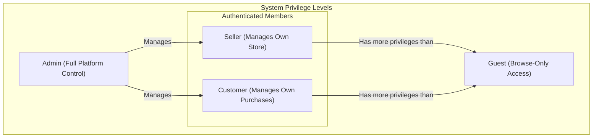

# 02. User Actors and Permissions

## 1. Introduction

This document defines the user actors (user types) and their corresponding permissions within the e-commerce shopping mall platform. Its purpose is to establish a clear, unambiguous, and authoritative understanding of who can access the system and what actions each user type is permitted to perform. This specification serves as a foundational guide for implementing security, access control, and role-specific functionality throughout the application.

A precise and rigorously defined permission model is critical for platform integrity, data security, and a predictable user experience. All functional requirements detailed in other documents must strictly adhere to the permission levels and rules outlined herein.

## 2. Actor Definitions

The system recognizes four distinct actors, each with a specific set of capabilities, limitations, and motivations.

### 2.1. Guest (Unauthenticated User)

A Guest is any individual who accesses the platform without being logged into an account. Their access is limited to public-facing discovery and browsing.

-   **Description**: A visitor who has not authenticated with the system.
-   **Primary Goal**: To explore the product catalog, view product details, and determine whether to create an account or make a purchase.

### 2.2. Customer

A Customer is an authenticated user who is the primary consumer on the platform. Their permissions are centered around purchasing and managing their personal order history.

-   **Description**: An authenticated user who can browse products, manage their personal profile and addresses, maintain a shopping cart and wishlist, place orders, and write reviews for products they have purchased.
-   **Primary Goal**: To find and purchase products, manage their orders effectively, and contribute to the community via product reviews.

### 2.3. Seller

A Seller is an authenticated user who lists and manages products for sale on the platform. Their permissions are focused on managing their own virtual storefront.

-   **Description**: An authenticated user who can list products for sale, define product variants (SKUs), manage their inventory and pricing, and fulfill orders for their own products. They have access to a dedicated dashboard to manage their sales activities.
-   **Primary Goal**: To sell products effectively, manage their online storefront, and process incoming orders efficiently.

### 2.4. Admin

An Admin is a privileged user with comprehensive oversight and control over the entire platform. They are responsible for maintaining the health, integrity, and smooth operation of the marketplace.

-   **Description**: A highly privileged user responsible for overall platform management. This includes overseeing all orders, managing the global product catalog, handling all user accounts (Customers and Sellers), moderating content, and configuring system-wide settings.
-   **Primary Goal**: To ensure the platform operates correctly, resolve disputes and exceptions, manage the user base, and monitor overall business activity.

## 3. Actor Hierarchy and Role Exclusivity

The actors are organized in a hierarchy based on their level of access and control. This hierarchy clarifies that higher-level actors possess more capabilities and can often manage actors at lower levels.

-   **Admin**: The highest level of authority with full system privileges. Admins can manage all other actors and their associated data across the entire platform.
-   **Seller & Customer**: Authenticated members who have significantly more privileges than Guests but operate in distinct functional domains.
-   **Guest**: The base level of access, limited to public-facing content only. All other actors inherit the capabilities of the Guest.

### 3.1. Role Exclusivity

To ensure clear separation of concerns and simplify the permission model, the `Customer` and `Seller` roles are mutually exclusive. 

-   A single user account SHALL be designated as either a `Customer` OR a `Seller`, but not both simultaneously.
-   This implies that if an individual wishes to both buy and sell on the platform, they must maintain two separate user accounts.
-   This design choice is reflected in the permission matrix where sellers do not have access to customer-centric features like a personal address book for purchasing.

## 4. Guest (Unauthenticated) User Access

Specific requirements govern the experience for users who are not logged in.

-   THE system SHALL allow Guest users to browse the full product catalog.
-   THE system SHALL allow Guest users to view product details, including descriptions, images, prices, and reviews.
-   THE system SHALL allow Guest users to use the search and filtering functionalities.
-   WHEN a Guest user attempts to add a product to the shopping cart, THEN THE system SHALL require the user to log in or create a Customer account.
-   WHEN a Guest user attempts to add a product to a wishlist, THEN THE system SHALL require the user to log in or create a Customer account.
-   WHEN a Guest user attempts to access any page that requires authentication (e.g., user profile, order history), THEN THE system SHALL redirect them to the login page.

## 5. Permission Matrix for Core Features

This matrix details the specific actions each actor can perform across the platform's core features. The system operates on a "deny by default" principle, meaning access is forbidden unless explicitly permitted here.

-   **✅: Action is permitted.**
-   **❌: Action is denied.**

| Feature / Action | Guest | Customer | Seller | Admin |
| :--- | :---: | :---: | :---: | :---: |
| **Account Management** | | | | |
| Register as Customer | ✅ | ❌ | ❌ | ✅ |
| Register as Seller | ✅ | ❌ | ❌ | ✅ |
| Log In / Log Out | ✅ | ✅ | ✅ | ✅ |
| View/Update Own Profile | ❌ | ✅ | ✅ | ✅ |
| Manage Own Addresses (for purchasing) | ❌ | ✅ | ❌ | ❌ |
| View Other User Profiles | ❌ | ❌ | ❌ | ✅ |
| Suspend/Deactivate Any User Account | ❌ | ❌ | ❌ | ✅ |
| **Product Catalog** | | | | |
| Browse/View All Products | ✅ | ✅ | ✅ | ✅ |
| Search and Filter Products | ✅ | ✅ | ✅ | ✅ |
| View Product Reviews | ✅ | ✅ | ✅ | ✅ |
| **Seller Product Management** | | | | |
| Create/List a New Product | ❌ | ❌ | ✅ | ✅ |
| Edit Own Product Details | ❌ | ❌ | ✅ | ✅ |
| Manage Own Product Variants (SKUs) | ❌ | ❌ | ✅ | ✅ |
| Deactivate/Delete Own Product | ❌ | ❌ | ✅ | ✅ |
| View All Products (Global Catalog) | ✅ | ✅ | ✅ | ✅ |
| Edit Any Product (Global) | ❌ | ❌ | ❌ | ✅ |
| **Inventory Management** | | | | |
| View Own Product Stock Levels | ❌ | ❌ | ✅ | ✅ |
| Update Own Product Stock Levels | ❌ | ❌ | ✅ | ✅ |
| View All Stock Levels (Global) | ❌ | ❌ | ❌ | ✅ |
| **Shopping Cart & Wishlist** | | | | |
| Add/Remove/Update Own Cart | ❌ | ✅ | ❌ | ❌ |
| View Own Cart | ❌ | ✅ | ❌ | ❌ |
| Add/Remove from Own Wishlist | ❌ | ✅ | ❌ | ❌ |
| **Order & Checkout** | | | | |
| Place an Order (Checkout) | ❌ | ✅ | ❌ | ❌ |
| View Own Order History | ❌ | ✅ | ❌ | ✅ |
| View Own Order Details | ❌ | ✅ | ❌ | ✅ |
| Request Cancellation for Own Order | ❌ | ✅ | ❌ | ✅ |
| Request Refund for Own Order | ❌ | ✅ | ❌ | ✅ |
| **Order Fulfillment (Seller)** | | | | |
| View Incoming Orders for Own Products | ❌ | ❌ | ✅ | ✅ |
| Update Order Status for Own Orders | ❌ | ❌ | ✅ | ✅ |
| Add Shipping/Tracking Info to Own Orders| ❌ | ❌ | ✅ | ✅ |
| Cancel an Incoming Order | ❌ | ❌ | ✅ | ✅ |
| **Global Order Management (Admin)** | | | | |
| View All Orders on the Platform | ❌ | ❌ | ❌ | ✅ |
| Update Status of Any Order| ❌ | ❌ | ❌ | ✅ |
| Manage/Approve Refunds and Cancellations| ❌ | ❌ | ❌ | ✅ |
| **Reviews and Ratings** | | | | |
| Submit a Review for a Purchased Product | ❌ | ✅ | ❌ | ❌ |
| Edit/Delete Own Review | ❌ | ✅ | ❌ | ✅ |
| Moderate/Delete Any Review | ❌ | ❌ | ❌ | ✅ |
| **Dashboard Access** | | | | |
| Access Seller Dashboard | ❌ | ❌ | ✅ | ✅ |
| Access Admin Dashboard | ❌ | ❌ | ❌ | ✅ |

## 6. Consolidated EARS Requirements

This section summarizes some of the most critical permission rules in the formal EARS (Event-Action-Response-State) format for ultimate clarity.

-   **WHEN** an authenticated user has the `admin` role, **THE** system **SHALL** grant access to the Admin Dashboard and all its functionalities.
-   **WHEN** an authenticated user has the `seller` role, **THE** system **SHALL** grant access to the Seller Dashboard.
-   **IF** a user with the `customer` role attempts to access the Seller Dashboard, **THEN** **THE** system **SHALL** respond with a "403 Forbidden" status.
-   **WHEN** a user with the `seller` role attempts to create a product, **THE** system **SHALL** permit the action.
-   **IF** a `seller` attempts to edit a product that does not belong to them, **THEN** **THE** system **SHALL** deny the request.
-   **WHEN** a user with the `customer` role attempts to place an order, **THE** system **SHALL** permit the action.
-   **IF** a user attempts to submit a product review for a product they have not purchased, **THEN** **THE** system **SHALL** prevent the submission.
-   **WHERE** a user has the `admin` role, **THE** system **SHALL** allow them to view and manage all orders, products, and user accounts on the platform.
-   **IF** any user other than an `admin` attempts to access the global order management dashboard, **THEN** **THE** system **SHALL** deny access.