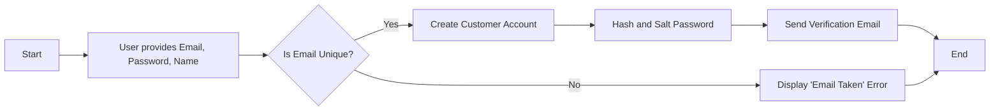
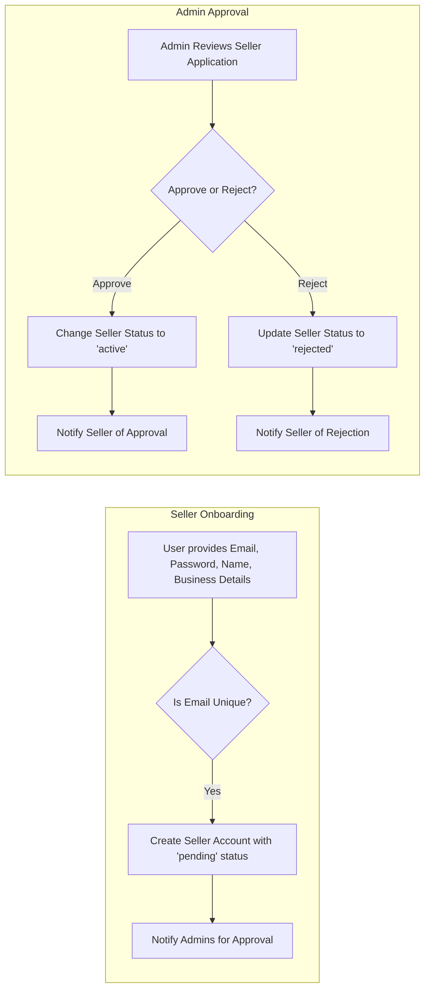
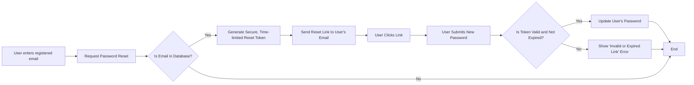
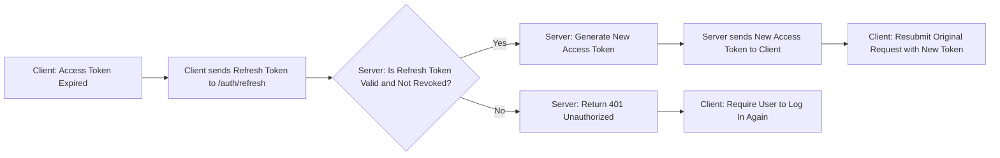

# 03. Authentication and Authorization Requirements

## 1. Introduction

This document specifies the complete requirements for user authentication and authorization for the e-commerce platform. It provides a blueprint for backend developers to implement a secure and robust system for managing user identity, access control, and sessions. The scope of this document covers the registration flows for all user actors (`Customer`, `Seller`), the secure login process, session management using JSON Web Tokens (JWT), password management policies, and the enforcement of Role-Based Access Control (RBAC).

Adherence to these requirements is critical for protecting user data and ensuring the integrity of the platform.

## 2. User Registration Flow

The system must provide distinct registration pathways for `Customers` and `Sellers` to accommodate their different information requirements and onboarding processes.

### 2.1. Customer Registration

This flow is for standard users who wish to browse and purchase products.



**Functional Requirements (EARS Format):**

*   **WHEN** a user submits the customer registration form with a unique email address, a name, and a valid password, **THE** system **SHALL** create a new user account with the `customer` role and an initial `active` status.
*   **IF** the email address submitted during registration already exists in the system, **THEN** **THE** system **SHALL** return an error message indicating that the email is already in use.
*   **THE** system **SHALL** enforce a strict password policy. Passwords **SHALL** be at least 12 characters long and include at least one uppercase letter, one lowercase letter, one number, and one special character (e.g., !@#$%^&*).
*   **THE** system **SHALL** securely hash and salt all user passwords using the `bcrypt` algorithm before storing them in the database.
*   **WHEN** a customer account is successfully created, **THE** system **SHALL** send a verification email to the user's provided email address to confirm their account ownership.

### 2.2. Seller Registration

This flow is for users who intend to sell products on the platform and includes a mandatory administrative approval step.



**Functional Requirements (EARS Format):**

*   **WHEN** a user submits the seller registration form with all required business information, **THE** system **SHALL** create a new user account with the `seller` role and an initial status of `pending approval`.
*   **WHEN** a new seller account is created in the `pending approval` state, **THE** system **SHALL** automatically notify platform administrators that a new seller application requires review.
*   **WHILE** a seller's account status is `pending approval`, **THE** system **SHALL** restrict their access to all seller-specific functionalities (e.g., product listing, dashboard access).
*   **WHEN** an administrator approves a seller application, **THE** system **SHALL** change the seller's account status to `active`.
*   **WHEN** a seller's account status changes to `active`, **THE** system **SHALL** grant them full access to all seller functionalities as defined in the [User Actors and Permissions document](./02-user-actors-and-permissions.md).

## 3. User Login and Session Management

This section defines how authenticated users gain and maintain access to the system.

### 3.1. Login Process

*   **WHEN** a user submits valid login credentials (email and password), **THE** system **SHALL** authenticate the user and issue a set of JWTs (Access Token and Refresh Token).
*   **IF** a user submits invalid credentials, **THEN** **THE** system **SHALL** return an "Invalid credentials" error and deny access.
*   **IF** a user's account is not in an `active` state (e.g., `pending approval`, `suspended`), **THEN** **THE** system **SHALL** prevent login and return an error message indicating the account status.
*   **THE** system **SHALL** implement rate limiting on the login endpoint to prevent brute-force attacks, allowing no more than 5 failed login attempts per user per 15-minute window.

### 3.2. Session Management

*   **THE** system **SHALL** use stateless JWTs for all authenticated user sessions.
*   **THE** system **SHALL NOT** store session state information on the server. All necessary session data (user ID, role, permissions) must be contained within the JWT payload, and the token must be self-verifiable.

## 4. Password Management

The system must provide secure methods for users to change and reset their passwords.

### 4.1. Password Reset Flow (Forgotten Password)



*   **WHEN** a user requests a password reset for a registered email address, **THE** system **SHALL** generate a unique, single-use, time-limited (e.g., 1 hour) password reset token.
*   **THE** system **SHALL** send an email containing a link with the reset token to the user's registered email address.
*   **WHEN** a user submits a new password using a valid and non-expired reset token, **THE** system **SHALL** update the user's password (re-hashing and salting it) and immediately invalidate the reset token.
*   **THE** system **SHALL** implement rate limiting on the password reset request endpoint.

### 4.2. Password Change Flow (Authenticated User)

*   **WHEN** an authenticated user who knows their current password submits their correct current password and a new password meeting the system's strength policy, **THE** system **SHALL** update the user's stored password.
*   **IF** the provided current password is incorrect, **THEN** **THE** system **SHALL** return an error and reject the change.

## 5. JWT-based Authorization and Token Handling

Authorization will be handled via JWTs issued upon successful login.

### 5.1. Token Structure and Handling

*   **Access Token**: A short-lived token (e.g., 15 minutes) sent in the `Authorization` header of each API request. It is a stateless token containing the user's identity and permissions.
*   **Refresh Token**: A long-lived, opaque token (e.g., 7 days) stored securely by the client (e.g., in an `HttpOnly` cookie). Its sole purpose is to obtain a new access token.

**Example Access Token JWT Payload:**
```json
{
  "sub": "user-uuid-12345",      // The user's unique identifier (Subject)
  "role": "customer",            // User role ("customer", "seller", or "admin")
  "iat": 1672531200,             // Issued At timestamp
  "exp": 1672532100              // Expiration Time timestamp (e.g., iat + 900 seconds)
}
```

### 5.2. Token Issuance and Validation

*   **WHEN** a user authenticates successfully, **THE** system **SHALL** generate and return both an access token and a refresh token.
*   **WHEN** a user makes a request to a protected endpoint, **THE** system **SHALL** validate the access token's signature, expiration, and claims before processing the request.
*   **IF** an access token is invalid or expired, **THEN** **THE** system **SHALL** reject the request with an `HTTP 401 Unauthorized` status.

### 5.3. Token Refresh Mechanism



*   **WHEN** an access token expires, **THE** client application **SHALL** use the refresh token to request a new access token from a designated `/auth/refresh` endpoint.
*   **WHEN** the system receives a valid and non-revoked refresh token, **THE** system **SHALL** issue a new access token.
*   **IF** the refresh token is invalid, expired, or has been revoked (e.g., due to a security event), **THEN** **THE** system **SHALL** require the user to re-authenticate with their primary credentials.

## 6. Role-Based Access Control (RBAC) Strategy

The system will use the `role` claim within the JWT to enforce access control at the API gateway or middleware level.

*   **THE** system **SHALL** restrict access to API endpoints and resources based on the user's role: `customer`, `seller`, or `admin`.
*   **WHERE** a user has the `admin` role, **THE** system **SHALL** grant access to all platform management functions.
*   **WHERE** a user has the `seller` role, **THE** system **SHALL** grant access to product management, inventory control, and order fulfillment functions for their *own* products.
*   **IF** a user attempts to access a resource for which their role does not have permission, **THEN** **THE** system **SHALL** reject the request with an `HTTP 403 Forbidden` status.
*   The specific permissions for each role are authoritatively defined in the [User Actors and Permissions document](./02-user-actors-and-permissions.md).