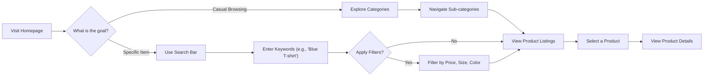

# 04. Customer Scenarios

This document describes the primary user journeys for a **customer** on the shopping mall platform. It focuses on their experience from discovering products and managing their personal account information to the crucial pre-purchase activities of using the shopping cart and wishlist. These scenarios provide essential context for the functional requirements detailed in other documents.

## 1. Product Discovery: Browsing and Searching

A customer's primary goal is to find products they are interested in. This journey involves several key interactions, from casual browsing to targeted searching.

### Product Discovery Flow



### Scenario 1: The Window Shopper
A customer arrives on the platform without a specific purchase in mind. 

1.  **Homepage Exploration**: The customer lands on the homepage and sees featured products, new arrivals, and promotional banners. They might click on a banner for "Summer Sales".
2.  **Category Navigation**: They decide to browse categories. They navigate from "Apparel" -> "Men's" -> "Shirts".
3.  **Viewing Listings**: A grid of shirts is displayed. Each item in the grid shows a primary product image, the product name, the brand, and the price.
4.  **Pagination**: THE system SHALL display product listings in pages of 20 items, newest first. The customer can navigate to the next page to see more products.

### Scenario 2: The Mission-Oriented Shopper
A customer visits the site to find a specific product: a medium-sized, black cotton t-shirt.

1.  **Using Search**: The customer immediately uses the search bar at the top of the page, typing "black cotton t-shirt".
2.  **Initial Results**: The system displays all products matching the keywords. The results are broad, including different sizes and brands.
3.  **Applying Filters**: To narrow down the results, the customer uses the filtering options on the side panel.
    -   They select "T-Shirts" under the `Category` filter.
    -   They select "M" under the `Size` filter.
    -   They select "Black" under the `Color` filter.
4.  **Refined Results**: WHEN a customer applies a filter, THE system SHALL update the product listing to show only items that match all selected criteria.
5.  **Sorting**: The customer can sort the filtered results by "Price: Low to High", "Price: High to Low", or "Highest Rated".

### Scenario 3: No Results Found
A customer searches for an obscure or misspelled item, "waterprooof hiking bootz".
1. THE system performs the search but finds no matching products.
2. **WHEN** a search query yields no results, **THE** system **SHALL** display a friendly message like "We couldn't find any products matching your search."
3. The system should also suggest alternative actions, such as checking the spelling, trying different keywords, or browsing popular categories.

## 2. Viewing Product Details and Selecting Variants

After finding a promising item in the product listing, the customer clicks on it to learn more.

```mermaid
graph TD
    A["Customer on Product Page"] --> B{"Selects Variant (e.g., Color, Size)"}
    B --> C["System Checks SKU Stock"]
    C --> D{"Is SKU In Stock?"}
    D --> |"Yes"| E["Enable 