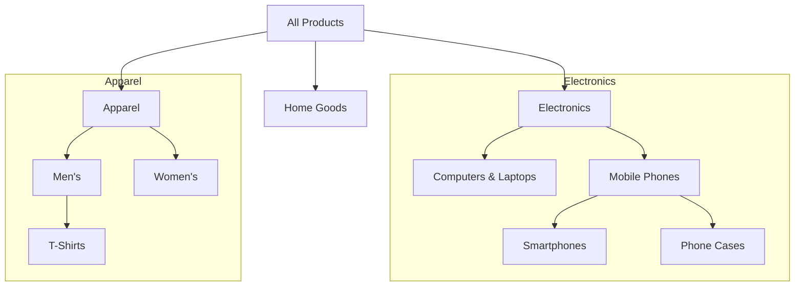
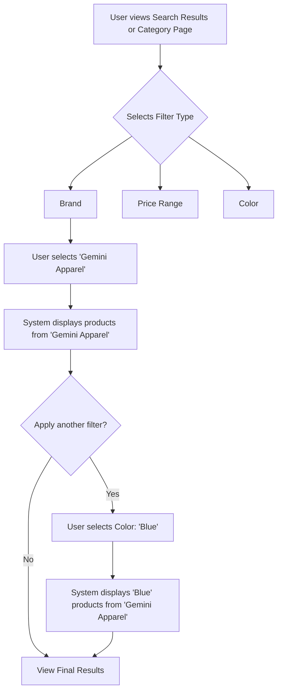

'''
# Product Catalog Management Requirements

## 1. Introduction

This document specifies the functional requirements for the product catalog system of the shopping mall platform. It covers the complete lifecycle and structure of products, from their basic definition and categorization to the complex management of variants (SKUs), search functionality, and visibility rules. The requirements outlined here are intended for backend developers and define *what* the system must do, not *how* it should be implemented.

## 2. Product Structure

The product entity is the fundamental building block of the catalog. It serves as a container for general information, while specific, sellable variations are handled by SKUs.

### 2.1. Core Product Attributes

THE system SHALL store a set of core attributes for each base product.

| Attribute | Description | Data Type | Example | Mandated | Notes |
|---|---|---|---|---|---|
| `productId` | A unique identifier for the product. | UUID | "a1b2c3d4-..." | ✅ Yes | System-generated, immutable. |
| `sellerId` | The unique identifier of the seller who owns the product. | UUID | "e5f6g7h8-..." | ✅ Yes | Foreign key to the seller actor. |
| `name` | The public-facing name of the product. | String | "Men's Classic T-Shirt" | ✅ Yes | Min 5 chars, Max 150 chars. |
| `description` | A detailed description of the product, supporting rich text or markdown. | String | "Made from 100% premium cotton..." | ✅ Yes | | 
| `brand` | The brand name of the product. | String | "Gemini Apparel" | ❌ No | | 
| `createdAt` | The timestamp when the product was created. | DateTime | "2025-11-06T14:42:23Z" | ✅ Yes | System-generated. |
| `updatedAt` | The timestamp of the last update. | DateTime | "2025-11-07T10:00:00Z" | ✅ Yes | System-generated on every modification. |

### 2.2. Product Images

THE system SHALL allow multiple images to be associated with a product and its variants.

*   **EARS-1 (Event-driven)**: WHEN a seller uploads images, THE system SHALL associate them with a specific product or a specific SKU.
*   **EARS-2 (Ubiquitous)**: THE system SHALL support common image formats (JPEG, PNG, WEBP).
*   **EARS-3 (Ubiquitous)**: THE system SHALL designate one image as the primary "thumbnail" image for the parent product, which is displayed in catalog listings.
*   **EARS-4 (State-driven)**: WHILE a product has at least one variant, THE system SHALL allow associating specific images with each SKU (e.g., showing a red shirt for the "Color: Red" SKU).

## 3. Product Categories

Products must be organized into a logical hierarchy to facilitate browsing and discovery.

### 3.1. Hierarchical Category Model

THE system SHALL support a hierarchical (tree) structure for product categories.

*   **EARS-5 (Ubiquitous)**: THE system SHALL allow categories to have a parent category, enabling the creation of sub-categories.
*   **EARS-6 (Ubiquitous)**: THE system SHALL support an unlimited depth for sub-categories.
*   **EARS-7 (Ubiquitous)**: THE system SHALL allow a category to have no parent, designating it as a top-level category.

### 3.2. Category Administration

Only `admin` users can manage the global category tree.

*   **EARS-8 (Event-driven)**: WHEN an admin creates a category, THE system SHALL require a unique name and an optional parent category.
*   **EARS-9 (Event-driven)**: WHEN an admin updates a category, THE system SHALL allow changing its name and its parent.
*   **EARS-10 (Event-driven)**: WHEN an admin attempts to delete a category, THE system SHALL fail IF the category contains any products.

### 3.3. Product-Category Assignment

*   **EARS-11 (Ubiquitous)**: A product SHALL be assigned to exactly one category.
*   **EARS-12 (Event-driven)**: WHEN a seller creates or updates a product, THE system SHALL require them to select a category from the existing category tree.

## 4. Product Variants (SKUs)

Variants allow a single product to be sold with different attributes, such as size or color. Each unique combination of these attributes corresponds to a Stock Keeping Unit (SKU).

### 4.1. Variant Attributes and Options

*   **EARS-13 (Ubiquitous)**: THE system SHALL allow a seller to define up to 3 variant attributes for a single product (e.g., "Color", "Size", "Material").
*   **EARS-14 (Ubiquitous)**: For each attribute, THE system SHALL allow a seller to define multiple options (e.g., for "Color", the options could be "Red", "Blue", "Green").

### 4.2. SKU Generation and Structure

*   **EARS-15 (Event-driven)**: WHEN a seller defines variant attributes and options for a product, THE system SHALL automatically generate a distinct SKU for every possible unique combination.

**Example Scenario**:
-   Product: "Classic T-Shirt"
-   Variant Attribute 1: **Size** (Options: S, M, L)
-   Variant Attribute 2: **Color** (Options: White, Black)
-   **Result**: The system generates 3 * 2 = 6 unique SKUs.
    -   `TSHIRT-CLASSIC-S-WHT`
    -   `TSHIRT-CLASSIC-S-BLK`
    -   `TSHIRT-CLASSIC-M-WHT`
    -   `TSHIRT-CLASSIC-M-BLK`
    -   `TSHIRT-CLASSIC-L-WHT`
    -   `TSHIRT-CLASSIC-L-BLK`

### 4.3. SKU-level Data Management

Price and inventory must be managed at the most granular level to ensure transactional integrity.

*   **EARS-16 (Ubiquitous)**: THE system SHALL manage price and stock quantity at the individual SKU level.
*   **EARS-17 (Ubiquitous)**: THE system SHALL NOT store price or stock information on the parent product entity.
*   **EARS-18 (Ubiquitous)**: Each SKU SHALL have its own `skuId`, `price`, `stockQuantity`, and optional set of overriding images.
*   **EARS-19 (State-driven)**: WHILE a product has no variants defined, THE system SHALL create a single default SKU to manage its price and stock.

## 5. Search and Filtering

Robust search and filtering are critical for user experience and product discovery.

### 5.1. Full-Text Search Capabilities

*   **EARS-20 (Event-driven)**: WHEN a customer submits a search query, THE system SHALL perform a case-insensitive, full-text search against the `name`, `description`, `brand`, and `category name` fields of all visible products.
*   **EARS-21 (Ubiquitous)**: Search results SHALL be ranked by relevance.

### 5.2. Faceted Filtering Logic

Faceted filtering allows users to narrow down search results or browse categories with precision.

*   **EARS-22 (Event-driven)**: WHEN a customer is viewing a category or search results page, THE system SHALL provide filtering options (facets) based on the attributes of the products in the result set.
*   **EARS-23 (Ubiquitous)**: The system SHALL support filtering by:
    *   **Price Range**: A dynamic range based on the results (e.g., $10 - $100).
    *   **Brand**: A list of unique brand names present in the results.
    *   **Variant Attributes**: For each variant attribute (e.g., "Color"), a list of available options ("Red", "Blue").

'''