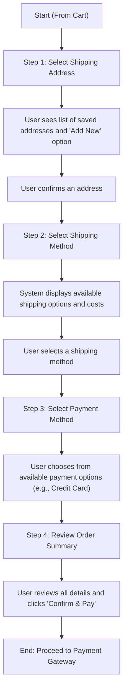
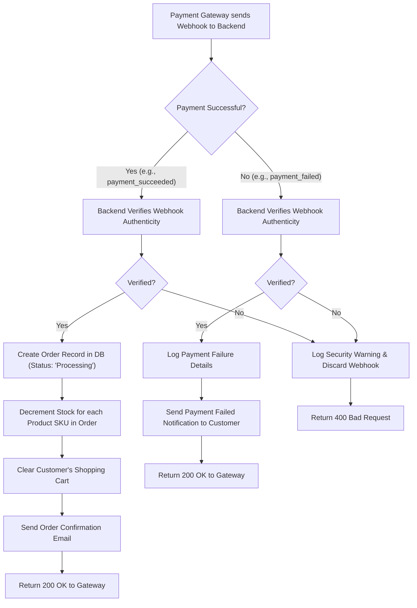

# 07. Order and Payment Processing Requirements

## 1. Introduction

This document outlines the complete workflow for the checkout, payment, and order creation processes within the e-commerce platform. It provides backend developers with the business logic and explicit system requirements required to implement a secure, reliable, and user-friendly transaction system. The process begins when an authenticated customer initiates checkout from their shopping cart and concludes with the successful and atomic creation of an order record in the system after payment is confirmed.

This specification is critical for transactional integrity and directly depends onseveral other documents:
- It assumes an authenticated user as defined in **[Authentication and Authorization](./03-authentication-and-authorization.md)**.
- It acts upon the items aggregated in the **[Shopping Cart](./06-shopping-cart-and-wishlist.md)**.
- It triggers the workflows described in **[Order Management and Tracking](./08-order-management-and-tracking.md)**.
- It interfaces with third-party services as defined in **[External Integrations](./14-external-integrations.md)**.

## 2. Order Data Structure

To provide context for the checkout process, the primary output is the creation of an `Order` record. THE system SHALL create an order record with the following core attributes.

| Attribute | Description | Data Type | Example | Notes |
|---|---|---|---|---|
| `orderId` | A unique identifier for the order. | UUID | "a1b2c3d4-..." | System-generated, immutable. |
| `customerId` | The ID of the customer who placed the order. | UUID | "e5f6g7h8-..." | Foreign key to the customer. |
| `orderStatus` | The current status of the order. | Enum | "Processing" | Initial status after successful payment. |
| `paymentStatus` | The status of the payment. | Enum | "Paid" | |
| `shippingAddress` | The JSON object of the customer's shipping address. | JSON | `{"street": "123...", "city": "Anytown"}` | Captured at time of order. |
| `shippingMethodId` | The ID of the selected shipping method. | String | "standard-shipping" | |
| `subtotal` | The total price of all items before taxes and shipping. | Decimal | 199.99 | |
| `shippingCost` | The cost of shipping. | Decimal | 10.00 | |
| `taxes` | The amount of tax applied. | Decimal | 16.00 | |
| `grandTotal` | The final amount charged to the customer. | Decimal | 225.99 | `subtotal + shippingCost + taxes` |
| `transactionId` | The reference ID from the payment gateway. | String | "pi_3L..." | For reconciliation. |
| `createdAt` | The timestamp when the order was created. | DateTime | "2025-11-06T14:42:23Z" | System-generated. |

## 3. Checkout Process Flow

The checkout process is a sequential, multi-step flow that is only available to authenticated `customer` actors.

### 3.1. Step 1: Shipping Address

*   **EARS-1**: WHEN a customer initiates checkout, THE system SHALL display a list of their saved shipping addresses.
*   **EARS-2**: THE system SHALL provide an option for the customer to add a new shipping address during this step.
*   **EARS-3**: THE system SHALL require the customer to select or confirm one shipping address before proceeding.

### 3.2. Step 2: Shipping Method

*   **EARS-4**: WHEN a shipping address is confirmed, THE system SHALL present the customer with a list of available shipping methods and their associated costs.
*   **EARS-5**: IF no shipping methods are available for the selected address, THEN THE system SHALL display an error and prevent the user from proceeding.

### 3.3. Step 3: Payment Method

*   **EARS-6**: THE system SHALL display the configured payment options (e.g., "Credit/Debit Card").
*   **EARS-7**: THE system SHALL require the customer to select a payment method to proceed.

## 4. Order Summary and Confirmation

Before the final payment action, the system must display a comprehensive and final order summary.

*   **EARS-8**: THE system SHALL display a final order summary page for customer review and confirmation.
*   **EARS-9**: This summary SHALL include:
    *   Selected Shipping Address
    *   Selected Shipping Method
    *   Selected Payment Method
    *   A list of all items, showing product name, SKU, quantity, and unit price for each.
    *   A financial breakdown showing: **Subtotal**, **Shipping Cost**, **Taxes**, and the final **Grand Total**.
*   **EARS-10**: THE system SHALL provide a "Confirm and Pay" button, which, when clicked, initiates the payment processing sequence.

## 5. Payment Gateway Integration

The backend integrates with a PCI-DSS compliant third-party payment gateway to ensure security. The backend does not handle raw card data.

### 5.1. Technical Flow

1.  **Frontend**: Requests a "payment intent" from the backend, sending the final order amount.
2.  **Backend**: Communicates with the payment gateway API, sending the amount and currency. It receives a `client_secret` from the gateway.
3.  **Backend**: Sends the `client_secret` back to the frontend.
4.  **Frontend**: Uses the `client_secret` and the gateway's library (e.g., Stripe.js) to securely collect payment details and submit them directly to the gateway.
5.  **Payment Gateway**: Processes the payment and sends an asynchronous notification (webhook) to a dedicated endpoint on our backend to confirm the payment's success or failure.

### 5.2. Idempotency

*   **EARS-11**: WHEN creating a payment request to the gateway, THE system SHALL generate and include a unique idempotency key to prevent accidental duplicate charges for the same order.

## 6. Payment Outcome Handling

The system's response to the payment gateway's webhook is critical for maintaining data integrity.

### 6.1. On Payment Success

*   **EARS-12**: WHEN the backend receives a successful payment webhook, THE system SHALL perform the following actions as a single, atomic transaction:
    1.  Create a new `Order` record with a status of "Processing".
    2.  Decrement the stock quantity for each SKU included in the order.
    3.  Clear all items from the customer's shopping cart.
*   **EARS-13**: WHEN the atomic transaction is complete, THE system SHALL send an "Order Confirmation" notification to the customer.
*   **EARS-14**: IF any part of the atomic transaction fails, a `customer` **SHALL** be able to view a list of all orders they have placed.

### 6.2. On Payment Failure

*   **EARS-15**: WHEN the backend receives a failed payment webhook, THE system SHALL log the failure details, including the error message from the gateway.
*   **EARS-16**: THE system SHALL send a "Payment Failed" notification to the customer, prompting them to try again.
*   **EARS-17**: THE system SHALL NOT create an order and SHALL NOT adjust any product inventory.

## 7. Data Integrity and Atomicity

*   **EARS-18**: THE system SHALL ensure that the creation of the order, the corresponding inventory decrements, and the clearing of the shopping cart are executed as a single, atomic database transaction.
*   **EARS-19**: IF any step within this transaction fails (e.g., an inventory update fails due to a race condition), THEN THE entire transaction SHALL be rolled back to prevent data inconsistency, and the system SHALL log a critical error for administrative review.
