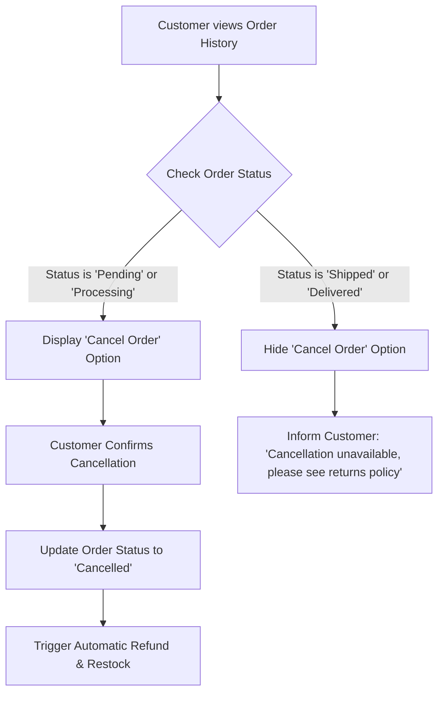
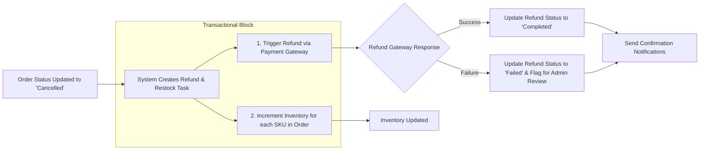

# 09. Cancellation and Refund Policy Requirements

## 1. Introduction

### 1.1. Purpose
This document specifies the definitive requirements, business rules, and system logic for handling order cancellations and the subsequent refunds on the e-commerce platform. Its purpose is to provide a clear, unambiguous, and comprehensive set of guidelines for backend developers to implement the necessary functionality that governs how and when orders can be canceled and how customers are reimbursed. Every requirement herein is mandatory for ensuring a consistent and trustworthy process.

### 1.2. Scope
This document covers:
- The conditions and workflows for order cancellations initiated by Customers.
- The conditions and workflows for order cancellations initiated by Sellers.
- The fully automated process for triggering and processing refunds for canceled orders.
- The roles, capabilities, and responsibilities of Administrators in overseeing, managing, and resolving exceptions within the cancellation and refund process.

It explicitly **does not** cover product returns or refunds for products that have already been delivered. That process shall be defined in a separate Returns Policy document.

### 1.3. Core Principles
- **Automation First**: The system shall automate the cancellation and refund process to the greatest extent possible to ensure speed and reduce manual error.
- **Transparency**: All actors (Customer, Seller, Admin) must have clear visibility into the status of a cancellation or refund request.
- **Integrity**: All related systems, particularly inventory and payment, must be updated transactionally to prevent data inconsistencies.

## 2. Customer-Initiated Cancellation

This section defines the rules for when a customer can cancel their own order.

### System Requirements (EARS Format)
- **State-driven**: WHILE an order's status is "Pending" or "Processing", THE system SHALL display a cancellation option to the customer in their order details view.
- **Unwanted Behavior**: IF an order's status is "Shipped" or "Delivered", THEN THE system SHALL NOT display a cancellation option.
- **Event-driven**: WHEN a customer confirms their intent to cancel an eligible order, THE system SHALL update the order status to "Cancelled".
- **Event-driven**: WHEN an order is successfully canceled by a customer, THE system SHALL immediately and automatically trigger the refund process as defined in Section 4.

## 3. Seller-Initiated Cancellation

This section defines the rules for when a seller must cancel an order they are responsible for fulfilling.

### 3.1. Cancellation Scenarios
A seller may need to cancel an order for various operational reasons, including but not limited to:
- **Inventory Discrepancy:** The product was discovered to be out of stock or damaged after the order was placed.
- **Pricing Error:** The product was listed at a fundamentally incorrect price.
- **Shipping Issues:** The seller is unable to ship the product to the customer's specified address.
- **Customer Request:** The seller is canceling the order on behalf of the customer.

### System Requirements (EARS Format)
- **Ubiquitous**: THE system SHALL provide an interface for sellers in their order management dashboard to cancel an order they are assigned to fulfill.
- **Event-driven**: WHEN a seller initiates an order cancellation, THE system SHALL require the seller to select a reason for the cancellation from a predefined list.
- **Event-driven**: WHEN a seller confirms the cancellation of an order, THE system SHALL update the order status to "Cancelled".
- **Event-driven**: WHEN an order is canceled by a seller, THE system SHALL immediately and automatically trigger the refund process as defined in Section 4.

## 4. Refund and Restock Process

This process is fully automated and is triggered by a change in order status to "Cancelled", regardless of who initiated it.

### 4.1. Refund and Restock Workflow

### 4.2. Refund Statuses
To provide clarity to all parties, every refund shall have its own status, distinct from the order status.
- **Pending:** The refund has been triggered but not yet sent to the payment processor.
- **Processing:** The refund request has been sent to the payment processor, and the system is awaiting a response.
- **Completed:** The payment processor has confirmed the refund was successful, and the customer has been reimbursed.
- **Failed:** The payment processor was unable to process the refund. This requires manual administrative intervention.

### System Requirements (EARS Format)
- **Event-driven**: WHEN an order status is updated to "Cancelled", THE system SHALL automatically create a corresponding refund record with an initial status of "Pending".
- **Event-driven**: WHEN an order is canceled, THE system SHALL automatically increment the stock quantity for each SKU in the order, returning the items to available inventory.
- **Ubiquitous**: THE system SHALL allow a customer to view the status of their refund in their "Order History" details.
- **State-driven**: WHILE a refund status is "Processing", THE system SHALL prevent any duplicate refund actions on the same order.
- **Event-driven**: IF a refund request to a payment gateway fails, THEN THE system SHALL update the refund status to "Failed" and generate an alert for an administrator.

## 5. Administrator Role in Cancellations & Refunds

Administrators have ultimate oversight and serve as the final authority for exceptions and disputes.

### 5.1. Refund Management Dashboard
- **Ubiquitous**: THE system SHALL provide a dedicated "Refund Management" queue in the Admin Dashboard.
- **Event-driven**: WHEN a refund's status becomes "Failed", THE system SHALL automatically add it to this queue for manual review.
- **Ubiquitous**: THE queue SHALL allow an Admin to view all details of the original order and the failed refund attempt, including error messages from the payment gateway.
- **Ubiquitous**: THE system SHALL provide Admins with the ability to manually mark a refund as "Completed" (after processing it externally) or "Rejected", with a mandatory note explaining the action.

### 5.2. Manual Intervention and Auditing
- **Ubiquitous**: THE system SHALL enable an Admin to trigger a refund on any order, regardless of its current status, to handle disputes or exceptions. Such actions must require a justification note.
- **Ubiquitous**: THE system SHALL create an immutable audit log entry for every action an admin performs related to cancellations or refunds (e.g., manual refund trigger, status update). The log must include the admin's ID, the action taken, the target order/refund ID, and a timestamp.

## 6. User Notifications

Clear and timely communication is essential during the cancellation and refund process.

- **Event-driven**: WHEN an order is successfully canceled (by customer or seller), THE system SHALL send an "Order Canceled" notification to the customer's registered email address.
- **Event-driven**: WHEN an order is canceled by a seller, THE system SHALL include the reason for the cancellation in the notification to the customer.
- **Event-driven**: WHEN a refund status is updated to "Completed", THE system SHALL send a "Refund Processed" notification to the customer.
- **Event-driven**: WHEN a refund status is updated to "Failed", THE system SHALL send an internal notification alert to a designated admin distribution list.
