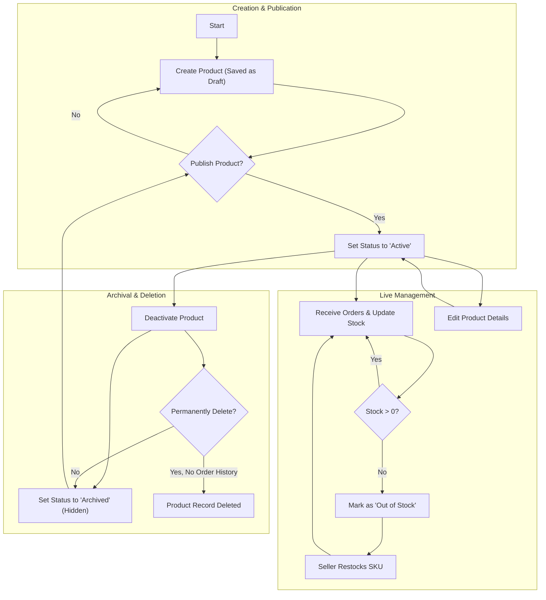
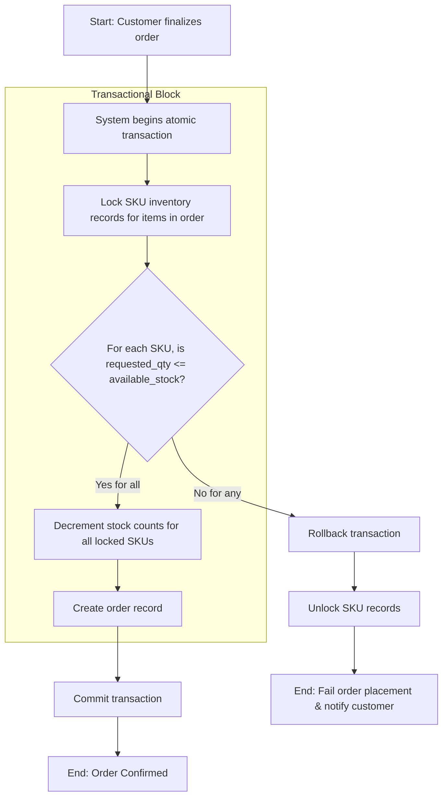

# 10. Seller Product and Inventory Management Requirements

## 1. Introduction

This document specifies the comprehensive functional requirements for the seller-facing product and inventory management system. It serves as the definitive guide for backend developers, detailing the rules, workflows, and constraints necessary to build a robust and reliable set of tools for the "seller" actor. The primary objective is to empower sellers with full control over their own listings and to ensure real-time inventory accuracy, which is critical for preventing overselling and maintaining customer trust.

All requirements herein are mandatory and must be implemented as specified to ensure transactional integrity and a consistent user experience. For actor definitions, refer to the [User Actors and Permissions Document](./02-user-actors-and-permissions.md).

## 2. Seller Dashboard Overview

The seller dashboard is the authenticated entry point and central command center for all seller activities. It must provide an at-a-glance overview of the seller's store performance and pending tasks.

- **THE** system **SHALL** present the seller with this dashboard immediately upon a successful login.
- **THE** dashboard **SHALL** display a summary of key performance indicators (KPIs), including:
    - Gross sales revenue for a selectable period (default: last 30 days).
    - Total number of orders received for the period.
    - A list of open orders requiring fulfillment, sorted by the oldest first.
    - A list of the top 5 SKUs that are low in stock.
    - A notification area for platform announcements and critical alerts (e.g., new order received, stock-out). 

## 3. Product and SKU Lifecycle

A product managed by a seller follows a clearly defined lifecycle. The system must support distinct states to allow for creation, publication, and archival.

## 4. Product Listing and Management (EARS)

Sellers must have complete control over their product listings. The structure of product data must align with the general rules outlined in the [Product Catalog Management Document](./05-product-catalog-management.md).

### 4.1. Product Creation

- **WHEN** a seller initiates the creation of a new product, **THE** system **SHALL** present a form with fields to define the core product attributes.
- **THE** system **SHALL** require the seller to provide a `Product Name`, `Description`, `Category`, and at least one `Image`.
- **WHEN** a seller saves a product for the first time, **THE** system **SHALL** create the product with a default status of `"Draft"`, making it invisible on the public storefront.

### 4.2. Defining Product Variants (SKUs)

- **WHILE** a product is in a `"Draft"` state, **THE** system **SHALL** allow the seller to define its variant attributes (e.g., "Color", "Size").
- **WHEN** a seller adds variant options, **THE** system **SHALL** automatically generate a list of all possible unique SKU combinations.
- **FOR each** generated SKU, **THE** system **SHALL** require the seller to provide a unique `SKU Code`, `Price`, and initial `Stock Quantity`.
- **THE** system **SHALL** prevent a product from being published (status changed to `"Active"`) **IF** it has defined variant options but at least one SKU has not been configured with a price and stock quantity.

### 4.3. Publishing and Editing

- **WHEN** a seller elects to publish a `"Draft"` product, **THE** system **SHALL** change its status to `"Active"` **ONLY IF** all SKU and pricing rules are met.
- **WHILE** a product is `"Active"`, **THE** system **SHALL** allow the seller to modify most product attributes, but **SHALL NOT** allow the deletion of variant options that have associated inventory or order history.

## 5. SKU-level Inventory and Stock Management (EARS)

Real-time, transactional inventory management is the most critical function of this system. All stock tracking **must** be performed at the individual SKU level to guarantee data integrity.

### 5.1. Automated Stock Decrement (Order Placement)

- **WHEN** a customer successfully places an order, **THE** system **SHALL** execute the inventory update as part of a single, atomic database transaction.
- **WITHIN** this transaction, **THE** system **SHALL** first verify stock availability for all SKUs in the order, and only then **SHALL** it decrement the stock quantity for each SKU.
- **IF** any SKU in the order has insufficient stock, **THEN** **THE** system **SHALL** roll back the entire transaction, ensuring no inventory levels are changed and the order is not created.

### 5.2. Automated Stock Increment (Cancellation/Refund)

- **WHEN** an order is cancelled or refunded and the items are designated for restock, **THE** system **SHALL** immediately and automatically increment the stock quantity for each corresponding SKU.
- This increment operation **SHALL** also be an atomic transaction to prevent race conditions.

### 5.3. Manual Stock Adjustments

- **THE** system **SHALL** provide an interface for the seller to manually update the stock quantity for any SKU.
- **WHEN** a seller performs a manual stock adjustment, **THE** system **SHALL** require them to select a reason for the change (e.g., "Initial Stock", "Inventory Count Correction", "Damaged Goods", "Stock Return").
- **THE** system **SHALL** prevent any manual adjustment that would result in a negative stock quantity.

## 6. Out-of-Stock Handling (EARS)

- **IF** any stock adjustment causes an SKU's stock quantity to become zero, **THEN** **THE** system **SHALL** automatically change the status of that SKU to `"Out of Stock"`.
- **WHILE** an SKU is in the `"Out of Stock"` state, **THE** system **SHALL** make it un-purchasable on the public storefront (e.g., disable the "Add to Cart" button for that variant).
- **THE** system **SHALL** allow sellers to configure low-stock alert thresholds on a per-SKU basis.
- **WHEN** an SKU's stock quantity drops to or below its specified threshold, **THE** system **SHALL** send a notification to the seller.

## 7. Product Deactivation and Deletion (EARS)

- **A** seller **SHALL** be able to change an `"Active"` product's status to `"Archived"`.
- **WHEN** a product is `"Archived"`, **THE** system **SHALL** immediately remove it from all public-facing storefront listings and search results but retain all its data for the seller's records.
- **IF** a seller attempts to permanently delete a product, **THEN** **THE** system **SHALL** only permit the action **IF** the product has no associated order history.
- **IF** a seller attempts to delete a product that has been sold before, **THEN** **THE** system **SHALL** deny the request and instruct the seller to archive the product instead. This preserves the integrity of historical sales records.

## 8. Auditing and History

- **THE** system **SHALL** create an immutable audit log entry for every single inventory change, whether automated (from an order) or manual (by a seller).
- **EACH** log entry **SHALL** record the `SKU ID`, `timestamp`, `quantity changed` (e.g., -1, +5), `new stock level`, the `source of the change` (e.g., Order ID, User ID of seller), and the `reason` for manual changes.
- This audit trail **SHALL** be accessible to administrators for resolving discrepancies.
