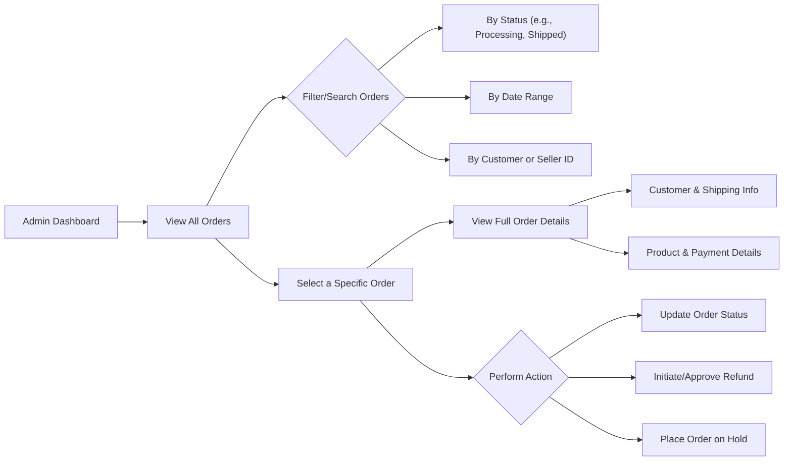
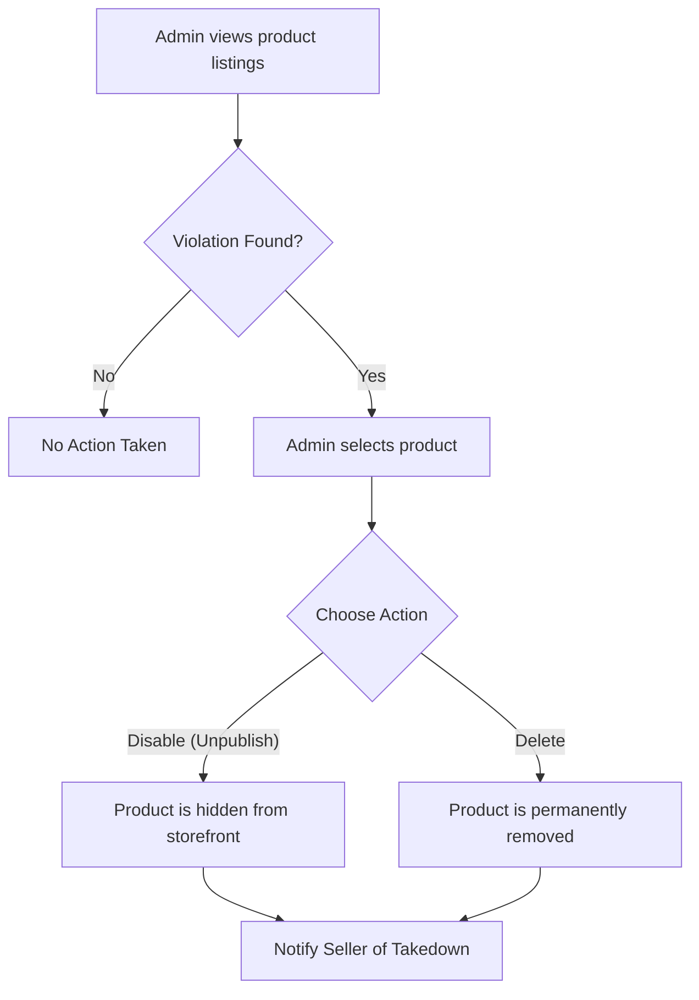
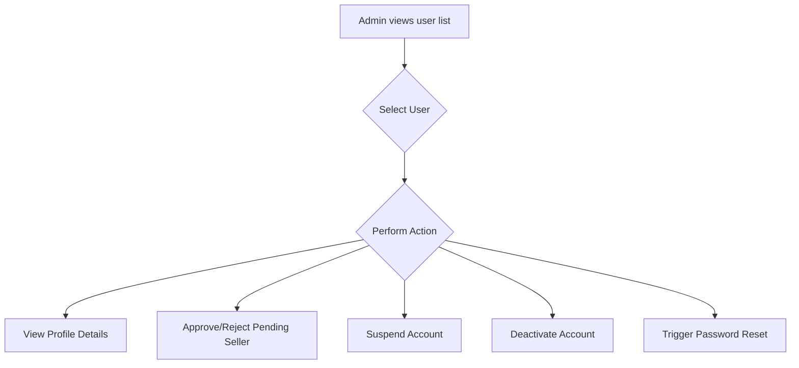
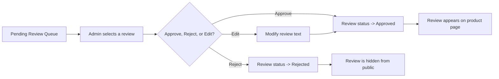
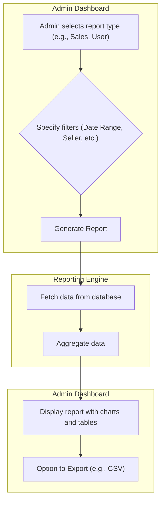

# 12. Admin Dashboard Functions

## Introduction

This document specifies the functional requirements for the Admin Dashboard, the central control system for the e-commerce platform. This interface is exclusively accessible to users with the "admin" role and provides the necessary tools for comprehensive platform governance, including order oversight, user management, content moderation, and business analytics. The requirements outlined here define *what* the system must do, leaving the technical implementation to the development team.

## 1. Global Order Management

Administrators require a holistic view of all transactions occurring on the platform to ensure operational integrity, manage exceptions, and provide customer support.

### Requirements

- THE system SHALL provide admins with a dashboard listing all orders placed on the platform, regardless of the seller.
- WHEN an admin navigates to the order management section, THE system SHALL display the most recent orders by default, sorted by creation date in descending order.
- THE system SHALL allow an admin to search for orders by ID, customer name/email, seller name, or order status.
- THE system SHALL allow an admin to filter orders by a specified date range.
- WHEN an admin selects an order, THE system SHALL display all associated details, including customer information, shipping address, product list with SKUs, payment status, shipping status, and a log of all status changes.
- WHERE an admin detects a potentially fraudulent or problematic transaction, THE system SHALL allow the admin to place a special "On Hold" status on the order.
- WHEN an order is placed "On Hold", THE system SHALL prevent any further status changes by the seller and send a notification to both the customer and seller indicating the order is under review.
- WHERE a refund is requested or required, THE system SHALL allow an admin to initiate and process a full or partial refund directly, overriding any seller-level restrictions.
- IF an order status requires manual correction (e.g., due to a shipping carrier error), THEN THE system SHALL permit an admin to manually update the order status at any point in its lifecycle.

## 2. Global Product Catalog Management

Admins are responsible for maintaining the quality and integrity of the entire product catalog. This includes managing categories and ensuring all seller products adhere to platform policies.

### Requirements

- THE system SHALL allow admins to view, search, and filter all products listed on the platform by any seller.
- WHERE a product listing violates platform policies (e.g., prohibited item, intellectual property infringement), THE system SHALL allow an admin to disable (unpublish) the product listing.
- WHEN a product is disabled by an admin, THE system SHALL immediately remove it from all public search results and storefronts but SHALL NOT affect existing, open orders containing that product.
- IF an admin disables a product, THE system SHALL send a notification to the seller explaining the reason for the action.
- THE system SHALL allow an admin to permanently delete a product listing.
- IF an admin attempts to delete a product that has been included in any past or present order, THEN THE system SHALL prevent the deletion and recommend disabling the product instead.
- THE system SHALL provide admins with full control over the platform's hierarchical product category structure, including the ability to add, edit, rename, and delete categories and sub-categories.
- WHEN a seller assigns a product to an incorrect category, THE system SHALL allow an admin to re-categorize the product.

## 3. User Account Management

Administrators must have the ability to manage all user accounts to handle support requests, enforce platform rules, and manage seller onboarding.

### Requirements

- THE system SHALL provide admins with a list of all registered user accounts, including both "customer" and "seller" roles.
- THE system SHALL allow an admin to search and filter users by role, email address, name, or account status (e.g., active, pending, suspended).
- WHEN an admin views a user's profile, THE system SHALL display all associated information, such as name, email, addresses, order history (for customers), and listed products (for sellers).
- WHERE a new seller application requires approval, THE system SHALL present it in an admin queue for review, allowing the admin to "approve" or "reject" the seller account.
- IF a user account violates terms of service, THEN THE system SHALL allow an admin to temporarily suspend the account.
- WHEN an account is suspended, THE system SHALL prevent the user from logging in but SHALL retain all user data. The account can be reinstated by an admin.
- IF a user account requires permanent removal, THEN THE system SHALL allow an admin to deactivate the account, which is an irreversible action.
- WHERE a user reports being unable to access their account, THE system SHALL allow an admin to trigger a password reset email on the user's behalf.

## 4. Review and Rating Moderation

To maintain a trustworthy and safe community, admins must be able to moderate user-submitted reviews and ratings.

### Requirements

- THE system SHALL provide admins with a moderation queue to view all product reviews submitted by customers that are in a "Pending" state.
- WHERE a review is automatically or manually flagged as potentially inappropriate, THE system SHALL prioritize it in the admin moderation queue.
- IF a review is found to be valid, THEN THE system SHALL allow an admin to change its status to "Approved", making it publicly visible.
- IF a review is found to contain spam, abusive language, or other content that violates platform policy, THEN THE system SHALL allow an admin to change its status to "Rejected".
- WHERE a review contains minor issues (like personal information), THE system SHALL allow an admin to edit the text of the review.
- WHEN an admin edits a review, THE system SHALL store the original text and log the changes for transparency and auditing purposes.
- THE system SHALL allow an admin to permanently delete any review, regardless of its status.

## 5. Platform Analytics and Reporting

Admins need access to data-driven insights to monitor the platform's health, track growth, and make informed business decisions.

### Requirements

- THE system SHALL provide admins with a main dashboard displaying high-level Key Performance Indicators (KPIs), including total revenue, number of orders, new user sign-ups, and average order value, with selectable timeframes (e.g., last 24 hours, last 7 days, last 30 days).
- THE system SHALL allow an admin to generate detailed sales reports, filterable by date range, seller, and product category.
- THE system SHALL allow an admin to generate reports on user activity, including customer registration trends and seller application rates.
- THE system SHALL provide a report identifying top-selling products and top-performing sellers based on sales volume and revenue.
- WHEN an admin generates a report, THE system SHALL provide an option to export the underlying data in a standard format such as CSV.

## 6. Security and Auditing

All actions performed within the Admin Dashboard must be logged to ensure accountability, provide a security trail, and facilitate debugging.

### Requirements

- THE system SHALL create an immutable audit log entry for every action an admin performs that creates, modifies, or deletes data.
- WHEN an admin performs a critical action (e.g., deleting a user, issuing a refund, disabling a product, or changing an order status), THE system SHALL log the admin's user ID, the specific action taken, the target entity ID (e.g., user ID, order ID), a timestamp, and the IP address from which the request originated.
- THE system SHALL implement strong access controls to ensure that only users with a specific, high-level "super admin" privilege can view the audit logs.
- WHERE a security investigation is required, THE system SHALL provide a secure and searchable interface for authorized personnel to review the admin audit trail.
- THE system SHALL protect the Admin Dashboard from unauthorized access by enforcing the same JWT-based authentication and role-based access control used throughout the rest of the application.
