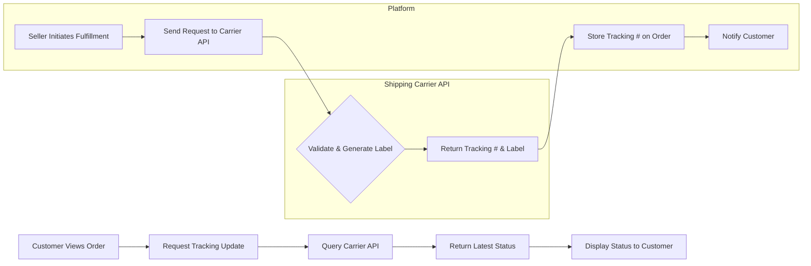

# 14. External Service Integration Requirements

## 1. Introduction

To deliver a feature-rich and seamless e-commerce experience, the platform must integrate with several specialized third-party services. These external integrations are critical for core functionalities such as payment processing, order fulfillment, user communication, and business analytics. This document outlines the requirements for integrating these services, focusing on functionality, security, and resilience. Developers must ensure that all integrations are implemented in a modular fashion to allow for future flexibility in vendor selection.

For overarching security and performance standards, please refer to the [Non-Functional Requirements Document](./13-non-functional-requirements.md).

## 2. Payment Gateway API Integration

A secure and reliable payment gateway is the cornerstone of any e-commerce platform. The system will integrate with a PCI-DSS compliant payment provider to handle all financial transactions.

Refer to the [Order and Payment Processing Document](./07-order-and-payment-processing.md) for details on the checkout flow.

### 2.1. Functional Requirements

*   **WHEN** a customer initiates the payment step in the checkout process, **THE** system **SHALL** establish a secure connection with the designated payment gateway.
*   **THE** system **SHALL** support multiple payment methods as provided by the gateway, including credit/debit cards, digital wallets, and other relevant local payment options.
*   **THE** system **SHALL** securely send transaction details (amount, currency, order ID) to the payment gateway for processing.
*   **WHEN** the payment gateway confirms a transaction status (success, failure, or pending) via a webhook, **THE** system **SHALL** immediately update the corresponding order status.
*   **THE** system **SHALL** store a non-sensitive transaction reference ID from the payment gateway for each order.
*   **WHERE** a user requests a refund via the platform, **THE** system **SHALL** be able to trigger a refund transaction through the payment gateway API, subject to approval rules.

### 2.2. Security and Compliance

*   **THE** system **SHALL NOT** store raw credit card numbers, CVVs, or other sensitive payment credentials. All such information must be handled directly by the payment gateway using tokenization methods (e.g., client-side tokenization).
*   **THE** system **SHALL** comply with all relevant PCI-DSS requirements for handling payment information, as outlined in the [Non-Functional Requirements Document](./13-non-functional-requirements.md).
*   **THE** system **SHALL** use secure, server-to-server communication with the payment gateway for all payment processing and confirmation steps.

### 2.3. Error Handling and Fallback Behavior

*   **IF** the payment gateway API returns a "payment failed" error, **THEN** **THE** system **SHALL** log the detailed error and present a clear, user-friendly message to the customer, prompting them to try again or use a different payment method.
*   **IF** the payment gateway service is unavailable or times out during a transaction, **THEN** **THE** system **SHALL** inform the user of the temporary issue and prevent the order from being placed in a stuck state. The user's cart must remain intact.
*   **IF** a payment confirmation webhook call from the gateway is missed, **THEN** **THE** system **SHALL** have a mechanism to periodically poll the gateway for the transaction status of any orders that have remained in a "pending payment" state for a defined period (e.g., 15 minutes).

## 3. Shipping Carrier API Integration

Integration with shipping carriers is essential for automating the fulfillment process and providing customers with real-time tracking information. The system should be able to interface with one or more carrier APIs to calculate shipping costs, generate labels, and track packages.

Further context can be found in the [Order Management and Tracking Document](./08-order-management-and-tracking.md).

### 3.1. Functional Requirements

*   **WHERE** available, **THE** system **SHALL** be able to retrieve real-time shipping rate estimates from the carrier API during the checkout process based on the customer's address and cart contents.
*   **WHEN** a seller initiates an order fulfillment, **THE** system **SHALL** allow them to generate a shipping label by sending order details (sender/recipient address, package dimensions) to the carrier API.
*   **THE** system **SHALL** retrieve and store the tracking number and a link to the carrier's tracking page for every fulfilled order.

### 3.2. Real-time Tracking

*   **THE** system **SHALL** provide customers with the real-time shipping status of their order.
*   **WHEN** a user views their order details, **THE** system **SHALL** be able to query the carrier API to get the latest tracking update or redirect them to the carrier's tracking portal.
*   **THE** system **SHALL** implement webhooks, if supported by the carrier, to receive push notifications for tracking status changes (e.g., "In Transit," "Out for Delivery," "Delivered"). These updates must automatically change the order status within our platform.

### 3.3. Error Handling and Fallback Behavior

*   **IF** the shipping carrier API is unavailable when a seller attempts to generate a label, **THEN** **THE** system **SHALL** notify the seller of the issue and provide an interface for them to manually enter tracking information later.
*   **IF** a real-time tracking request fails, **THEN** **THE** system **SHALL** display the last known status and provide a direct link to the carrier's tracking website as a fallback.

### 3.4. Integration Flow Diagram

## 4. Email/SMS Notification Service

Transactional notifications are vital for keeping users informed about their account and order activity. The system will use a third-party service to reliably send emails and, optionally, SMS messages.

### 4.1. Trigger-based Notifications

*   **THE** system **SHALL** integrate with a notification service to send messages based on specific system events.
*   **WHEN** a user successfully registers, **THE** system **SHALL** trigger the sending of a "Welcome" email, which includes an email verification link.
*   **WHEN** a user requests a password reset, **THE** system **SHALL** trigger the sending of an email with a secure reset link.
*   **WHEN** an order is successfully placed, **THE** system **SHALL** trigger the sending of an "Order Confirmation" email to the customer.
*   **WHEN** an order's status is updated (e.g., Shipped, Delivered, Canceled), **THE** system **SHALL** trigger a notification to the customer.

### 4.2. Template Requirements

*   **THE** system **SHALL** use pre-defined, customizable templates managed within the notification service for all outgoing messages.
*   **THE** system **SHALL** pass dynamic data (e.g., customer name, order number, product details, tracking link) to the notification service to populate the templates.

### 4.3. Error Handling

*   **IF** the notification service API fails to accept a message request, **THEN** **THE** system **SHALL** log the error and place the notification in a retry queue for a limited number of attempts.
*   **THE** system **SHALL** monitor email bounce and block rates through the service's dashboard or webhooks to maintain a healthy sender reputation.

## 5. Analytics Service Integration

To understand user behavior and make data-driven decisions, the platform will integrate with a third-party analytics service.

### 5.1. Event Tracking

*   **THE** system **SHALL** send event data to the analytics service based on user actions and system events to enable business intelligence and behavior analysis.
*   **WHEN** a user performs a key action, **THE** system **SHALL** track this event with relevant, non-personally identifiable properties.

### 5.2. Data Points

The following key events must be tracked:

*   **User Events**: `User Registered`, `User Logged In`.
*   **Product Events**: `Product Viewed`, `Product Searched`, `Product Added to Cart`, `Product Added to Wishlist`, `Product Reviewed`.
*   **Order Events**: `Checkout Started`, `Payment Attempted`, `Order Completed`, `Order Canceled`.
*   **Seller Events**: `Product Listed`, `Product Stock Updated`.

## 6. General Integration Requirements

These requirements apply to all external service integrations.

### 6.1. API Key and Secret Management

*   **THE** system **SHALL** securely store all third-party API keys, secrets, and other credentials.
*   **THE** system **SHALL** use a dedicated secret management solution (e.g., AWS Secrets Manager, HashiCorp Vault, or environment variables in a secure, audited context).
*   **THE** system **SHALL NOT** hardcode credentials in source code, configuration files, or logs.
*   **THE** system **SHALL** support the rotation of API keys with minimal service disruption.

### 6.2. Logging, Monitoring, and Auditing

*   **THE** system **SHALL** log all outbound requests and inbound responses (excluding sensitive data like credentials) from external APIs for debugging and auditing purposes.
*   **THE** system **SHALL** monitor the health, latency, and error rates of all external service integrations.
*   **WHEN** an external service integration fails repeatedly, **THE** system **SHALL** trigger an alert to the platform administrators.
*   **THE** system **SHALL** implement circuit breaker patterns where appropriate to prevent cascading failures when an external service is down or experiencing high latency.
