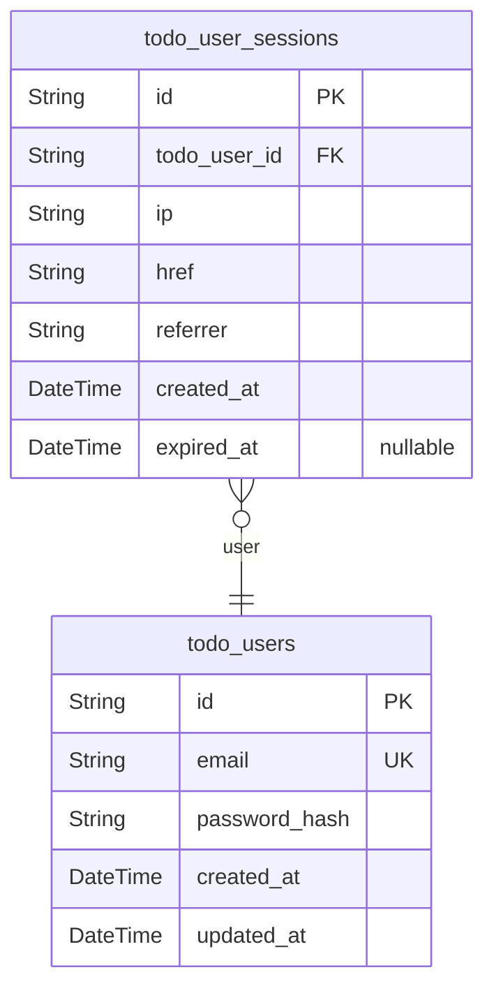
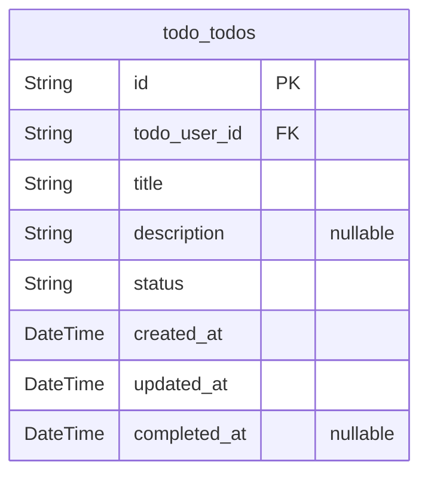

# Prisma Markdown

> Generated by [`prisma-markdown`](https://github.com/samchon/prisma-markdown)

- [Actors](#actors)
- [Todos](#todos)

## Actors

### `todo_users`

Registered users for the Todo List application.

Represents all individual identities authorized to use the system. Each
user is uniquely identified by their email address and can manage their
own personal todos, but is strictly isolated from all other users by
access controls and permissions. Passwords are securely stored using
strong hash algorithms; no plain-text credentials are ever retained.

User accounts cannot access or modify any other user's data. All
authentication flows, session establishment, and permission checks depend
primarily on this table.

Timestamps enable tracking of account creation and the last time
credentials or user records were modified. No administrative users or
privileged roles exist in this MVP.

Properties as follows:

- `id`
  > Primary Key. Universally unique user identifier for each application
  > user. Must not collide with any other id in the system.
- `email`
  > The user's unique email address. Used for authentication and business
  > communication. Must be unique among all users.
- `password_hash`
  > Hashed password for user authentication. Never stores the plain-text
  > password. Follows industry-standard secure hash algorithm requirements.
- `created_at`: Timestamp of when the user account was initially created.
- `updated_at`
  > Timestamp of the most recent update to the user's account information
  > (such as password or email).

### `todo_user_sessions`

Authentication sessions for users of the Todo List application.

Each record represents a single authenticated session established by a
user. Sessions are created at user login, persist throughout
authenticated API usage, and are invalidated at logout or expiration. The
session is always linked to exactly one user.

Sessions record connection context (IP, href, referrer) and temporal data
(creation and expiration times). Session records enable audit trails for
security and troubleshooting. Sessions are strictly subsidiary to their
parent user, managed through identity flows, and are never edited
directly except by system actions.

Properties as follows:

- `id`
  > Primary Key. Universally unique session identifier for each
  > authentication/session instance.
- `todo_user_id`
  > Foreign key referencing the user who owns this session. Establishes the
  > relationship with [todo_users.id](#todo_users).
- `ip`
  > IP address from which the session was established. Used for auditing and
  > security context.
- `href`
  > Full URL where the session started (landing or login page). Captures the
  > source for audit and analytics.
- `referrer`
  > Referrer URL for the session, providing additional context to the
  > authentication attempt.
- `created_at`: Timestamp when the session was created.
- `expired_at`
  > Timestamp when the session expired or was invalidated. Null if the
  > session is still active.

## Todos

### `todo_todos`

Todo items for individual users.

This table stores all todo entries created by users. Each todo is
strictly owned by a single user, represented by a foreign key reference
to the [todo_users](#todo_users) table. The model enforces field level
constraints per requirements: 'title' is always required (1-255 char),
'description' is optional (up to 1000 chars), and 'status' can only be
'complete' or 'incomplete'. Each todo includes timestamps for creation,
last update, and (optionally) completion to support rapid lookup,
sorting, and user-facing status. This model provides strong ownership
enforcement—no sharing, delegation, or multi-user association is
possible. All CRUD operations are limited to the owning user. Hard
deletes (no deleted_at) are specified per business requirement. All
business, validation, and ownership rules are enforced at the schema and
API layers.

Properties as follows:

- `id`: Primary Key.
- `todo_user_id`
  > Owner of this todo, referencing a registered user. Foreign key to {@link
  > todo_users.id}.
- `title`: Todo title (1-255 characters). Required at all times.
- `description`: Optional description with maximum 1000 characters.
- `status`
  > Completion status; allowed values are 'incomplete' or 'complete'. Only
  > these two string values are valid.
- `created_at`: Timestamp of todo creation (UTC, ISO8601).
- `updated_at`: Timestamp of last modification (UTC, ISO8601).
- `completed_at`
  > Timestamp when todo was marked as complete (UTC, ISO8601). Null if
  > incomplete.
