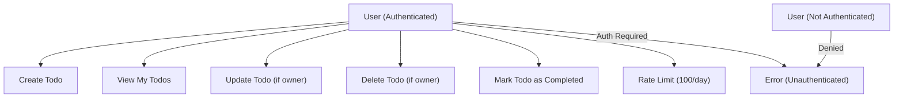

# User Requirements for Minimal Todo List Backend

## Core User Needs

- WHEN a user is registered and authenticated, THE system SHALL allow the user to create a new todo item with a title and optional description.
- WHEN a user creates a todo, THE system SHALL save the todo linked to the specific user who created it so that only this user SHALL have access to view, update, or delete this specific todo.
- WHEN a user views their list of todos, THE system SHALL provide all todos belonging to that user in creation or update order, with clearly specified title, description (if any), status (such as completed or not completed), and unique todo identifier.
- WHEN a user marks a todo as completed, THE system SHALL immediately update the status for that specific todo item and reflect the change in future views.
- WHEN a user wishes to update a todo’s title, description, or completion status, THE system SHALL permit this update if and only if the user is authenticated and is the creator/owner of the todo.
- WHEN a user deletes a todo, THE system SHALL permanently remove the todo and ensure it is not accessible through any user list or by API.
- WHEN a user attempts to access, modify, or delete a todo they do not own, THE system SHALL deny the action and provide a clear error message (such as "insufficient permissions").
- WHEN a user is not authenticated, THE system SHALL deny all todo creation, viewing, update, and deletion attempts, and SHALL respond with an "authentication required" error message.

## Non-functional Requirements

- WHEN any user action is performed, THE system SHALL provide confirmation of success or failure back to the user within 2 seconds under normal operation.
- WHEN persistent storage is in use, THE system SHALL guarantee that a user’s todos are durable so that no created or updated todo can be lost due to normal system operation or minor outages.
- WHEN processing concurrent requests, THE system SHALL handle conflicts (such as two simultaneous updates for the same todo) by using the last valid operation received or by rejecting one operation with an appropriate error message.
- WHEN a user attempts to submit more than 100 todos per day, THE system SHALL return a clear message indicating daily usage limits have been reached and block further creates.
- WHEN any system failure or error occurs (such as database, storage, service interruptions), THE system SHALL return a clear, user-friendly, and actionable error message.
- WHEN multiple requests are made in parallel by a single user, THE system SHALL maintain full data consistency so that only the expected result of each action is visible and available to that user.
- WHEN a user requests their todos, THE system SHALL return the results in a predictable, consistent order (for example, most recently updated first by default).
- WHEN a user marks a todo as completed, THE system SHALL record the timestamp of completion for auditing, analytics, or history viewing (if added).
- THE system SHALL store and process only minimal, necessary data for each todo (no extra fields beyond title, description, completion status, timestamps, and ownership).

## Assumptions and Constraints

- System is designed for single-user usage: no sharing, delegation, or group functions.
- No social interactions, external integration, or push notifications included in minimum version.
- Authentication is mandatory for any todo-related action; registration is out of scope for this minimum version (assume users pre-exist in the system).
- The only user role is “User”; no admin or manager role is required or supported in an MVP.
- All actions are handled using API endpoints protected by a standard session or token-based authentication.
- Maximum allowed todos per user per day: 100
- Minimum required for a todo: title (non-empty string, max 255 chars). Description is optional (max 2,000 chars).

## Mermaid Diagram: User and Todo Workflow

## Acceptance Criteria

- The backend SHALL make it impossible for users to access, change, or delete todos they do not own.
- All error states SHALL be clearly described in user-facing API messages.
- Data retention, deletion, and update logic SHALL be in strict accordance with user’s actions, with no undeclared side effects.
- Todo list SHALL enforce ownership on every operation (CRUD).
- All requirements use EARS format and follow security best practices.

## Out of Scope for MVP

- Advanced features such as reminders, tags, due dates, subtasks, priorities, or team collaboration (not included).
- Admin operations, reporting, analytics, and audit logs (beyond simple completion timestamp).
- User registration, password reset, and external authentication integrations.

---

This requirements specification provides a focused, actionable foundation for backend engineers to implement a minimal, secure, and user-centric Todo list backend, with clear business logic, usage rules, error handling, and workflow constraints as described above.