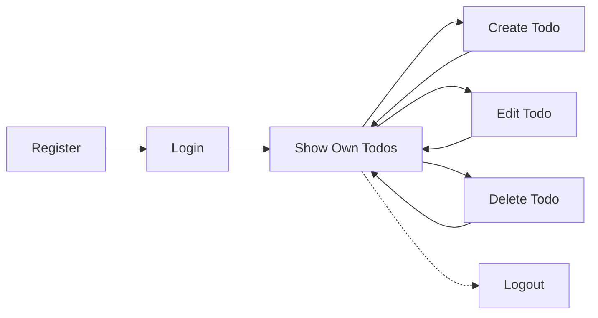

# Requirements Specification – Todo List Application

## Introduction
WHEN an individual needs a straightforward digital tool to manage personal tasks, THE Todo List Application SHALL provide a secure, intuitive online solution enabling users to create, read, update, and delete their own todos efficiently. The sole business goal is to maximize reliable task management for individuals in the least complicated manner possible.

## Actors & Permissions
- WHEN a person wishes to use the application, THE system SHALL require them to register an individual account using unique credentials.
- WHEN authenticated, THE user SHALL only access, view, or modify their own todo items.
- THE system SHALL NOT provide any group accounts, team features, or shared lists.
- WHEN a request is made to access another user's data, THEN THE system SHALL deny the request and provide a security alert (see [Exception Handling](./09-exception-handling-and-errors.md)).

## User Scenarios
- WHEN a new user wishes to join, THEN THE system SHALL present a registration page requesting a unique identifier (e.g., email) and password.
- WHEN an existing user returns, THEN THE system SHALL present a login form for authentication.
- WHEN authenticated, THE user SHALL:
  - View all of their own todos in a list
  - Create a new todo by entering a title; the todo appears as 'incomplete' by default
  - Edit a todo (change title, toggle completed status)
  - Delete a todo; it is permanently removed from the user's account
- WHEN a user logs out, THEN future access to their data SHALL require login again.
- IF authentication fails at login, THEN THE system SHALL show a clear error and not reveal any user content.
- WHEN requesting any feature beyond the scope below, THEN THE system SHALL return a "Not Supported" response.

## Functional Requirements
- WHEN a user attempts to register, THEN THE system SHALL validate all required fields and ensure uniqueness of the identifier; IF validation fails, THEN THE system SHALL return actionable error messages.
- WHEN a user logs in, THEN THE system SHALL verify identifier and password against stored records; IF credentials are incorrect, THEN THE system SHALL reject login.
- WHEN an authenticated user creates a todo, THEN THE system SHALL save it to their account and reflect it in their personal list.
- WHEN an authenticated user updates a todo, THEN THE system SHALL perform the update if and only if the todo belongs to the user; OTHERWISE, SHALL deny and return an error.
- WHEN an authenticated user deletes a todo, THEN THE system SHALL remove it and update the user's list immediately.
- WHEN an unauthenticated user or invalid session requests any resource, THEN THE system SHALL deny access robustly and return an authentication failure message.
- THE system SHALL provide a read endpoint that always reflects only the authenticated user's todos.

## Security & Privacy Requirements
- WHEN storing user credentials, THEN THE system SHALL use industry-standard secure hashing and never store plain-text passwords.
- WHEN transmitting any user data, THEN THE system SHALL require a secure (HTTPS) connection.
- WHEN authenticated, THEN THE system SHALL issue a session token or similar, used on each request for user authentication.
- WHEN session tokens expire or are invalid, THEN THE system SHALL deny access and prompt for login.
- THE system SHALL never expose any user's data to any other user, either by accident or API misuse; cross-user access is strictly forbidden.

## Performance Requirements
- WHEN a user performs registration, login, or any todo operation (CRUD), THEN THE operation SHALL complete and return a result within 2 seconds under normal service load.
- THE system SHALL achieve 99% success rate on core operations (login, CRUD) for properly formed authenticated requests.

## Out-of-Scope / Non-Goals
- WHEN users request features such as reminders, notifications, tags, due dates, priorities, subtasks, attachments, statistics, integrations, team or admin roles, or any sharing/collaboration, THEN THE system SHALL explicitly NOT support or implement these in the minimal version. For future ideas, see [Future Considerations](./11-future-considerations.md).

## Quality and Success Metrics
- WHEN users attempt registration and login, THEN THE system SHALL succeed in >95% of cases for well-formed input.
- THE system SHALL guarantee zero data leaks between users (no cross-user reading, writing, or deletion).
- WHEN creating, updating, or deleting todos, THEN success SHALL be reflected in the user's list without delay or inconsistency in >99% of cases.
- System SHALL maintain user retention rates above 50% after 30 days for early adopters through reliability and ease-of-use.

## Visual User Flow

## Cross-References
- [Service Overview](./01-service-overview.md)
- [Exception Handling](./09-exception-handling-and-errors.md)
- [Future Considerations](./11-future-considerations.md)
