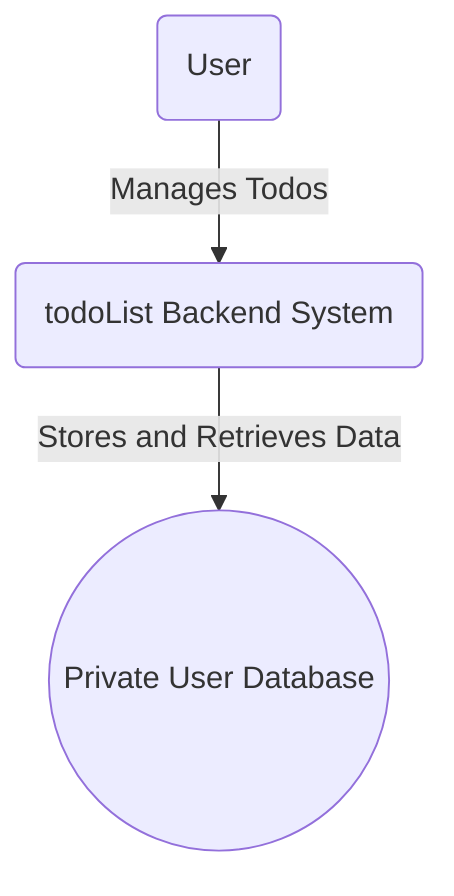

# 02. Business Model

This document defines the strategic business model for the **todoList** application. It outlines the service's core value proposition, identifies the target user profile, and establishes the precise scope of its offering. The purpose of this document is to provide a clear business context that aligns development efforts with user-centric goals and ensures the final product is focused and effective.

## 1. Value Proposition

In a market saturated with complex, feature-heavy productivity suites, the core value of the **todoList** application is its radical **simplicity and unwavering focus**. The service is not just a tool; it's a philosophy. It is the digital equivalent of a clean sheet of paper and a pen—uncluttered, immediate, and effective. It provides value not by offering more features, but by offering fewer, more refined ones that directly address the user's fundamental need: to capture and manage tasks with zero friction.

### Key User Benefits:

*   **Reduced Cognitive Load**: By providing a single, reliable place to offload tasks, the application frees the user's mind from the mental burden of remembering everything. This mental clarity allows them to focus their cognitive resources on higher-value activities.
*   **Increased Focus and Productivity**: The application provides a clear, linear path to productivity. The simple acts of listing tasks, viewing them in a clean interface, and checking them off as complete create a powerful psychological loop of accomplishment and motivation.
*   **Effortless and Immediate Utility**: The learning curve is non-existent. The service is designed to be so intuitive that a new user can sign up and become productive in under a minute, without needing tutorials or guides. This immediacy is a core component of its value.
*   **A Distraction-Free Sanctuary**: We are defined as much by what we *don't* do. By deliberately excluding collaboration features, complex notifications, and project management overhead, the application creates a private, calm space for personal task management, shielding the user from digital noise.

## 2. Target User Profile

The ideal user for this application is the "Focused Minimalist." This individual is not a project manager or a power user but is anyone who feels overwhelmed by the complexity of modern digital life and seeks simple, elegant tools to regain control.

*   **Who They Are**: They are students managing assignments, professionals tracking personal action items, parents organizing family chores, or anyone who needs a straightforward way to manage a list of personal goals and reminders.
*   **Their Core Need**: They need a tool that is fast, reliable, and "just works." They want to open the app, capture a thought or task, and move on with their day. Their primary goal is to ensure nothing important slips through the cracks.
*   **Their Pain Points with Other Tools**:
    *   **Feature Overload**: They feel that mainstream productivity apps are bloated with features they will never use (e.g., Gantt charts, team assignments, calendar integrations).
    *   **Onboarding Friction**: They are frustrated by lengthy sign-up processes, mandatory tutorials, and complex interfaces that get in the way of the simple act of creating a list.
    *   **Decision Fatigue**: They find that overly-complex tools require too much effort to manage the tool itself, rather than managing the tasks.

This service is built for the user who believes that the right technology should be nearly invisible, seamlessly integrating into their life and helping them achieve their goals with the least possible friction.

## 3. Service Scope

The scope of this application is intentionally and strictly limited to preserve its core value of simplicity. It is a Minimum Viable Product (MVP) focused exclusively on personal task management for a single user.

### System Context Diagram

The following diagram illustrates the high-level boundary of the service.

### In Scope (Core Functionality)

THE system SHALL allow an authenticated user to perform the following core actions exclusively on their own to-do items:

*   **User Account Management**: Securely register, log in, and manage a private, personal account.
*   **Create**: Add new tasks with a title to their personal list. Each new task is assigned a default status of "incomplete."
*   **Read**: View their complete list of tasks, with an option to filter by completion status (All, Complete, Incomplete).
*   **Update**: Modify the content of an existing task or change its completion status (e.g., from "incomplete" to "complete" and vice-versa).
*   **Delete**: Permanently remove a task from their list.
*   **Data Isolation**: All user data is strictly private and cannot be seen or accessed by any other user.

### Out of Scope (Explicitly Excluded)

To prevent feature bloat and maintain focus, the following functionalities are explicitly excluded from the current scope:

*   Any form of team collaboration, task sharing, or multi-user features.
*   Sub-tasks, project hierarchies, or dependencies between tasks.
*   File attachments, rich text formatting, or extended notes for tasks.
*   Due dates, reminders, calendar integrations, or push notifications.
*   Tagging, categorization, or any advanced filtering beyond completion status.
*   Public APIs or third-party service integrations.

## 4. Monetization Strategy

The **todoList** application is conceived as a **free, value-driven service**. The primary goal is to deliver an exceptional user experience and solve a common problem effectively. There are no plans for monetization, subscriptions, or advertisements in the current scope. This reinforces the commitment to a distraction-free environment and ensures that all development decisions are made in the best interest of the user, not a revenue target.

## 5. Key Success Metrics

While the service is not commercial, its success will be measured by its ability to deliver on its value proposition. The following key metrics will be used to gauge its effectiveness:

*   **User Engagement Rate**: The percentage of registered users who actively create, update, or complete a task within a given week. A high engagement rate indicates that the tool is a regular part of the user's workflow.
*   **User Retention Rate**: The percentage of users who return to the application a week or a month after their first session. High retention is the strongest indicator of product-market fit.
*   **Task Completion Rate**: The ratio of tasks marked as "complete" versus tasks created. This metric provides insight into whether the tool is genuinely helping users accomplish their goals.
*   **Simplicity Index**: Measured via optional user surveys, this qualitative metric will track user sentiment on the ease of use of the application. The goal is to maintain a consistently high rating for simplicity and user satisfaction.