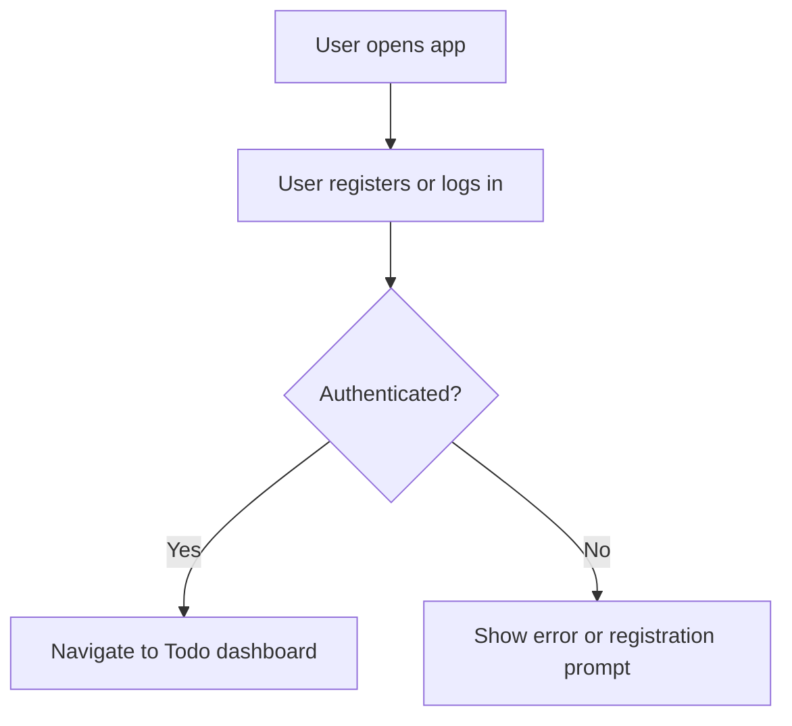
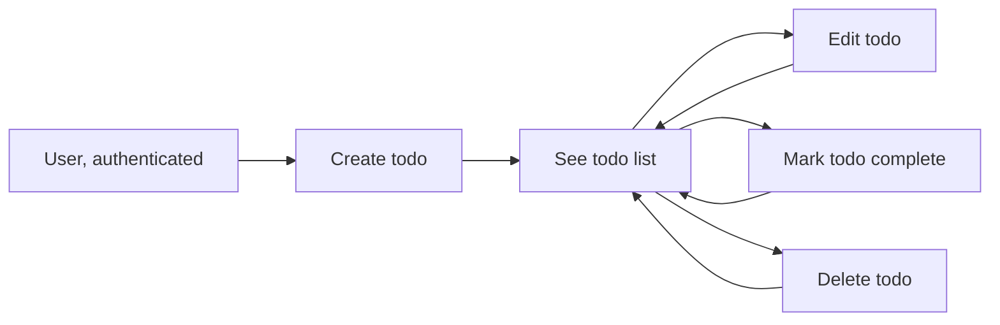

# Minimalist Todo List Application: Requirements

## 1. Introduction
The Todo application enables users to register, log in, and manage a personal list of tasks with maximum simplicity and no distractions. The app intentionally avoids all non-essential features, focusing on rapid, frictionless task management. The business objective is to serve users seeking clarity, privacy, and efficiency in their daily productivity tools without onboarding complexity or feature overload.

## 2. Actors
- **User**: An individual who registers and manages their own private todos. No role hierarchy exists, and every registered user has the same access rights to their own data only.

## 3. User Authentication and Authorization
- Registration is mandatory to use the todo management features. Minimal information (only email and password) is required.
- WHEN a user has registered and confirmed their identity, THE system SHALL grant access only to that user's tasks.
- WHEN a user attempts to access tasks belonging to another user, THE system SHALL reject the request and provide a clear error message.
- THERE SHALL be no social, collaborative, or multi-user shared access; each user's data is strictly isolated.
- WHEN a request is unauthenticated, THE system SHALL respond with an authentication-required error, never leaking any data.

## 4. Functional Requirements (EARS Format)
### 4.1. Todo Creation
- WHEN an authenticated user submits a valid text for a new task, THE system SHALL create a todo item associated with the user's account and set its status to active.
- WHEN a user submits a task with only whitespace or no content, THE system SHALL reject the creation request with an explicit validation error message.

### 4.2. Todo Editing
- WHEN an authenticated user edits a todo they own, THE system SHALL allow editing of the title/content of the task, provided the edited value is not blank.
- WHEN a user attempts to edit a todo they do not own, THE system SHALL reject the action and log an authorization error.

### 4.3. Marking Todos as Complete
- WHEN a user marks a todo as complete, THE system SHALL set the completion status and record the completion timestamp.
- WHEN a completed todo is viewed, THE system SHALL display that it is complete and show the date of completion.

### 4.4. Deleting Todos
- WHEN a user deletes a todo, THE system SHALL remove it from their account with no way to view it afterward.
- WHEN a user attempts to delete a todo they do not own, THE system SHALL deny the request.

### 4.5. Listing Todos
- WHEN a user requests their todo list, THE system SHALL display all active and completed todos associated with that user, ordered by most recently created or updated first.

### 4.6. Filtering Todos
- WHEN a user wants to view only active or only completed todos, THE system SHALL allow filtering of the list based on status.

### 4.7. Error Handling
- WHEN any action fails due to authentication, authorization, or validation, THE system SHALL respond within 2 seconds and provide a specific, user-friendly message indicating the cause.

## 5. User Flows

### Registration and Login Flow

### Todo Management Flow

## 6. Non-functional Requirements

- WHEN a user interacts with the system, THE system SHALL respond to all actions within 2 seconds under normal loads.
- THERE SHALL be no advertisements, third-party tracking, or data sharing; all todos are private to each authenticated user.
- THE application SHALL maintain at least 99.9% uptime over any 90-day period.
- WHEN a system error occurs, THE system SHALL log the event securely and return a generic error message to the user.
- Data SHALL be encrypted both in transit and at rest.
- User data SHALL never be used for marketing or shared externally.

## 7. Success Metrics and Quality Assurance
- Number of unique active users per day and month SHALL be measured.
- 7-day and 30-day user retention SHALL be tracked.
- The ratio of todos created to todos completed per user SHALL be recorded for insight into user engagement.
- Users returning weekly SHALL be tracked to assess retention.
- User feedback SHALL be solicited and monitored for product improvement.

## 8. Out-of-Scope Features
- No collaborative, multi-user task sharing or delegation
- No priority, labels, reminders, due dates, attachments, integrations, or push notifications
- No analytics for end-users

All requirements and business rules are focused on delivering a production-minimal todo management service where privacy, speed, clarity, and reliability are the core principles.