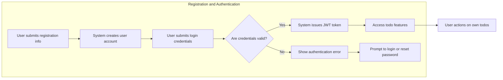

# User Actors and Permissions

## User Roles

| Actor Name | Description |
|------------|-------------|
| user       | A registered individual who can authenticate via API, create, read, update, and delete their own todos. No access to other users' data or administrative features. |

- WHEN an individual registers, THE system SHALL create a 'user' account capable of authenticated access to all permitted operations.
- THE 'user' SHALL be limited to operations on their own data only.
- THE 'user' SHALL NOT access, view, edit, or delete any data belonging to other users.
- THE system SHALL maintain strict data ownership boundaries and guarantee data isolation at all times.
- THE system SHALL NOT expose administrative or non-user roles.
- THE system SHALL enforce a single user actor model for all application features.

## Authentication Flows

### Registration and Login

- WHEN a person provides all required registration information, THEN THE system SHALL create a new account and allow the person immediate access to authentication.
- WHEN a 'user' provides valid login credentials, THEN THE system SHALL issue a session token (JWT) valid strictly for that user.
- WHEN a 'user' logs out, THEN THE system SHALL revoke the current session token and block further access until relogin.
- IF authentication fails, THEN THE system SHALL present a clear, actionable business error, without exposing security implementation details.
- WHEN a 'user' requests password reset, THE system SHALL verify identity using secure business-approved verification (such as email code) and allow reset only for the requesting account.
- WHEN a 'user' has token expiry (30 minutes for short-lived access, 7 days for refresh), THE system SHALL require re-authentication before allowing any protected action.
- WHEN email verification is enabled according to requirements, THE system SHALL only allow access to protected features after successful verification.

- WHEN a login session expires or is manually revoked, THEN THE system SHALL deny all API actions until the 'user' logs in again.
- IF any API request is made without valid authentication, THEN THE system SHALL reject the request and respond with a standard business error.

### Supported Authentication Business Rules

- THE system SHALL use JSON Web Tokens (JWT) for user authentication and session validation.
- Tokens SHALL contain userId, issuedAt, expiry, and user role claims relevant to "user" actor.
- All tokens SHALL be validated before any protected API operation.
- WHEN a session is expired or revoked, THE system SHALL force full re-authentication for continued access.

## Permission Matrix

| Action                              | user |
|-------------------------------------|------|
| Register (create account)           | ✅   |
| Login                               | ✅   |
| Logout                              | ✅   |
| Create own todo                     | ✅   |
| View list of own todos              | ✅   |
| Edit own todo                       | ✅   |
| Delete own todo                     | ✅   |
| View/edit/delete other's todos      | ❌   |
| Reset password                      | ✅   |
| Change email/password               | ✅   |
| Perform admin/system actions        | ❌   |
| Access without authentication       | ❌   |

- FOR all user-facing actions, THE system SHALL enforce permissions as outlined in the matrix above.
- IF a user attempts to bypass access restrictions, THEN THE system SHALL deny the action, return an appropriate business error, and log the violation for compliance.
- THE system SHALL NOT permit escalation of privileges nor lateral data access under any circumstance.
- THE system SHALL always default to "deny" if an action is not explicitly allowed to the "user" role.

## Security Considerations

- WHEN issuing session tokens, THE system SHALL use secure lifecycle management, including expiration and rotation for JWT tokens.
- THE system SHALL ensure that a "user" can never access data, metadata, or any information belonging to other users.
- IF any unauthorized access attempt is detected, THEN THE system SHALL log the attempt and provide only generic error feedback, never exposing sensitive data or details of other accounts.
- WHEN a session expires or revocation occurs, THE system SHALL invalidate the token and require the user to re-authenticate.
- WHEN password reset or recovery is initiated, THE system SHALL ensure full verification of ownership before making account changes.
- THE system SHALL log all permission violations and support business audit requirements.
- THE system SHALL NOT expose resource existence, details, or ownership metadata of other accounts in any error, API, or business message.

---

All requirements specified here are written in business-oriented language, free from implementation or technical/database-specific details. This document provides the full requirements for user actors, authentication flows, and permission enforcement for the backend of the Todo List Service. For technical API, validation, or schema details, refer to the relevant implementation guides.