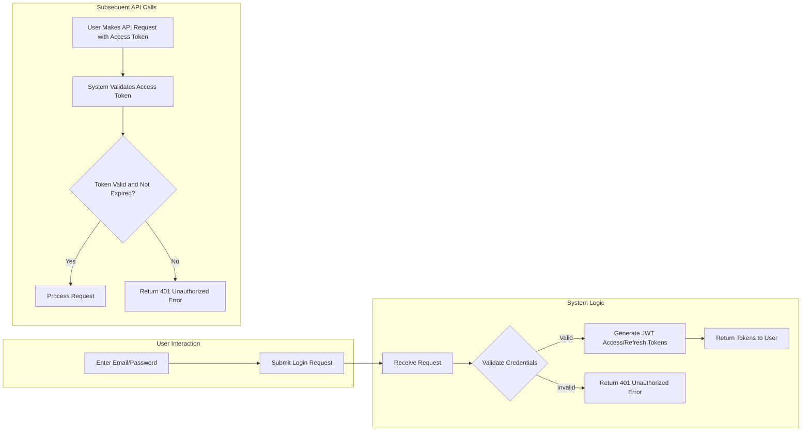

# 03. User Actors, Authentication, and Authorization

This document defines the user actors for the todoList application, their associated permissions, and the requirements for authentication and authorization. It serves as a comprehensive guide for implementing a secure access control model based on clear business rules.

## Actor Definitions

An "actor" represents a type of user that interacts with the system, defined by their roles and permissions. To align with the project's core value of simplicity, the todoList application is designed around a single, primary actor.

-   **`user` (Member)**: The sole actor in the system. This actor represents any individual who has registered for an account to create and manage their personal to-do items.

There are no administrative, moderator, or other privileged roles within the scope of this application. All security policies and business logic are centered around the `user` actor, ensuring that the system remains focused on personal task management.

## User Actor: `user` (Member)

### Description and Role

The `user` is the central figure in the application. Each `user` owns a private, personal workspace to manage their tasks. The system must guarantee that a user's data is completely isolated and accessible only to them. The primary role of the `user` is to perform Create, Read, Update, and Delete (CRUD) operations on their own to-do items.

### Core Permissions

An authenticated `user` has the following permissions, which are strictly limited to the to-do items they own:

-   **Create Todos**: THE system SHALL allow an authenticated `user` to create new to-do items for their own list.
-   **Read Todos**: THE system SHALL allow an authenticated `user` to view the full list of their own to-do items.
-   **Update Todos**: THE system SHALL allow an authenticated `user` to modify the content and status of their own to-do items.
-   **Delete Todos**: THE system SHALL allow an authenticated `user` to permanently remove to-do items from their own list.

Crucially, a `user` has **no permission** to view or interact with the to-do items of any other `user` under any circumstances.

## Authentication and Authorization Requirements

Authentication is the process of verifying a user's identity, while authorization is the process of granting them permission to perform actions. The system must implement robust and secure mechanisms for both.

### Authentication and Session Management

The system will provide a standard email and password-based authentication mechanism. The flow is visualized below.

**Flow Description:**
1.  **User Registration**: A new user creates an account with a unique email and password.
2.  **User Login**: A registered user submits their credentials. The system validates them.
3.  **Token Issuance**: Upon successful validation, the system generates and returns a short-lived Access Token and a long-lived Refresh Token.
4.  **Authenticated Access**: The client application stores these tokens and sends the Access Token in the header of all subsequent API requests to prove the user's identity.
5.  **Token Validation**: The system validates the Access Token on every request to a protected endpoint before processing it.
6.  **Logout**: The client discards the tokens to end the session.

### Token-Based Session Management (JWT)

To manage user sessions securely and scalably, the system will use JSON Web Tokens (JWT).

-   **Access Token**: A short-lived token (e.g., expires in 15 minutes) sent with every API request to authorize the user. Its payload is critical for the authorization logic.
    -   THE system SHALL issue an Access Token containing a payload with at least the user's unique identifier (`userId`).
    -   Example Payload: `{ "userId": "c4a7f3d8-2a1e-4b8a-9d9f-3e3e3e3e3e3e", "type": "access", "iat": 1672531200, "exp": 1672532100 }`
-   **Refresh Token**: A long-lived token (e.g., expires in 7 days) used exclusively to obtain a new Access Token when the current one expires. This allows a user to remain logged in for an extended period without re-entering their credentials.
    -   THE system SHALL provide a secure endpoint for renewing an Access Token using a valid Refresh Token.
    -   THE system SHALL securely store or manage Refresh Tokens to prevent misuse.

### Authorization and Data Ownership

Authorization rules are the core of the application's security, ensuring that users can only access their own data. The central rule is strict data ownership.

-   **EARS-AUTH-1 (Unauthenticated Access)**: WHEN an unauthenticated user attempts to access any resource other than the public registration or login endpoints, THEN THE system SHALL reject the request with a `401 Unauthorized` error.
-   **EARS-AUTH-2 (Authenticated Access)**: THE system SHALL protect all endpoints related to to-do management (create, read, update, delete) to ensure only authenticated users can access them.
-   **EARS-AUTH-3 (Data Ownership)**: IF a user provides a valid Access Token, THEN THE system SHALL only permit actions (create, read, update, delete) on to-do items that are owned by the `userId` contained within that token.
-   **EARS-AUTH-4 (Cross-User Access Prevention)**: IF an authenticated user attempts to read, update, or delete a to-do item belonging to another user, THEN THE system SHALL reject the request with a `404 Not Found` error. This is a critical security measure to avoid confirming the existence of a resource to an unauthorized party.
-   **EARS-AUTH-5 (Full Access to Own Data)**: WHILE a user is authenticated, THE system SHALL grant them full CRUD access to their own to-do items.

## User Permission Matrix

The following table summarizes the permissions for the `user` actor and serves as a definitive guide for implementing access control logic.

| Feature / Action | Target Resource | Allowed for an Authenticated `user`? | System Response for Unauthorized Attempt |
| :--- | :--- | :---: | :--- |
| **Authentication** | | |
| Register an Account | `N/A` | ✅ | `N/A (Public)` |
| Log in to Account | `N/A` | ✅ | `N/A (Public)` |
| Log out of Account | `User's own session` | ✅ | `401 Unauthorized` |
| Renew Access Token | `User's own refresh token` | ✅ | `401 Unauthorized` |
| **Todo Management** | | |
| Create a New Todo Item | `User's own account` | ✅ | `401 Unauthorized` |
| Read List of Todos | `User's own todos` | ✅ | `401 Unauthorized` |
| Read a Single Todo | `User's own todo` | ✅ | `401 Unauthorized` |
| Update a Todo | `User's own todo` | ✅ | `401 Unauthorized` |
| Delete a Todo | `User's own todo` | ✅ | `401 Unauthorized` |
| **Cross-User Actions** | | |
| Read another user's todos | `Another user's resource` | ❌ | `404 Not Found` |
| Update another user's todo | `Another user's resource` | ❌ | `404 Not Found` |
| Delete another user's todo | `Another user's resource` | ❌ | `404 Not Found` |
