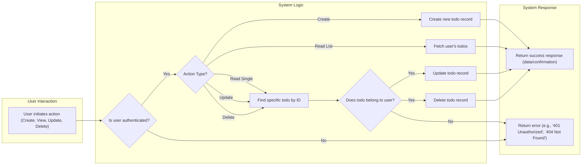

# 04. Functional Requirements: Todo Management

This document outlines the specific functional requirements for managing to-do items (hereafter referred to as "todos") in the `todoList` application. It covers the core Create, Read, Update, and Delete (CRUD) operations available to a `user`.

## General Requirements

All todo management operations are governed by the following system-wide rules:

*   **EARS-TODO-01 (Ubiquitous):** THE system SHALL ensure that all operations described in this document are only accessible to an authenticated `user`.
*   **EARS-TODO-02 (Ubiquitous):** THE system SHALL enforce strict data ownership, ensuring a `user` can only perform actions on todos that are associated with their own account.

### Todo Management Workflow

The following diagram illustrates the high-level process flow for any todo management action initiated by a `user`.

## Creating a Todo

This section details the requirements for a `user` to add a new todo to their list.

*   **EARS-TODO-03 (Event-driven):** WHEN a `user` submits a request to create a new todo, THE system SHALL require the request to contain a non-empty `title` string with a maximum length of 255 characters.
*   **EARS-TODO-04 (Unwanted Behavior):** IF a request to create a todo has a missing, empty, or whitespace-only `title`, THEN THE system SHALL reject the request and return an "Invalid Input" error.
*   **EARS-TODO-05 (Event-driven):** WHEN a todo is successfully created, THE system SHALL associate it with the unique identifier of the authenticated `user` who made the request.
*   **EARS-TODO-06 (Event-driven):** WHEN a new todo is created, THE system SHALL automatically assign it a default `status` of "incomplete". Status management is further detailed in [Functional Requirements: Status Management](./05-functional-requirements-status.md).
*   **EARS-TODO-07 (Event-driven):** WHEN a todo is successfully created, THE system SHALL return the complete data object for the newly created to-do, including its system-generated unique ID, title, and default status.

## Reading/Viewing Todos

This section covers the requirements for a `user` to retrieve and view their todos.

*   **EARS-TODO-08 (Event-driven):** WHEN a `user` requests their list of todos, THE system SHALL return an array of all todo objects associated with that `user`'s account, sorted by creation date in descending order (newest first).
*   **EARS-TODO-09 (Event-driven):** WHEN a `user` requests to view a single todo by its unique identifier, THE system SHALL first verify that the todo belongs to that `user` before returning the complete todo data object.
*   **EARS-TODO-10 (Unwanted Behavior):** IF a `user` requests to view a single todo using an identifier that does not exist in the system, THEN THE system SHALL return a "Not Found" error.
*   **EARS-TODO-11 (Unwanted Behavior):** IF a `user` requests to view a single todo that belongs to another `user`, THEN THE system SHALL respond with a "Not Found" error, treating the item as if it does not exist for the requesting user to avoid data leakage.

## Updating a Todo

This section describes the requirements for a `user` to modify an existing todo. This concerns changes to the `title`. For status changes, see the separate status management document.

*   **EARS-TODO-12 (Event-driven):** WHEN a `user` requests to update a todo, THE system SHALL require the unique identifier of the target todo and a new `title`.
*   **EARS-TODO-13 (Event-driven):** WHEN a `user` requests to update a todo's `title`, THE system SHALL validate that the new `title` is a non-empty string with a maximum length of 255 characters.
*   **EARS-TODO-14 (Unwanted Behavior):** IF a `user` attempts to update a todo with an empty or invalid `title`, THEN THE system SHALL reject the request and return an "Invalid Input" error.
*   **EARS-TODO-15 (Unwanted Behavior):** IF a `user` attempts to update a todo using an identifier that does not exist, THEN THE system SHALL return a "Not Found" error.
*   **EARS-TODO-16 (Unwanted Behavior):** IF a `user` attempts to update a todo that belongs to another `user`, THEN THE system SHALL deny the request and return a "Not Found" error.
*   **EARS-TODO-17 (Event-driven):** WHEN a todo's `title` is successfully updated, THE system SHALL return the complete, updated data object for that todo.

## Deleting a Todo

This section outlines the requirements for a `user` to permanently remove a todo from their list.

*   **EARS-TODO-18 (Event-driven):** WHEN a `user` requests to delete a todo, THE system SHALL require the unique identifier of the target todo.
*   **EARS-TODO-19 (Unwanted Behavior):** IF a `user` attempts to delete a todo using an identifier that does not exist, THEN THE system SHALL return a "Not Found" error.
*   **EARS-TODO-20 (Unwanted Behavior):** IF a `user` attempts to delete a todo that belongs to another `user`, THEN THE system SHALL deny the request and return a "Not Found" error.
*   **EARS-TODO-21 (Event-driven):** WHEN a `user` successfully deletes a todo, THE system SHALL permanently remove all data associated with that todo from the database and return a confirmation of successful deletion (e.g., an HTTP 204 No Content response).