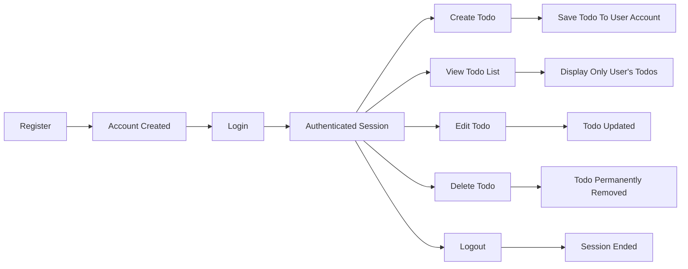

# Minimal Todo List – Requirements Document

## 1. Introduction
A Todo List application enables end users to capture, track, and manage their personal tasks in a digital environment. The core application objective is to deliver an extremely simple, secure, and private todo tracking backend as a foundation for early product validation and learning. Business goals for this MVP are: enable individual users to retain sole access over their tasks; keep data segregated; require minimal learning curve; deliver a fast, reliable API.

## 2. Actors
- **User**: An individual who registers and uses the Todo application. Owns all data created. Responsible for managing their own account, authentication, and personal todos. No administrative or shared roles exist in this MVP.

## 3. User Requirements (EARS Format)
- THE system SHALL allow a new user to register with a valid email and password, providing a unique account for todo management.
- THE system SHALL require users to authenticate (login) before allowing access to any todo features. 
- WHEN a user forgets their password, THE system SHALL provide a secure password reset workflow via email.
- WHEN a user is authenticated, THE system SHALL issue a secure, single-user session for that account.
- WHEN a user logs out, THE system SHALL close the session and revoke access to all protected todo APIs until re-authentication.
- THE system SHALL allow authenticated users to create todos containing a mandatory title and an optional description.
- WHEN a todo is created, THE system SHALL assign it a unique identifier, associate it to the creating user, and store a creation timestamp.
- WHEN a user views or lists todos, THE system SHALL only return todos belonging to that user, ordered chronologically, and indicate completion status (complete/incomplete) clearly.
- WHEN a user requests details for a todo by identifier, THE system SHALL only return the todo if it was created by that user.
- WHEN a user edits a todo, THE system SHALL permit updating the title, description, and completion status.
- WHEN a user deletes a todo, THE system SHALL immediately and permanently remove it from that user's todo list.
- IF a user attempts to view, modify, or delete any todo that does not belong to them, THEN THE system SHALL deny access and provide a clear error message.
- THE system SHALL guarantee that todos are only accessible, visible, or modifiable by the creating (authenticated) user under all circumstances.
- WHEN a user account is deleted, THE system SHALL permanently remove all todos associated with that user account.
- IF a user requests an export of their data, THEN THE system SHALL provide their complete todo data in a widely-used machine-readable format (JSON or CSV). 

## 4. Functional Minimum Scope
- Feature set is limited strictly to single-user CRUD (Create/Read/Update/Delete) management of todos.
- All authentication uses email/password pair only. No social logins, multi-user teams, or third-party auth.
- Only simple, flat todos allowed—no nested, recurring, reoccurring, scheduled, or tagged todos.
- No attachments or media permitted in todos for MVP.
- All todo data is private and isolated to the authenticated user.
- Application language is English only; internationalization is not supported in MVP.
- All features require live network connection; offline operations are out of scope for MVP.

## 5. User Journeys & Workflows

### Account Creation and Authentication
1. User supplies email and password to register.
2. App validates credentials and creates user record.
3. User logs in with registered credentials.
4. Authenticated session is established (single user context).

### Todo Management
1. User creates a new todo (title is required, description optional).
2. System stores todo with user id and timestamp and sets status to "incomplete."
3. User views their todo list—system returns only their todos, with clear status labels.
4. User edits a todo (system checks ownership, permits editing fields or completion status).
5. User deletes a todo (system permanently removes if owned by user).

### Logout & Data Export
1. User logs out—system closes session, requires login for any future action.
2. User may request export of their todos—system delivers all entries in JSON or CSV file.

#### Visual Workflow (Mermaid)

## 6. Non-functional Requirements
- THE system SHALL respond to todo-related API requests within 1 second for up to 100 users concurrently under typical load.
- THE system SHALL achieve at least 99.9% uptime during declared service hours.
- THE system SHALL securely hash all stored passwords and never store raw or plain text credentials.
- THE system SHALL use encrypted communications (e.g., HTTPS) for all API traffic.
- THE system SHALL never expose tokens or confidential user data to any party except the authenticated owner.
- IF a user attempts brute-force authentication or excessive requests, THEN THE system SHALL apply rate limiting and lockout as appropriate.
- THE system SHALL support future capacity scaling to accommodate more users with no data loss or access issues.

## 7. Out of Scope
- No multi-user or collaborative todo features (no sharing or delegating).
- No recurring, scheduled, or notification-enabled todos in MVP.
- No tagging, categorization, or prioritization.
- No advanced metadata, reminders, push notifications, or attachments.
- No mobile/offline support or multi-language UI.

## 8. Assumptions & Constraints
- Each user is uniquely identified by validated email.
- Data is user-isolated—no shared/global tasks.
- Only email/password authentication implemented initially.
- All business requirements are mandatory; exceptions are never permitted in MVP.

## 9. Glossary
- **MVP**: Minimum Viable Product – earliest version supporting only must-have features
- **Todo**: A single actionable item or note entered by the user
- **Authenticated User**: A user who has successfully provided credentials and has a current session
- **CRUD**: Create, Read, Update, Delete – basic operations for resources
- **Session**: Server-side authentication context established upon login, terminated upon logout or expiration