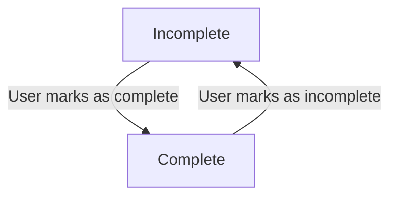

# 05. Functional Requirements: Status Management

## 1. Introduction

The status of a to-do item is a core concept in the `todoList` application, representing a user's progress on a task. This document specifies the functional requirements for managing these statuses, the transitions between them, and how they affect data visibility and retrieval. The logic defined here is critical for the primary user experience of tracking and completing tasks.

All requirements apply to an authenticated `user` and are strictly scoped to the to-do items they own, in line with the data isolation principles defined in the [Security and Data Privacy](./10-security-and-data-privacy.md) document.

## 2. Todo Status Model

A to-do item can exist in one of two distinct states: **Incomplete** or **Complete**. The system must enforce this model to ensure data consistency.

-   **Incomplete**: The default state for any newly created to-do item. It signifies a task that is pending and requires action.
-   **Complete**: A state indicating the user has finished the task.

**FR-S-01 (Ubiquitous):** THE system SHALL assign a default status of "Incomplete" to every new to-do item upon its creation.

The following diagram illustrates the lifecycle of a to-do item's status:

## 3. Marking a Todo as Complete

This section defines the requirements for transitioning a to-do item from "Incomplete" to "Complete".

**FR-S-02 (Event-driven):** WHEN a `user` requests to mark a to-do item as complete, THE system SHALL update the status of that specific to-do item to "Complete".

**FR-S-03 (State-driven):** WHILE a to-do item's status is "Complete", THE system SHALL record and store a `completed_at` timestamp indicating when it was completed.

**FR-S-04 (Unwanted Behavior):** IF a `user` requests to mark a to-do item as complete, but the specified to-do item does not exist, THEN THE system SHALL return a "Not Found" error, as detailed in the [Error Handling Scenarios](./08-error-handling.md).

**FR-S-05 (Unwanted Behavior):** IF a `user` attempts to mark a to-do item as complete that belongs to another user, THEN THE system SHALL return a "Forbidden" error, enforcing the data ownership rules from the [User Actors and Permissions](./03-user-actors.md) document.

**FR-S-06 (State-driven):** IF a to-do item's status is already "Complete" and a request is made to mark it as complete, THEN THE system SHALL take no action and return a success response confirming the existing state.

## 4. Marking a Todo as Incomplete

This section defines the requirements for reverting a "Complete" to-do item back to the "Incomplete" state.

**FR-S-07 (Event-driven):** WHEN a `user` requests to mark a to-do item as incomplete, THE system SHALL update the status of that specific to-do item to "Incomplete".

**FR-S-08 (State-driven):** WHEN a to-do item's status is changed to "Incomplete", THE system SHALL clear the `completed_at` timestamp by setting its value to `null`.

**FR-S-09 (Unwanted Behavior):** IF a `user` requests to mark a to-do item as incomplete, but the specified to-do item does not exist, THEN THE system SHALL return a "Not Found" error.

**FR-S-10 (Unwanted Behavior):** IF a `user` attempts to mark a to-do item as incomplete that belongs to another user, THEN THE system SHALL return a "Forbidden" error.

**FR-S-11 (State-driven):** IF a to-do item's status is already "Incomplete" and a request is made to mark it as incomplete, THEN THE system SHALL take no action and return a success response confirming the existing state.

## 5. Viewing Todos by Status

To provide an organized and focused user experience, the system must support filtering the list of to-do items based on their status.

**FR-S-12 (Event-driven):** WHEN a `user` requests their list of to-do items, THE system SHALL provide an optional query parameter (e.g., `status`) to filter the results.

**FR-S-13 (State-driven):** WHERE the `user` provides a `status` filter of "Complete", THE system SHALL return only the to-do items belonging to that `user` that are marked as "Complete".

**FR-S-14 (State-driven):** WHERE the `user` provides a `status` filter of "Incomplete", THE system SHALL return only the to-do items belonging to that `user` that are marked as "Incomplete".

**FR-S-15 (State-driven):** WHERE the `user` does not provide a `status` filter, or provides a value of "All", THE system SHALL return all to-do items belonging to that `user`, regardless of their status.
