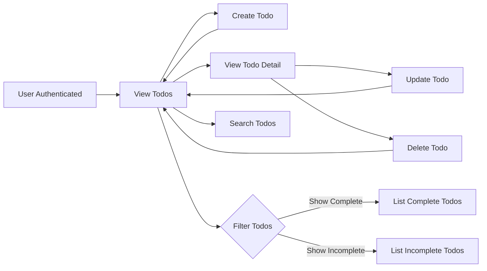

# Functional Requirements - Todo List Application

## Introduction
The Todo list application enables a registered user to create, view, update, and delete their own personal todo items. The following business requirements MUST be adhered to when implementing the backend. All requirements use the EARS (Easy Approach to Requirements Syntax) format, focus on clearly defined user actions, data scopes, and business rules. No feature beyond individual todo management is included; there is no administration or data sharing. All technical design and implementation specifics are left to the backend development team, provided the business rules are satisfied in full. 

---

## 1. Todo Management

### 1.1. Creating Todos
- WHEN a user is authenticated and submits a new todo, THE system SHALL allow the user to create a new todo entry tied to their account.
- THE system SHALL require that each todo has a non-empty "title" field and the length must not exceed 255 characters.
- THE system SHALL, optionally, accept a "description" field for a todo, with a maximum length of 1000 characters.
- THE system SHALL assign the new todo an "incomplete" status as a default upon creation.
- IF a user attempts to create a todo with invalid or empty fields, THEN THE system SHALL return a clear validation error message and prevent creation.

### 1.2. Viewing Todos
- WHEN a user is authenticated, THE system SHALL allow the user to retrieve a list of their todos in reverse-chronological order (recently created first).
- WHEN authenticated, THE user SHALL be able to view the details of any todo they own, but NOT any todo created by another user.
- IF a user is not authenticated, THEN THE system SHALL prohibit all access to todo data endpoints.

### 1.3. Updating Todos
- WHEN a user is authenticated and requests changes to a todo they own, THE system SHALL allow updates to "title", "description", and "completion status" fields.
- THE system SHALL prohibit updates to todos not owned by the authenticated user and return an explicit unauthorized error message.
- THE system SHALL record the timestamp of any update on a todo entry.

### 1.4. Deleting Todos
- WHEN a user is authenticated and requests deletion of one of their todos, THE system SHALL permanently remove the todo and make it inaccessible to anyone, including the user.
- THE system SHALL reject any attempts to delete a todo belonging to another user and return an unauthorized access error.

### 1.5. Completion and Status
- WHEN a user marks a todo as complete, THE system SHALL update the completion status and timestamp of completion.
- Completed todos SHALL remain visible in the user's todo list until deleted.
- THE system SHALL allow users to set a todo's status back to incomplete.

### 1.6. Listing and Searching
- THE system SHALL list all todos for the authenticated user, with optional filtering by status ("complete", "incomplete").
- THE system SHALL enable basic text search confined to the authenticated user's own todos by "title" or "description".

### 1.7. Limiting User Data
- THE system SHALL enforce a hard maximum of 1000 todos per user; IF a user requests creation of a new todo beyond this limit, THEN THE system SHALL return an error indicating the limit is reached and deny the creation.

---

## 2. Authentication Requirements

### 2.1. Access Control
- THE system SHALL demand valid authentication for any todo functionality. No unauthenticated access, listing, or data retrieval is permitted.
- IF any endpoint is accessed without a valid session or token, THEN THE system SHALL deny the request and return an authentication-required error message.

### 2.2. Actor Scope
- THE only actor in the system SHALL be the registered user; there are no administrative users, shared data, or public access.
- IF anyone attempts unauthenticated or anonymous use of any todo function, THEN THE system SHALL prohibit access.

### 2.3. Session and Security
- EACH action (create, read, update, delete) SHALL be permitted only in an authenticated user session context.
- IF a user's authentication session is expired or invalid, THEN THE system SHALL deny access to all todo functions.

---

## 3. Data Ownership

### 3.1. Strict Ownership
- WHILE authenticated, THE system SHALL restrict visibility and all CRUD operations to todos belonging to the logged-in user only.
- IF a user attempts to access or modify another user's todo, THEN THE system SHALL return a clear not-authorized error and SHOULD log such events for audit purposes.

### 3.2. Privacy and Isolation
- THE system SHALL offer zero support for shared, collaborative, or public todos; all user data is strictly private.

---

## 4. Validation and Business Rules

### 4.1. Title and Description Constraints
- THE system SHALL return a validation error if a "title" is empty, missing, or longer than 255 characters.
- "Description" fields over 1000 characters SHALL be rejected at creation or update, with a clear error message to the user.

### 4.2. Completion Status Rules
- THE system SHALL accept only two valid status values for todos: "complete" or "incomplete".
- IF any other status value is provided, THEN THE system SHALL reject the request and return a clear error.

### 4.3. Data Integrity Practices
- EVERY input field SHALL be validated for data type, length, and content (protection against XSS, SQLi-like inputs, or malformed data).
- THE system SHALL present user-facing validation error messages for malformed or malicious inputs.

### 4.4. Optional Rate Limiting
- IF a user exceeds 60 todo-modifying actions (create, update, delete) within a 1-minute window, THEN THE system SHALL temporarily block further modifying actions until the window passes and return a rate-limiting error.

---

## 5. Success Metrics

### 5.1. Performance
- THE system SHALL respond to any authenticated todo request within 1 second under regular conditions (ignoring rate limiting or system-level failures).

### 5.2. Reliability
- THE system SHALL guarantee at least 99.5% uptime monthly for todo functions.

### 5.3. Data Consistency
- AFTER any create, update, or delete action, list and detail views SHALL reflect the changed state immediately for the authenticated user, i.e., with no visible lag.

---

## 6. Mermaid Diagram: User Todo Flow

---

## Implementation Autonomy
> *Developer Note: This requirement document explicitly describes only business and functional requirements. All technical architecture, API, or database decisions belong to the backend engineering team and must satisfy the requirements stated here.*
