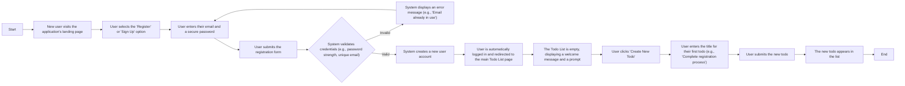
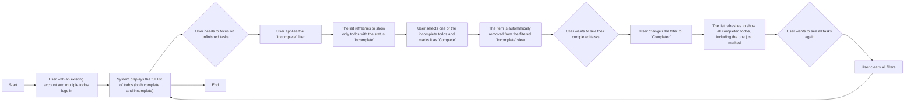

```mermaid
graph LR
    A["Start"] --> B["User logs into the application"];
    B --> C["System displays the main Todo List page"];
    C --> D{"Is the list empty?"};
    D -->|"Yes"| E["User clicks 'Create New Todo'"];
    D -->|"No"| F["User views existing todos"];
    F --> E;
    E --> G["User enters a title and description for the new todo"];
    G --> H["User submits the new todo"];
    H --> I["System saves the todo and refreshes the list"];
    I --> J["User views the updated list with the new item (marked 'Incomplete')"];
    J --> K["User selects the todo to edit"];
    K --> L["User modifies the todo's title or description"];
    L --> M["User saves the changes"];
    M --> N["System updates the todo and refreshes the list"];
    N --> O["User views the updated list with the modified item"];
    O --> P["User clicks the checkbox to mark the todo as 'Complete'"];
    P --> Q["System updates the todo's status and refreshes the list"];
    Q --> R["User views the list with the item now marked as 'Complete'"];
    R --> S["User clicks the 'Delete' button for the completed todo"];
    S --> T["System permanently removes the todo"];
    T --> U["User views the final list without the deleted item"];
    U --> V["End"];
```

# 06. User Scenarios

This document illustrates the primary user workflows within the Todo List application from the end-user's perspective. The scenarios provide a narrative context for the functional requirements, guiding developers on the intended interaction patterns and business logic.

## Primary User Scenario: Full Todo Lifecycle

This scenario covers the complete journey of a single to-do item, from creation to deletion, for a registered and authenticated `user`. It demonstrates the core CRUD (Create, Read, Update, Delete) operations that form the foundation of the application.

### Workflow Diagram

### Step-by-Step Description

1.  **Login and Access**: A registered `user`, Jane, needs to organize her day. She opens the application and enters her credentials to log in.
2.  **View Initial List**: The system authenticates Jane and displays her personal to-do list. Today is her first time using the app after registering, so the list is empty. She sees a welcoming message prompting her to create her first task.
3.  **Create a New Todo**: Jane decides to add her first task. She clicks the 'Create New Todo' button and provides a clear, actionable title: "Draft project proposal". She also adds an optional description: "Include Q4 projections and competitor analysis."
4.  **Submit and Confirm**: Upon submitting the form, the system validates the input according to the defined [Business Rules](./07-business-rules.md). The new to-do item instantly appears in her list, clearly marked with an "Incomplete" status. This confirms the task has been successfully created as detailed in the [Todo Management Requirements](./04-functional-requirements-todos.md).
5.  **Update an Existing Todo**: Later, Jane realizes the proposal also needs a budget section. She finds the "Draft project proposal" todo in her list and selects the option to edit it. She modifies the description to add "Include Q4 projections, competitor analysis, and budget outline."
6.  **Save and Verify Changes**: After saving her changes, the system updates the item. The list immediately reflects the modified description, confirming the update was successful.
7.  **Mark as Complete**: After several hours of work, Jane finishes the proposal. She navigates back to her to-do list, finds the item, and clicks the checkbox to mark it as "Complete". The system updates the item's status, and it is now visually distinguished as a completed task (e.g., with a strikethrough), providing a sense of accomplishment. This status change is governed by the [Status Management Requirements](./05-functional-requirements-status.md).
8.  **Delete for Tidiness**: To keep her active to-do list clean and focused on pending tasks, Jane decides to remove the completed item. She selects the delete option for the "Draft project proposal" todo.
9.  **Confirm Permanent Deletion**: The system permanently removes the to-do item from her list. The UI updates instantly, and her list now only shows remaining tasks, leaving her with a clear view of what's next.

## Scenario: User Registration and First Todo

This scenario outlines the journey of a new `user` from discovering the service to creating their very first to-do item.

### Workflow Diagram

### Step-by-Step Description

1.  **Initiate Registration**: A new user, Mark, finds the application and decides to sign up for a simple, no-frills to-do service.
2.  **Provide Credentials**: Mark enters his email address and chooses a strong password, following the validation rules specified in the [Security and Data Privacy](./10-security-and-data-privacy.md) document.
3.  **Submit Registration**: He submits the registration form.
4.  **System Validation**: The backend system immediately checks if the email is unique and if the password meets the required security criteria.
5.  **Account Creation**: Upon successful validation, the system creates a new `user` account for Mark and securely hashes his password.
6.  **First Login Experience**: Mark is automatically logged into the application and redirected to the main dashboard, which presents him with an empty to-do list. A clear message welcomes him and encourages him to create his first task.
7.  **Create First Todo**: Following the prompt, Mark decides to create his first to-do item: "Finish setting up my new account".
8.  **Confirmation of Action**: The task instantly appears on his list, confirming that he is now an active `user` ready to leverage the full functionality of the application.

## Alternative Scenario: Managing Multiple Todos

This scenario describes how a `user` interacts with the application when they have multiple to-do items with different statuses. It focuses on viewing and filtering the list to manage their tasks effectively.

### Workflow Diagram

### Step-by-Step Description

1.  **Login to a Populated List**: An existing `user`, Sarah, logs into her account. She has been using the app for a few weeks and has a list of several to-do items, a mix of both completed and pending tasks.
2.  **View Full List**: The system displays all of Sarah's to-do items, typically sorted with the newest first. The visual clutter of completed tasks makes it hard to see what she needs to do next.
3.  **Filter for Focus**: To reduce cognitive load and focus only on what's pending, Sarah uses a filter control to view only "Incomplete" items.
4.  **View Focused List**: The list immediately updates, hiding all the completed tasks and showing only the active ones. This gives her a clear, actionable view.
5.  **Complete a Task from Filtered View**: Sarah completes one of the tasks from this filtered list—"Reply to client email"—and marks it as "Complete."
6.  **Automatic List Update**: As soon as the item is marked as complete, it dynamically disappears from her "Incomplete" view, as it no longer matches the active filter. This provides immediate, satisfying feedback.
7.  **Review Accomplishments**: Curious about her progress, Sarah changes the filter to "Completed."
8.  **View Completed Items**: The list now displays all her completed items, including the one she just marked off, giving her a sense of accomplishment.
9.  **Return to Full View**: Finally, Sarah removes all filters to see her entire list of tasks again, both pending and completed.