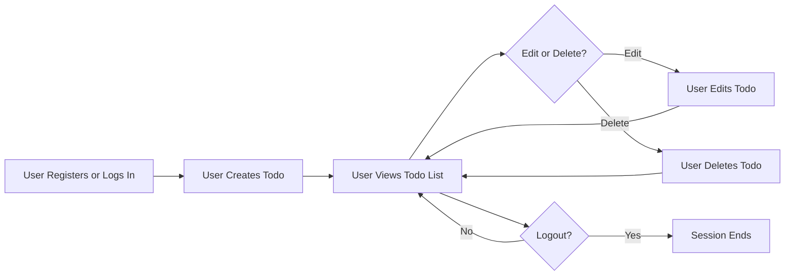

# Todo List Application Requirements - User Stories, Scenarios & Acceptance Criteria

## Typical User Journeys

### User Registration and Authentication
- WHEN a visitor accesses the service for the first time, THE system SHALL provide the option to register using a unique email and secure password.
- WHEN a new user provides a unique email and a password that meets security constraints (minimum 8 characters, contains letters and numbers), THE system SHALL create a new user account and establish an authenticated session.
- WHEN a user provides credentials during login, THE system SHALL authenticate the user and establish a secure session.
- WHEN a user logs out, THE system SHALL immediately terminate the session and require full re-authentication for any protected action.

### Todo Management (CRUD)
- WHEN a logged-in user requests to create a new todo, THE system SHALL require task content and add the new todo to the user's own todo list.
- WHEN a user retrieves the todo list, THE system SHALL return all todo items owned by the user, supporting sorting by most recent or completion status.
- WHEN a user edits a todo, THE system SHALL permit modifications to the task content and allow marking the task as completed or uncompleted.
- WHEN a user deletes a todo, THE system SHALL permanently remove the todo item from the user's list.
- THE system SHALL prohibit users from viewing, modifying, or deleting any todo item not owned by them.

### Session Resumption and Data Protection
- WHEN a user revisits the application with an active authentication session, THE system SHALL restore the session and display that user's todo list.
- IF a user's session is missing or expired, THEN THE system SHALL require full re-authentication to access any personal todos.
- THE system SHALL guarantee that NO user's data is ever accessible by another user under any conditions.

### Example Workflow Diagram

## Edge Cases

### Duplicate or Invalid Registration
- IF registration uses an already existing email, THEN THE system SHALL reject the attempt and display a duplication error.
- IF a registration uses a weak password (less than 8 chars, missing letters/numbers), THEN THE system SHALL reject the registration explaining required constraints.

### Unauthorized Access Attempts
- IF a user attempts to access or manipulate another user's todo by any method, THEN THE system SHALL deny the access and return an explicit error message.
- IF an unauthenticated user attempts to use any todo API, THEN THE system SHALL require authentication and return an unauthorized error until logged in.

### Data Integrity and Validation
- WHEN creating or editing a todo, THE system SHALL validate that the content is non-empty and not greater than 255 characters in length. IF not, THEN THE request SHALL be rejected with a validation error specifying allowed constraints.
- WHEN a user attempts to update or delete a todo that does not exist or has already been deleted, THE system SHALL return a clear error message specifying that the item is not found.

### Session and Token Edge Cases
- IF a user's authentication session has become invalid or expired, THEN THE system SHALL require re-authentication before any further protected action.
- IF a session token is malformed, revoked, or does not match a valid user, THEN THE system SHALL deny access to all todo resources and give an authentication error.

### Data Consistency During Rapid Changes
- IF a user submits multiple changes to a single todo in rapid succession, THEN THE system SHALL process changes sequentially and guarantee that only the final, coherent state is saved, never storing incomplete or partial changes.

## Acceptance Criteria (EARS-compliant)

### Authentication and Session Management
- WHEN a user registers with unique credentials, THE system SHALL provision an account and establish a session.
- IF a user attempts to register with a duplicate email, THEN THE system SHALL reject registration and supply a duplication error.
- WHEN a correct login is performed, THE system SHALL start an authenticated session.
- IF login uses invalid credentials, THEN THE system SHALL provide an invalid login error.
- WHEN a user logs out, THE system SHALL end the session instantly.
- IF a session or token is expired or invalid, THEN THE system SHALL block endpoint access and request re-authentication.

### Todo CRUD
- WHEN a valid session exists, THE system SHALL allow creation, reading, updating, and deletion of only the user's own todos.
- IF a user tries to access, edit, or delete a todo not owned by them, THEN THE system SHALL return an explicit 'forbidden' error.
- WHEN a todo is created/edited, THE system SHALL enforce 1-255 chars non-empty constraint on content. IF violated, THEN validation error with constraint details SHALL be raised.
- WHEN deleting a todo, THE system SHALL remove only that user's single todo and reply with action success.
- IF the target todo does not exist, THEN a 'not found' error SHALL be supplied.

### Performance, UX, and Internationalization
- WHEN any action (register, login, create, read, update, delete) is attempted, THE system SHALL respond within 2 seconds under normal circumstances.
- THE system SHALL ensure all responses and errors are clearly described and localized to the user's language, including error details and validation failures.
- THE system SHALL guarantee that user actions and data are fully isolated; NO operation by any user can affect data belonging to another.

### Security and Privacy
- THE system SHALL never expose any PII, credentials, or todo data across user boundaries.
- THE system SHALL use secure, expiring tokens and revoke them at logout or when compromised.
- IF suspicious activity or malformed/invalid tokens are detected, THEN THE system SHALL immediately log the event and block access securely.

## Requirements Summary Table

| Requirement                           | EARS Phrase                                                                                             |
|---------------------------------------|--------------------------------------------------------------------------------------------------------|
| Unique registration                   | WHEN a user registers, THE system SHALL not allow duplicate emails                                    |
| Password strength                     | WHEN registering, THE password SHALL be >=8 chars, with letters and numbers                           |
| Authenticated session only for CR*UD  | WHEN authenticated, THE user SHALL CRUD only their own todos                                          |
| Ownership enforcement                 | THE system SHALL deny access to todos not owned by the user                                           |
| Todo validation                       | WHEN creating/editing, content SHALL be 1-255 non-empty chars                                         |
| Fast error handling                   | All errors SHALL be returned within 2 seconds, localized                                              |
| Secure tokens                         | Auth & session tokens SHALL be expiring and invalidated at logout/compromise                          |
| Data isolation                        | All data and actions SHALL be scoped per-user with no cross-user leakage                              |
| Suspicious or invalid token response  | IF suspicious/invalid tokens, THE system SHALL log/block immediately                                  |
| Consistency under concurrency         | Rapid changes SHALL result in only the latest user-consistent todo state                              |

## Permission & Ownership Matrix

| Actor      | Register | Login | Logout | Create Todo | View Own Todos | Edit Own Todo | Delete Own Todo | View/Edit/Delete Other Todos |
|------------|----------|-------|--------|-------------|----------------|---------------|----------------|------------------------------|
| User       | Yes      | Yes   | Yes    | Yes         | Yes            | Yes           | Yes            | No                           |
| Guest      | No       | No    | No     | No          | No             | No            | No             | No                           |

## Security and Privacy Highlights
- All authentication and user data SHALL use secure, encrypted storage and transit
- Session lifetime SHALL be limited and user-driven logout SHALL take effect immediately
- Access to every protected action SHALL strictly require valid authentication
- No action or view SHALL ever expose or suggest the existence of data outside the current account context

## Error Handling and Edge Scenarios
- All error situations SHALL result in actionable, clear, and localized error messages specifying the exact reason and corrective action
- System SHALL never reveal operational or internal details in error messages
- Rate-limiting or suspicious attempts SHALL result in temporary lockout with notification of next allowed action

## Summary

This requirements specification provides all business logic in EARS format and includes user journeys, error handling, CRUD, ownership enforcement, session flows, and minimum performance standards for a minimal, secure, production-grade Todo List application. All requirements are measurable and immediately actionable by backend developers, meeting the standards for thoroughness, clarity, and completeness.