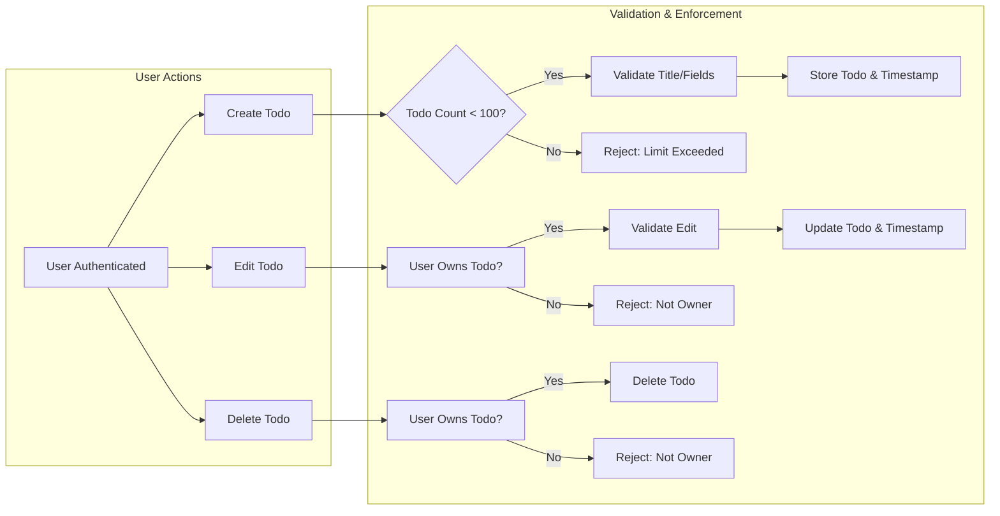

# Todo List Application Requirements Analysis

## Introduction and Purpose
The purpose of this document is to specify natural-language business requirements, business rules, and operational constraints for the Todo List Application, with a focus on absolute minimum functionality necessary for a robust service. This specification is the basis for downstream backend implementation and is written to remove ambiguity for the development team.

## User Actors
- **User**: A registered, authenticated individual who manages their own personal todos.

## Scope and Applicability
These requirements apply exclusively to todo management for individual users, including creation, editing, deletion, viewing, and validation of todo items. All logic is enforced at the API, service, and data layers for every authenticated user.

## Todo Lifecycle
### Creation
- WHEN a user creates a todo, THE system SHALL require authentication and SHALL associate the todo with the authenticated user only.
- WHEN a user submits a new todo, THE system SHALL require a non-empty title and SHALL allow an optional description.
- WHEN a new todo is created, THE system SHALL set its initial completion status to "incomplete" and record the creation timestamp in ISO 8601, UTC.

### Editing
- WHEN a user edits a todo, THE system SHALL require authentication and SHALL only permit editing of their own todos.
- WHEN a user submits an edit, THE system SHALL allow changes only to the fields "title," "description," and "completion status".
- WHEN a todo is edited, THE system SHALL update the last-modified timestamp to the current time in ISO 8601, UTC and SHALL require the title field to remain present and non-empty.

### Deletion
- WHEN a user requests deletion of a todo, THE system SHALL confirm authentication and ownership before removal.
- WHEN deletion is successful, THE system SHALL remove only the specified todo belonging to the authenticated user.
- IF a user attempts to delete a todo not owned by them, THEN THE system SHALL reject this attempt and return an explicit authentication error message.

### Viewing
- WHEN a user requests todo items, THE system SHALL display only todos owned by the authenticated user.

## Business Requirements & Rules (EARS Format)
- WHEN a user is authenticated, THE system SHALL allow creation of todos up to a maximum of 100 active todos per user; attempting to exceed this limit SHALL result in an explicit error.
- WHEN creating or editing a todo, THE system SHALL require the "title" field to be present, not only whitespace, with length 1-255 characters.
- WHEN a "description" is present, THE system SHALL allow up to 1000 characters.
- WHEN creating or editing, THE system SHALL require "completion status" to be a boolean value; if omitted on creation, it defaults to false (incomplete).
- WHEN a user attempts to create a todo on behalf of another user, THE system SHALL reject the creation and provide a permission error.
- WHEN requesting or manipulating todos, THE system SHALL always confirm ownership and SHALL never expose any user’s data to another user under any circumstance.
- IF a user is deleted, THEN THE system SHALL delete or anonymize all todos that were owned by that user.
- THE system SHALL guarantee that all create, edit, or delete operations are atomic; no partial state should result from errors.

## Validation and Error Handling
- WHEN a submitted field fails validation, THE system SHALL reject the request and return an explicit, actionable error message indicating the failed field and reason.
- WHEN a backend or database error occurs during a todo operation, THE system SHALL NOT commit any changes and SHALL return a general error to the user.
- WHEN a user attempts an unauthorized action (such as editing/deleting/viewing another user’s todo), THE system SHALL always deny the action and provide an explicit error response.

## Summary and Success Criteria
The system is successful if, in every circumstance, each user can create, view, edit, and delete only their own todos, subject to a 100 active todo limit, with all validation and business rules strictly enforced. No user can see or modify another user’s data. All operations return clear error messages when business or validation rules are not met.

## Mermaid Diagram: Core Workflow

## Authentication Requirements
- All users MUST be authenticated before gaining access to any todo functionality.
- Each todo MUST be permanently linked to its creator; only the creator can view, edit, or delete their own todos.
- Authentication errors SHALL return explicit status and error messages.
- Session management SHALL ensure that only authenticated sessions can perform any todo-related operation.

## Security & Permission Matrix
| Actor | Create | Edit | Delete | View |
|-------|--------|------|--------|------|
| User  |  Yes   | Yes  |  Yes   | Yes  |
| Other |   No   |  No  |   No   |  No  |

- THE system SHALL enforce this matrix for all endpoints and operations.

## Edge Cases & Examples
- WHEN a user named Alice, already at 100 todos, attempts to create another, THE system SHALL reject the attempt and provide an error, e.g. "Todo limit exceeded."
- WHEN Bob edits his own todo successfully, THE system SHALL update the last-modified timestamp to current UTC.
- IF Charlie tries to delete a todo owned by Dana, THE system SHALL reject the operation with a permission error.
- WHEN a user submits a new todo with an empty title, THE system SHALL reject the request and specify the title validation error.
- WHEN a user’s session expires, THE system SHALL reject any further todo operations until the user re-authenticates.
