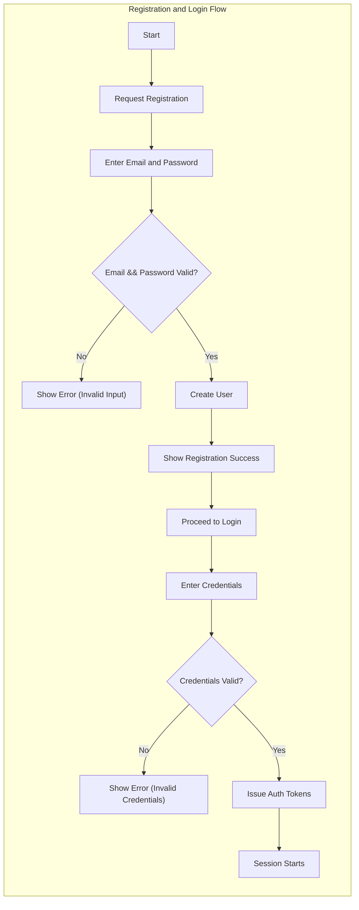
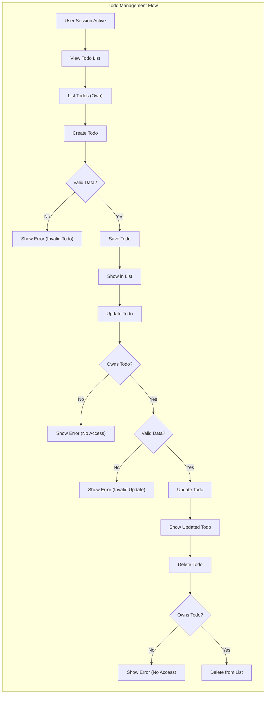
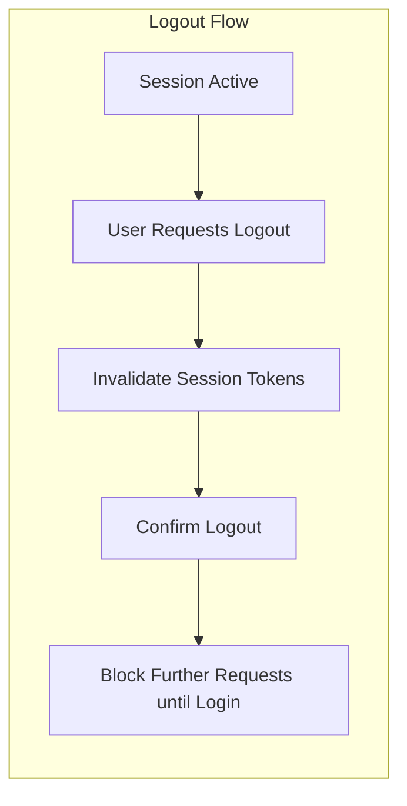

# Todo List Application - Requirements Analysis

## 1. Introduction
A minimal Todo List application provides users the ability to manage a personal list of tasks. The user interacts with the service solely to create, read, update, and delete todo items. The focus is on delivering only the essential features required for a functional and secure Todo list system.

## 2. Service Actors and Permissions
- **Actor**: `user`
    - Description: A registered individual who can authenticate to the application and manage their own todos.

### Authentication and Access
- WHEN a person is not authenticated, THE system SHALL deny access to any todo features except registration and login.
- WHEN a user is authenticated, THE system SHALL grant access exclusively to that user's todos.
- No shared, admin, or guest roles exist in the minimal functional scope of this service.

## 3. User Requirements (EARS Format)
- WHEN the user wants to register, THE system SHALL request email and password, and validate them per business rules.
- WHEN the user logs in, THE system SHALL require email and password and issue session tokens on successful authentication.
- WHEN the user is authenticated, THE system SHALL allow viewing, creating, editing, and deleting ONLY their own todos.
- WHEN the user requests a todo action on non-owned data, THE system SHALL deny the operation.
- IF the user provides invalid credentials or data, THEN THE system SHALL respond with detailed error messages without leaking sensitive system information.
- IF validation fails during registration, login, or todo manipulation, THEN THE system SHALL provide actionable feedback.
- WHEN the user logs out, THE system SHALL immediately invalidate active tokens and require re-authentication for subsequent access.
- WHEN a user session expires, THE system SHALL require re-authentication.

## 4. Functional and Validation Requirements
- WHEN creating a todo, THE system SHALL require a non-empty title, limit its length (e.g., 1~100 characters), and prohibit dangerous or offensive content.
- WHEN updating a todo, THE system SHALL require ownership verification and valid input (as in creation).
- WHEN deleting a todo, THE system SHALL require ownership verification.
- WHEN reading todos, THE system SHALL return ONLY the user's own todos, ordered by creation date descending by default.
- WHEN an operation targets a non-existent todo, THE system SHALL indicate as much, without hinting at other users' data.
- WHEN session is active, THE system SHALL allow all permitted actions within the user's account.

## 5. Core Business Rules and Ownership
- WHILE a user is signed in, THE system SHALL permit manipulation of their own todo items exclusively.
- WHEN a todo is created, THE system SHALL set its status to 'active' by default and assign a unique identifier.
- No todo may be shared, delegated, or accessed by any actor other than its owner.
- WHEN multiple users exist, THE system SHALL ensure strict data isolation for all operations.

## 6. User Interaction Flows

### 6.1 Registration and Login
#### Main Flow
- WHEN a new user wants to register, THE system SHALL provide a registration interface accepting email and password inputs.
- WHEN valid credentials are provided, THE system SHALL register and authenticate the user and start the session.
- IF registration fails (invalid data, duplicate email), THEN THE system SHALL indicate the specific error.
- WHEN login credentials are valid, THE system SHALL issue authentication tokens.
- IF login fails, THEN THE system SHALL return a non-specific error (no leakage of sensitive system information).

### 6.2 Todo Management Flow
#### Main Flow
- WHEN authenticated, THE user SHALL be able to create a todo with required fields.
- WHEN reading their todos, THE system SHALL only return that user's todos.
- WHEN updating or deleting a todo, THE system SHALL verify user ownership before performing action.
- IF action fails (invalid data, unauthorized, or non-existent todo), THEN THE system SHALL report the appropriate error message.

### 6.3 Logout Flow
#### Main Flow
- WHEN a user requests logout, THE system SHALL immediately invalidate all session tokens and end the session.
- IF a user attempts to logout when not logged in, THEN THE system SHALL acknowledge and do nothing further.
- WHEN session expires, THE system SHALL require login again for further actions.

## 7. Error and Exception Handling
- WHEN user input fails validation (registration, login, todo actions), THE system SHALL provide a clear, actionable error message with no internal details revealed.
- WHEN an unauthorized or unauthenticated todo operation is attempted, THEN THE system SHALL reply with suitable denial and instructions to login or correct the action.
- WHEN a targeted todo does not exist, THEN THE system SHALL indicate 'not found' and not reveal any information about other users' data.
- WHEN authentication fails, THEN THE system SHALL ensure no system or sensitive user data is leaked.

## 8. Performance and Security Expectations
- WHEN a user logs in, THE system SHALL provide authentication tokens within 2 seconds under normal conditions.
- WHEN creating, reading, updating, or deleting todos, THE system SHALL complete operation and respond within 2 seconds of request receipt except during system outages.
- WHEN logging out, THE system SHALL confirm action in less than 1 second.
- WHEN operating under expected load, THE system SHALL protect all data using industry-standard security controls (e.g., password hashing, secure token storage, TLS).
- WHEN handling any user data, THE system SHALL follow privacy best practices.

## 9. Summary and Success Metrics
- All requirements follow EARS format for clarity and testability.
- Only minimal, user-owned todo features are provided, without sharing, delegation, or advanced concepts.
- System is considered successful when all flows and requirements are satisfied, and users can perform CRUD (create, read, update, delete) on their own todos securely and reliably.
- The document’s wording and diagrams are intentionally implementation-ready for backend developer usage.