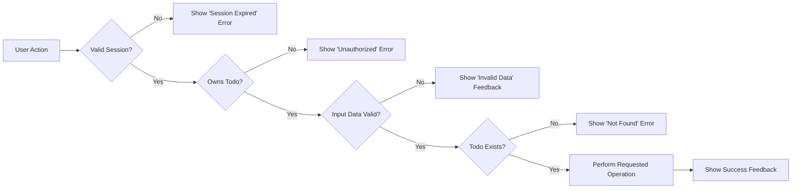

# Exception Handling and Errors in Todo List Application

## 1. Common Failure Scenarios

All system responses to abnormal and exceptional user-level scenarios must be explicitly defined in natural, business-oriented language and adhere to EARS (Easy Approach to Requirements Syntax) format for clarity, completeness, and testability.

### 1.1. Authentication Failures
- WHEN a user submits invalid login credentials, THE system SHALL reject access and display a clear message: "Invalid credentials. Please check your email and password."
- WHEN a user session is expired, missing, or the access token is invalid (expired, missing, incorrect), THE system SHALL deny access to any protected todo feature and prompt login with the message: "Your session has expired. Please log in again."

### 1.2. Authorization Failures
- WHEN a user attempts to access, update, or delete a todo that belongs to another user, THE system SHALL reject the action and display: "You do not have permission to access this todo."

### 1.3. Data Validation Failures
- WHEN the user attempts to create or update a todo with missing, empty, or invalid data (such as a missing or empty title), THE system SHALL reject the submission and display: "Some required information is missing or not valid."
- WHEN the user's data includes forbidden, unsupported, or overlength characters, THE system SHALL reject the request and display a message that specifies the offending field(s) and the relevant restriction(s).

### 1.4. Resource Not Found
- WHEN the user requests or modifies a todo by an ID that does not exist, THE system SHALL respond with: "The requested todo was not found."

### 1.5. Already Deleted Resource
- WHEN a user attempts to update or delete a todo that has already been removed, THE system SHALL inform: "This todo no longer exists."

### 1.6. Business Rule Violations
- WHEN a user attempts to create more todos than allowed by system rules (if such limits exist), THE system SHALL reject the action and show: "You have reached your maximum allowed number of todos."
- WHEN write actions are attempted during maintenance periods (scheduled or unscheduled), THE system SHALL reject the action and show: "Service is temporarily unavailable due to maintenance. Please try again later."

## 2. User Error Feedback

All user-visible error communication must follow actionable, plain language standards. Error responses shall not expose technical details (such as stack traces or database identifiers) under any circumstance.

### 2.1. Feedback Principles
- THE system SHALL ensure all error messages are brief, precise, and clearly actionable by the user
- WHERE user input is the cause, THE system SHALL provide reasons so users can correct data and retry
- WHERE multiple validation errors are present, THE system SHALL communicate all issues at once in the response

### 2.2. Standard Error Messages Table
| Scenario                              | User Message                                              |
|---------------------------------------|-----------------------------------------------------------|
| Invalid credentials                   | "Invalid credentials. Please check your email and password." |
| Session expired or token invalid      | "Your session has expired. Please log in again."            |
| Unauthorized operation                | "You do not have permission to access this todo."           |
| Missing/invalid data                  | "Some required information is missing or not valid."        |
| Todo not found                        | "The requested todo was not found."                         |
| Already deleted                       | "This todo no longer exists."                               |
| Exceeding todo limit                  | "You have reached your maximum allowed number of todos."    |
| Maintenance window                    | "Service is temporarily unavailable due to maintenance. Please try again later." |
| Internal/unexpected error             | "An unexpected error occurred. Please try again later."      |

## 3. Data Conflict Handling

Data consistency and correctness are core principles for business process integrity. The backend must properly handle conflicts and concurrent changes to todos, prioritizing transparency and user trust.

### 3.1. Concurrent Updates
- WHEN multiple users (or one user from multiple sessions) attempt to update the same todo at the same time, THE system SHALL always apply only the latest valid change (based on server timestamp) and inform the user if any data was overwritten or rejected.
- IF a todo is deleted while a user is editing it, THEN upon save attempt, THE system SHALL return the message: "This todo no longer exists."

### 3.2. Update-Delete Conflicts
- WHEN a user tries to update a todo that has been deleted before their submission, THE system SHALL return: "The requested todo was not found."

### 3.3. Duplicate Creation
- WHERE todo item uniqueness is required (title/content match), WHEN a duplicate submission occurs, THE system SHALL not create the todo and SHALL notify the user about the duplication.

## 4. Business Rules for Error Management

### 4.1. Performance
- THE system SHALL deliver all error responses within 1 second under normal operational circumstances.

### 4.2. Consistency & Logging
- THE system SHALL use consistent error codes, response formats, and messages across all endpoints and workflows.
- THE system SHALL log all errors (except ordinary client-side validation failures) for service diagnostics and improvement.

### 4.3. Security
- THE system SHALL never expose raw stack traces, database IDs, or other internal exception details to users.
- THE error response format SHALL be designed to avoid leaking sensitive implementation information.

## 5. Performance and Security Considerations

The service must balance error reporting transparency with robust data security and fast user feedback. Security reviews and response time monitoring are required.

- THE system SHALL respond to all business-level errors within 1 second except during major infrastructure failures or planned downtime
- THE system SHALL ensure that all error responses are sanitized and do not include any PII, credential, or business-sensitive data

## 6. Error Handling Workflow Diagram

---

All exception handling and error responses above SHALL become core, testable backend business logic for the Todo list service. Each requirement MUST be implemented exactly as specified, without omission, to ensure maintainable, user-centered, and reliable application operation.