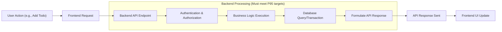

# 09. Performance Requirements

## 1.0 Introduction

This document specifies the non-functional performance requirements for the **todoList** application. Performance is not a secondary goal but a primary feature critical to user satisfaction and retention. A slow or unresponsive application fails to deliver on its core promise of simplicity and efficiency. Therefore, all backend development must prioritize and adhere to the standards defined herein.

These requirements translate the user-centric expectation of a "fast" and "instant" experience into concrete, measurable engineering targets. They serve as the benchmark for development, testing, and deployment.

### 1.1 The P95 Standard

All response time requirements in this document are measured at the **95th percentile (P95)**. This means that for any given API endpoint, 95 out of every 100 requests must complete at or below the specified target time under the defined load conditions. This standard ensures a consistent and reliable user experience by focusing on the typical case rather than being skewed by rare outliers.

## 2.0 General Performance Principles

These high-level principles guide the overall design and implementation of the backend system to ensure a consistently responsive user experience.

- **Ubiquitous Requirement**: THE system SHALL feel responsive to user input at all times.
- **Ubiquitous Requirement**: THE system SHALL provide immediate feedback for user actions whenever possible, preventing the user from wondering if their action was registered.
- **Ubiquitous Requirement**: THE system SHALL be designed to handle typical user loads without any perceptible degradation in responsiveness.

## 3.0 API Response Time Requirements (P95)

API response time is the duration from the moment the backend server receives a request to the moment it sends the complete response. This is the most critical factor in the application's perceived speed.

### 3.1 Authentication Endpoints

Authentication processes must be both secure and swift to avoid frustrating users at the entry point of the application.

- **EARS-1 (Event-driven)**: WHEN a `user` submits valid login credentials, THE system SHALL authenticate the user and return session tokens within **800 milliseconds**.
- **EARS-2 (Event-driven)**: WHEN a new `user` registers for an account, THE system SHALL create the account, log the user in, and return session tokens within **1200 milliseconds**.
- **EARS-3 (Event-driven)**: WHEN an authenticated `user` provides a valid refresh token to obtain a new access token, THE system SHALL process the request and return a new access token within **400 milliseconds**.

### 3.2 Core Todo CRUD Operations

These operations form the primary interaction loop for the user. Their performance is paramount to making the application feel fluid and productive.

- **EARS-4 (Event-driven)**: WHEN a `user` creates a new to-do item, THE system SHALL process the request and return a confirmation response within **300 milliseconds**.
- **EARS-5 (Event-driven)**: WHEN a `user` requests to view a single to-do item by its ID, THE system SHALL fetch and return the item's data within **250 milliseconds**.
- **EARS-6 (Event-driven)**: WHEN a `user` updates the title or description of an existing to-do item, THE system SHALL process the request and return a confirmation response within **300 milliseconds**.
- **EARS-7 (Event-driven)**: WHEN a `user` deletes a to-do item, THE system SHALL process the request and return a confirmation response within **300 milliseconds**.

### 3.3 Status Management

Changing a to-do's status is a very frequent action. It must feel instantaneous.

- **EARS-8 (Event-driven)**: WHEN a `user` marks a to-do item as "complete", THE system SHALL process the status update and return a confirmation response within **200 milliseconds**.
- **EARS-9 (Event-driven)**: WHEN a `user` marks a to-do item as "incomplete" (reverting it), THE system SHALL process the status update and return a confirmation response within **200 milliseconds**.

## 4.0 Data Loading and Scalability Requirements

This section defines how quickly data must be delivered to the user and the baseline load the system must support while meeting all P95 targets.

### 4.1 List Retrieval and Pagination

Efficiently loading the user's to-do list is crucial for the initial application experience.

- **EARS-10 (Event-driven)**: WHEN a `user` requests their list of to-do items, THE system SHALL return the first page of results (up to 50 items) within **400 milliseconds**.
- **EARS-11 (Ubiquitous)**: THE system SHALL implement pagination for any user with more than 50 to-do items to ensure fast initial load times.
- **EARS-12 (Event-driven)**: WHEN a `user` requests a subsequent page of their to-do list, THE system SHALL return the requested page within **300 milliseconds**.
- **EARS-13 (Event-driven)**: WHEN a `user` filters their to-do list by status (e.g., "complete" or "incomplete"), THE system SHALL return the filtered results within **400 milliseconds**.

### 4.2 Initial Application Load

The total time for the application to become interactive is a key metric.

- **EARS-14 (Event-driven)**: WHEN a `user` with an active session opens the application, THE backend system SHALL respond to the initial data-fetching requests (user info, first page of todos) within **500 milliseconds**, enabling the frontend to render the main view quickly.

### 4.3 Concurrent Load Expectation

The system must maintain its performance standards under a baseline level of concurrent activity.

- **EARS-15 (State-driven)**: WHILE the system is operating under a load of up to **100 concurrent users**, IT SHALL meet all specified P95 response time targets without degradation.
- **EARS-16 (State-driven)**: WHILE the database contains up to **1 million to-do items** across all users, THE system SHALL meet all specified P95 response time targets for database-related operations.