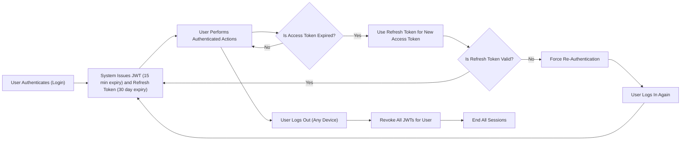

# Performance and Security Requirements for Todo List Application

## Performance Expectations

- WHEN a user requests any authenticated API operation (create, update, delete todo), THE system SHALL respond within 1 second under normal operating conditions so that the user receives rapid feedback.
- WHEN a user retrieves a list of todos and the result set contains up to 100 todos, THE system SHALL deliver the response within 1 second, as measured from API request to system response.
- THE system SHALL ensure that every operation for creating, reading, updating, or deleting todos completes instantly where possible, and SHALL NOT exceed 2 seconds under typical system load.
- WHEN the platform is under heavy load, THE system SHALL continue to accept valid requests and queue them, providing a user-visible notification if the operation cannot be completed within 5 seconds, so that users are not left waiting indefinitely.
- THE system SHALL support a minimum of 20 active users performing simultaneous basic todo requests, with no impact to the speed or reliability of core features.
- WHEN unexpected network or external errors prevent normal completion, THE system SHALL promptly notify the user about temporary unavailability and SHALL recommend retrying after a short period, ensuring users receive feedback and guidance.
- WHILE scheduled maintenance is occurring (as notified to users in advance), THE system SHALL display a visible notice and SHALL reject new requests with an expected restoration time included so users can plan accordingly.
- THE system SHALL maintain strict data isolation to guarantee that actions performed on one user's todos can never affect the data of another user, preserving privacy and integrity.

## Security Requirements

- THE system SHALL enforce strict authentication for all access to todos and personal data, ensuring that no unauthenticated requests are processed.
- THE system SHALL restrict visibility and modifications of todos to their owners exclusively; users SHALL NOT view, create, update, or delete todos belonging to another user under any circumstances.
- THE system SHALL implement secure authentication using JWT (JSON Web Token) for session management; all access SHALL require a valid JWT as described in [User Actors and Permissions](./03-user-actors-and-permissions.md).
- WHEN a JWT is expired, revoked, or tampered with, THE system SHALL deny the associated API request and require re-authentication before allowing any further actions.
- DURING authentication, THE system SHALL enforce strong password policies (minimum 8 characters, at least one letter and one number) and SHALL NEVER store plain-text passwords; all passwords SHALL be hashed and salted using industry-standard algorithms.
- WHEN a user requests a password reset, THE system SHALL provide a secure, time-limited password reset flow (maximum 15 minutes for the token), never revealing the registration status of an email unless the process is successful.
- THE system SHALL limit repeated failed authentication attempts, SHALL respond to brute-force attempts by temporarily locking login for up to 30 minutes, and SHALL notify impacted users with appropriate feedback.
- THE system SHALL require explicit user confirmation for password changes and SHALL record the timestamp of the last password update for user reference.
- THE system SHALL encrypt all data in transit via HTTPS to prevent interception of sensitive information.
- THE system SHALL log all authentication events, including login attempts, password changes, and reset flows, for security monitoring, without ever exposing PII (personally identifiable information) in publicly accessible logs.
- WHEN suspicious activity (such as repeated suspicious login attempts) is detected, THE system SHALL suspend the affected account and communicate the suspension reason with instructions for restoration following verification.

## Session Management

- THE system SHALL manage user access with JWTs (access tokens valid for 15 minutes of inactivity) and refresh tokens (valid for up to 30 days unless revoked or expired), maximizing session security without sacrificing usability.
- WHEN a user logs out from any device, THE system SHALL immediately revoke all JWTs and refresh tokens for that user, preventing further access until re-authentication occurs.
- USERS SHALL be enabled to log out from all devices with a single action, which SHALL invalidate all active sessions across devices.
- WHEN suspicious session activity is detected (such as login from a new device or location), THE system SHALL inform the user and prompt a password change as necessary.
- THE system SHALL always notify users in advance of session expiration, whenever possible, so they can save changes and re-authenticate as needed.
  
### Session Management Flow (Mermaid)

## Error Handling & User Feedback

- WHEN an action fails due to expired session, invalid credentials, or token problems, THE system SHALL return a clear, non-ambiguous error message and require the user to log in again before retrying.
- WHEN an operation is not completed due to heavy system load or external failures, THE system SHALL display an actionable message and automatically retry once if possible; otherwise, it SHALL encourage the user to retry after waiting.
- WHEN a user's session is close to expiration (within 1 minute), THE system SHALL warn the user, giving them an opportunity to save work and re-authenticate.
- WHEN a user attempts to access or modify data outside their authorization (e.g., another user's todos), THE system SHALL respond with a forbidden error and SHALL NOT disclose any details about the unauthorized resource.

## Summary

These requirements establish mandatory, concrete standards for performance, security, authentication, and error handling for the Todo list application. Every business and system rule is actionable and testable, providing the foundation for a robust, secure, and responsive backend that reliably meets user expectations while following industry best practices.