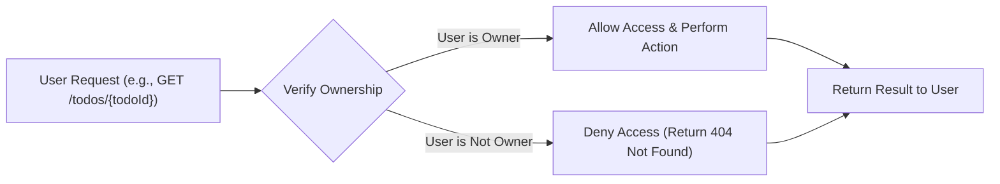
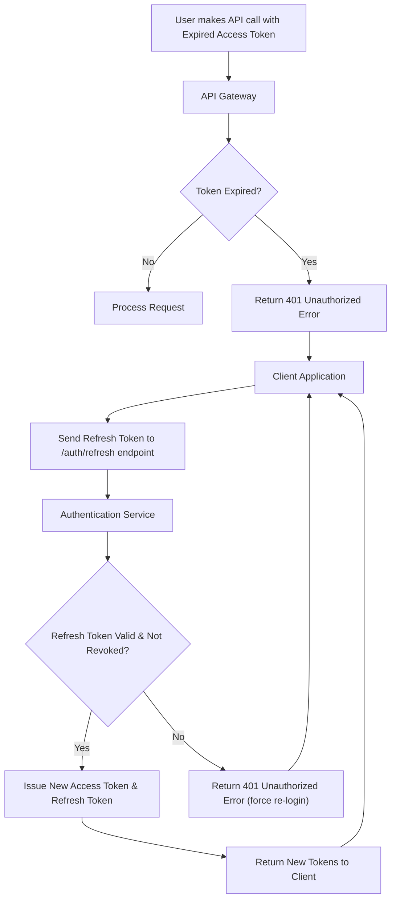

# 10. Security and Data Privacy

This document outlines the essential security and data privacy requirements for the Todo List application. Its purpose is to ensure that user data is handled securely, that each user's privacy is maintained, and that the system is resilient against common threats. The requirements specified here are foundational to building trust with users and protecting their information.

## 1. Security Principles

The system's design must be guided by the following core security principles:

-   **Principle of Least Privilege**: Each component and user of the system should only have the permissions essential to perform their intended function. The "user" actor must not be able to access any administrative functions or data belonging to other users.
-   **Defense in Depth**: The security of the system must not rely on a single defensive mechanism. Multiple layers of security controls—including secure authentication, strict data isolation, input validation, and rate limiting—must work together to protect the application.
-   **Secure by Default**: The default configuration of the system must be the most secure one. All user-facing features must be built with security as a primary consideration from the outset.
-   **Never Trust User Input**: All data received from clients must be treated as untrusted and be rigorously validated and sanitized before being processed.

## 2. Data Isolation

Data isolation is the most critical security requirement for this multi-tenant application. It ensures that a user can only ever access their own data.

*   **EARS Requirement (Ubiquitous)**: THE system SHALL associate every to-do item with the unique identifier of the user who created it.
*   **EARS Requirement (Event-driven)**: WHEN a `user` makes any request to read, update, or delete a specific to-do item, THE system SHALL first verify that the `user` is the legitimate owner of that to-do item before proceeding with the operation.
*   **EARS Requirement (Unwanted Behavior)**: IF a `user` attempts to access a to-do item URI or identifier that belongs to another user, THEN THE system SHALL treat the request as if the to-do item does not exist and return a "404 Not Found" response, to avoid revealing the existence of other users' data.
*   **EARS Requirement (Ubiquitous)**: THE system SHALL ensure that no API endpoint or internal function exposes a mechanism for one user to query or access another user's to-do items, regardless of their authentication status.

### Access Control Flow

## 3. Authentication and Session Management

Secure authentication and session management are essential to verify user identity and maintain secure sessions. The system will use JSON Web Tokens (JWT) for this purpose.

### JWT-Based Authentication

*   **EARS Requirement (Event-driven)**: WHEN a user successfully authenticates, THE system SHALL issue two tokens: a short-lived **Access Token** and a long-lived **Refresh Token**.
*   **EARS Requirement (State-driven)**: WHILE an Access Token is valid, THE system SHALL use it to authorize user requests. The Access Token payload SHALL contain the user's unique identifier (`userId`) and have an expiration time of no more than **15 minutes**.
*   **EARS Requirement (State-driven)**: WHILE a Refresh Token is valid, THE system SHALL use it solely for the purpose of obtaining a new Access Token. The Refresh Token SHALL have an expiration time of no more than **7 days**.
*   **EARS Requirement (Ubiquitous)**: THE Refresh Token SHALL be stored securely by the system in a manner that prevents theft and misuse.
*   **EARS Requirement (Event-driven)**: WHEN a user logs out, THE system SHALL invalidate the associated Refresh Token to prevent its further use.
*   **EARS Requirement (Unwanted Behavior)**: IF a user presents an expired Access Token, THEN THE system SHALL reject the request with an "Unauthorized" error, prompting the client to use the Refresh Token.

### JWT Refresh Flow

## 4. Password Management

Robust password management is essential for protecting user accounts from unauthorized access.

*   **EARS Requirement (Ubiquitous)**: THE system SHALL store all user passwords in a securely hashed and salted format using a modern, industry-standard, memory-hard algorithm such as **Argon2id**.
*   **EARS Requirement (Ubiquitous)**: THE system SHALL NEVER store passwords in plain text, encoded, or in any reversibly encrypted format.
*   **EARS Requirement (Event-driven)**: WHEN a `user` registers or changes their password, THE system SHALL enforce a minimum password complexity of at least **8 characters**.
*   **EARS Requirement (Event-driven)**: WHEN a `user` provides a password during login, THE system SHALL securely compare the provided password against the stored hash in constant time to prevent timing attacks.

## 5. Input Validation and API Security

To protect against common web vulnerabilities, the system must treat all client-side input as untrusted and enforce several API-level security measures.

### Input Validation and Sanitization

*   **EARS Requirement (Ubiquitous)**: THE system SHALL validate all incoming data from users—including request bodies, query parameters, and URL paths—for correct type, format, and length.
*   **EARS Requirement (Unwanted Behavior)**: IF any input data fails validation, THEN THE system SHALL immediately reject the request with an "Invalid Input" error and SHALL NOT process the data further.
*   **EARS Requirement (Ubiquitous)**: THE system SHALL sanitize all data before it is returned in an API response to prevent Cross-Site Scripting (XSS) vulnerabilities.

### Rate Limiting

*   **EARS Requirement (Event-driven)**: WHEN multiple failed login attempts are detected from a single IP address, THE system SHALL implement rate limiting, temporarily blocking further attempts from that IP to mitigate brute-force attacks.
*   **EARS Requirement (Ubiquitous)**: THE system SHALL enforce a general rate limit on all API endpoints to protect against denial-of-service (DoS) attacks and abusive behavior.

### Transport Layer Security

*   **EARS Requirement (Ubiquitous)**: THE system SHALL enforce the use of **HTTPS (TLS 1.2 or higher)** for all communication between the client and the server to protect data in transit.

## 6. Data Privacy

Data privacy involves respecting the user's information and collecting only what is necessary for the service to function.

*   **EARS Requirement (Ubiquitous)**: THE system SHALL only collect the absolute minimum personal data required for account creation and functionality, which is limited to a user's email address and password.
*   **EARS Requirement (Ubiquitous)**: THE user's personal data (email address) SHALL NOT be shared with any third parties or used for any purpose other than core application functionality (e.g., account login, password reset) without explicit user consent.
*   **EARS Requirement (Ubiquitous)**: THE content of a user's to-do items SHALL be considered private and confidential information, accessible only to the owning user.
*   **EARS Requirement (Event-driven)**: WHEN a user deletes their account, THE system SHALL permanently and irreversibly delete all associated personal data and created content, such as to-do items.

## 7. Security Logging and Monitoring

Logging security-relevant events is crucial for detecting and responding to potential threats.

*   **EARS Requirement (Event-driven)**: WHEN a security-sensitive event occurs, THE system SHALL generate an audit log entry. Such events include, but are not limited to:
    *   Successful user login
    *   Failed user login attempt
    *   Password change or reset
    *   Account deletion
*   **EARS Requirement (Ubiquitous)**: THE security logs SHALL be stored securely with restricted access to prevent tampering or unauthorized viewing.
