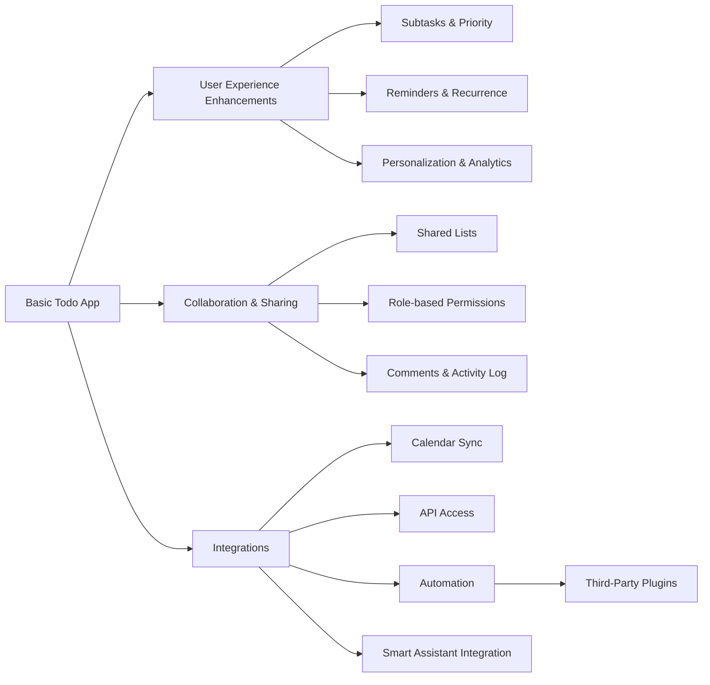

# Future Considerations for the Todo List Application

## Potential Features

The Todo list application may evolve to incorporate features designed to meet a wider range of user needs, improve engagement, strengthen retention, and ensure competitiveness as user expectations increase. These features are not part of the minimum viable product but are considered for future planning and should be kept in scope for business and technical evaluation.

### User Experience Enhancements
- WHEN users have complex tasks, THE system SHALL support subtasks or nested todos to break down larger goals.
- WHEN users desire to manage priorities, THE system SHALL provide options for marking todos as low, medium, high, or urgent.
- WHEN a user wants to track deadlines, THE system SHALL allow due dates with notification or reminder mechanisms that alert users appropriately using email or push methods.
- WHEN a task needs to be performed repeatedly, THE system SHALL allow users to easily set tasks as recurring at daily, weekly, or custom intervals.
- WHEN users want richer context, THE system SHALL support attaching images, documents, or URLs to individual todos, preserving security and privacy.
- IF users desire to organize tasks flexibly, THEN THE system SHALL enable custom labels or tags for categorization, filtering, and user-defined views.

### Collaboration and Sharing
- WHEN users need to coordinate with others (e.g., families, teams, groups), THE system SHALL support shared todo lists where multiple users may view and contribute tasks.
- WHEN shared lists are enabled, THE system SHALL enforce permission controls via user roles, such as viewer and editor, to avoid unauthorized changes.
- WHEN task collaboration occurs, THE system SHALL maintain an activity history to track all changes and updates, creating audit trails and accountability.
- WHEN teams require communication on tasks, THE system SHALL enable comments and notes to be added within any todo for richer context.

### Integrations and Extensibility
- IF users want to sync with external tools, THEN THE system SHALL offer calendar integration, allowing due dates to appear on common services (Google, Outlook, etc.).
- WHEN users adopt other productivity platforms, THE system SHALL provide mechanisms for importing and exporting tasks using industry-standard APIs.
- WHERE timely task status is critical, THE system SHALL offer mobile push notifications for reminders and updates.
- IF users want to interact hands-free, THEN THE system SHALL provide voice assistant integration for task add/view actions.
- WHEN organizations require process automation, THE system SHALL allow for integration with platforms such as Zapier or IFTTT, triggering third-party actions on todo changes.

### Personalization and Advanced Features
- IF users seek a customized experience, THEN THE system SHALL provide theming options including light/dark mode and high-contrast accessibility.
- WHEN users want insights into productivity, THE system SHALL provide analytics such as task completion rates, overdue trends, and activity summaries.
- IF accidental deletion occurs, THEN THE system SHALL maintain an archive/trash feature, allowing restoration of todos for a period before permanent removal.
- WHERE common workflows exist, THE system SHALL provide reusable templates and checklists.
- IF engagement is a business goal, THEN THE system MAY implement gamification (badges, streaks, points) to motivate frequent use.

### Security and Data Privacy
- WHEN user accounts need greater security, THE system SHALL provide multi-factor authentication options.
- WHEN data portability is requested, THE system SHALL support secure data export and import options for user backup and transfer.
- WHEN users need privacy for sensitive information, THE system SHALL implement end-to-end encryption of todo data.

## Scaling Considerations

### User Base Growth
- WHEN the number of registered users increases beyond projections, THE system SHALL maintain application responsiveness and user experience with predictable performance.
- IF daily active user numbers spike due to promotions, THEN THE system SHALL scale horizontally and vertically (application servers, database, storage) to handle increased load and data volume.

### Data Management
- WHEN users create a large number of todos or attachments, THE system SHALL provide efficient storage management with pagination, data archiving, and resource optimization.
- IF collaborative lists reach large participant counts, THEN THE system SHALL implement scalable access control, ensuring permission checks remain performant as group size increases.

### Operational and Technical Scalability
- IF infrastructure limitations are reached, THEN THE system SHALL support seamless deployment to higher-capacity environments or cloud providers.
- WHEN business operations demand monitoring, THE system SHALL expose metrics (performance, error rates) to proactively detect and resolve issues before user impact.
- IF a disaster recovery requirement exists, THEN THE system SHALL support regular secure backups, quick restore procedures, and transparent communication of issues.
- WHEN expanding regionally or adopting multi-tenancy models, THE system SHALL ensure strict isolation and data segregation between organizational units to protect privacy and compliance.

## Long-term Vision

### Business Evolution
- WHEN the todo platform achieves a large and loyal user base, THE business SHALL evaluate monetization strategies, including premium features, subscriptions, and enterprise solutions for organizations.
- IF complementary productivity services align with market strategy, THEN THE service SHALL initiate integration partnerships to augment user capabilities and drive organic growth.

### Feature and Technology Strategy
- WHERE user research or emerging trends suggest unmet needs, THE system roadmap SHALL prioritize features that directly contribute to user engagement, retention, and satisfaction.
- THROUGHOUT ongoing development, THE system SHALL preserve commitments to simplicity, reliability, fast performance, and a positive user experience even as feature depth increases.
- THE product lifecycle SHALL integrate regular user feedback for continuous improvement, ensuring business relevance and competitive advantage.

### Roadmap for Ecosystem Expansion
- WHERE new opportunities are validated, THE todo platform MAY extend into habit tracking, project management, calendar features, or advanced team collaboration (permissions, roles, automation).
- THE architecture SHALL remain modular and API-driven to enable future feature additions, third-party integrations, and a broader productivity ecosystem.

## Mermaid Diagram: Future Expansion Paths

