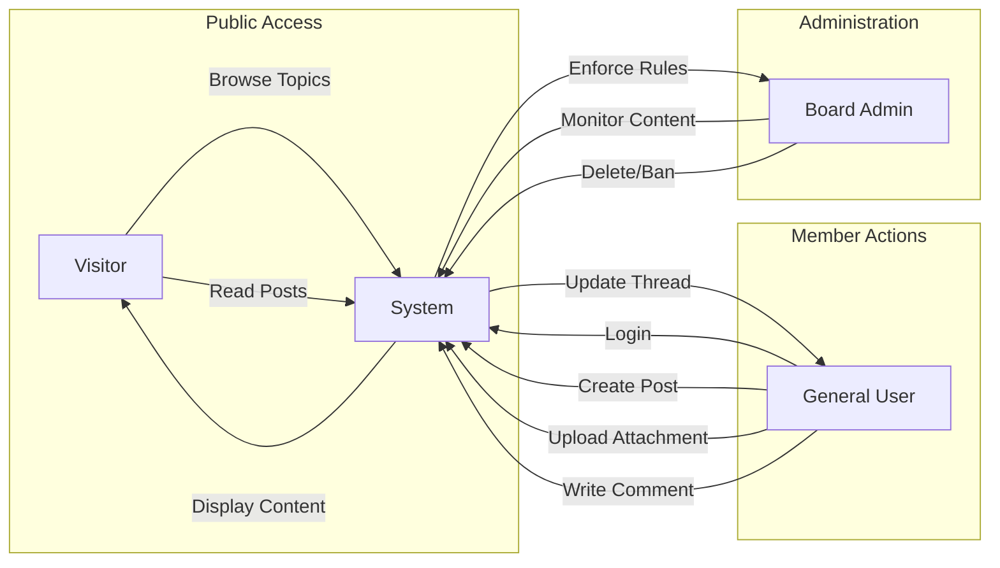

# ecoPoliDiscuss - Service Overview

## 1. Introduction

**ecoPoliDiscuss** is a streamlined, minimalist digital platform designed specifically for focused discussions on Economic and Political topics. In an era of clear social media noise, this service aims to provide a clean, distraction-free environment where content and conversation take center stage.

The defining characteristic of this service is "Simplicity." It avoids unnecessary complexity, gamification, and algorithmic feeds in favor of a straightforward bulletin board structure that empowers users to share insights, debate policies, and analyze economic trends.

## 2. Business Model

### Why This Service Exists
There is a significant market gap for a dedicated, no-nonsense discussion space for serious topics like economics and politics. Large social networks often dilute these conversations with algorithms designed for engagement rather than quality. **ecoPoliDiscuss** solves this by offering a specialized, focused venue where the chronological flow of ideas is preserved.

### Business Strategy
*   **Market Positioning**: A niche community for intellectuals, students, and enthusiasts of social sciences.
*   **Growth Strategy**: Organic growth through high-quality content indexing and word-of-mouth within interest groups.
*   **Sustainability**: Low-overhead operation due to minimalist feature set, potentially supported by unobtrusive static advertising or community donations in the future.

### Core Value Proposition
*   **Focused Content**: Strict categorization (Economic vs. Political) ensures users find exactly what they are looking for.
*   **Rich Media Support**: Ability to attach images and files enables data-driven discussions (charts, reports).
*   **Zero Clutter**: Removal of distracting features (complex profiles, gamification) to focus solely on the discussion.

## 3. Service Vision & Philosophy

> "Keep it straightforward and minimal."

The guiding philosophy for the development of **ecoPoliDiscuss** is strict adherence to minimalism. Every feature must justify its existence by directly contributing to the core function: **posting and discussing**.

*   **Functional Clarity**: If a feature does not help a user post, read, or comment, it is likely unnecessary.
*   **User Autonomy**: Users, not algorithms, decide what to read. The feed is chronological or category-based.
*   **Accessibility**: The interface should be intuitive enough that no tutorial is required.

## 4. Scope of Service

### In-Scope Features (The "Must-Haves")
*   **Dual Category Boards**: A clear separation between "Economic" and "Political" discussion threads.
*   **User Accounts**: Simple registration and login to verify identity for posting.
*   **Rich Posting**: Creation of text-based posts with support for:
    *   Image uploads (for charts, political cartoons, etc.)
    *   File attachments (PDF reports, data sheets).
*   **Community Interaction**: Threaded comments to facilitate back-and-forth debate.
*   **Moderation Tools**: Essential tools for Administrators to remove spam or hate speech.

### Out-of-Scope Features (The "Nice-to-Haves" - Excluded for Simplicity)
*   Real-time chat or instant messaging.
*   Complex friend systems or follower graphs.
*   Algorithmic "For You" feeds or trending logic.
*   Gamification (badges, complex reputation points).
*   Third-party social login integrations (initially excluded to keep auth simple).

## 5. System Context & Core Workflow

The following diagram illustrates the high-level interaction between the main actors and the system.

## 6. High-Level Functional Requirements (EARS)

### Access and Navigation
*   **Ubiquitous**: THE system SHALL provide public read-only access to all "Economic" and "Political" discussion boards for all users.
*   **Ubiquitous**: THE system SHALL display post lists sorted chronologically by default.

### Posting and Content
*   **Event-driven**: WHEN a logged-in user submits a new discussion topic, THE system SHALL validate that a category (Economic or Political) is selected.
*   **Event-driven**: WHEN a user includes a file attachment in a post, THE system SHALL store the file and display a download link or preview.
*   **Unwanted Behavior**: IF an attachment exceeds the defined size limit, THEN THE system SHALL reject the upload and display a specific error message.

### Moderation
*   **Ubiquitous**: THE system SHALL allow the "Board Admin" to permanently delete any post or comment.
*   **State-driven**: WHILE a user account is banned by an Admin, THE system SHALL prevent that user from creating any new content.

## 7. User Actors Overview

The system is designed for three specific types of users:

| Actor | Role & Responsibility |
|-------|-----------------------|
| **Visitor** | Unauthenticated guests. They can consume content (read posts, view images) but cannot influence discussions. |
| **General User** | The core community member. Once registered, they drive the platform by creating topics, debating in comments, and sharing resources. |
| **Board Admin** | The guardian of the community. Responsible for maintaining civility and enforcing the "on-topic" nature of the boards. |

## 8. Success Metrics

To measure the success of this minimal viable product (MVP):

*   **Engagement Rate**: Number of comments per discussion thread.
*   **Content Quality**: Frequency of posts containing attachments (indicating data-driven discussion).
*   **Platform Stability**: Zero critical errors during standard posting/reading workflows.
*   **User Retention**: Percentage of General Users who return to post more than once.

## 9. Future Considerations

While the current scope is strictly minimal, future iterations *might* consider:
*   Simple keyword search functionality.
*   Basic user bookmarks for saving favorite threads.
*   A "Dark Mode" for comfortable reading at night.

***

> *Developer Note: This document defines **business requirements only**. All technical implementations (architecture, APIs, database design, etc.) are at the discretion of the development team. Focus on delivering a robust, simple backend that supports these core user flows without over-engineering.*