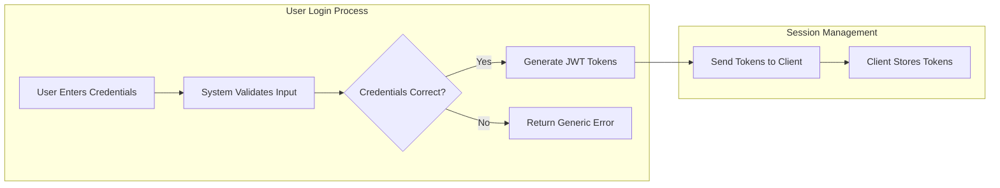

# User Actors and Permissions

## 1. Introduction
This document defines the user actors, authentication mechanisms, and access control policies for the **ecoPoliDiscuss** platform. The system is designed with a straightforward three-tier user model to facilitate economic and political discussions while maintaining order and quality.

The primary goal is to distinguish between passive consumers (Visitors), active participants (General Users), and system overseers (Board Admins). This clear separation ensures that while information is publicly accessible, distinct responsibilities are enforced for content creation and moderation.

## 2. Authentication Infrastructure

### 2.1 Core Authentication Requirements
The system requires a secure and standard authentication process to manage user identities.

- **Ubiquitous**: THE system SHALL use JSON Web Tokens (JWT) for managing user sessions.
- **Ubiquitous**: THE system SHALL secure all passwords using industry-standard hashing algorithms before storage.
- **WHEN** a user registers, THE system SHALL require a valid email address and a password.
- **WHEN** a user logs in successfully, THE system SHALL issue an Access Token (valid for 30 minutes) and a Refresh Token (valid for 7 days).
- **WHEN** an Access Token expires, THE system SHALL use the Refresh Token to issue a new Access Token without requiring user re-login.
- **WHEN** a user logs out, THE system SHALL invalidate the current Refresh Token.
- **If** authentication fails due to invalid credentials, THEN THE system SHALL return a generic error message to prevent account enumeration.

### 2.2 Authentication Process Flow

## 3. User Actor Definitions

### 3.1 Visitor (Guest)
**Description**: An unauthenticated user who accesses the platform to consume content. They represent the general public interested in economic and political topics but do not participate in discussions.

**Business Rules & Capabilities**:
- **Ubiquitous**: THE Visitor SHALL have read-only access to all public discussion boards.
- **Ubiquitous**: THE Visitor SHALL be able to search for discussions by keyword or category.
- **Ubiquitous**: THE Visitor SHALL allow viewing of attached images and files within posts.
- **WHEN** a Visitor attempts to perform a write action (post/comment/like), THE system SHALL prompt them to log in or register.

### 3.2 General User (Member)
**Description**: An authenticated user who has completed the registration process. They are the core content creators of the platform, engaging in discussions through posts, comments, and file sharing.

**Business Rules & Capabilities**:
- **WHILE** logged in, THE General User SHALL allow creating new discussion threads in either the Economic or Political category.
- **WHILE** creating a post, THE General User SHALL allow uploading image files (JPEG, PNG) and document files (PDF, TXT) as attachments.
- **WHILE** viewing a discussion, THE General User SHALL allow posting text-based comments.
- **WHEN** a General User views their own content, THE system SHALL allow them to edit or delete that content.
- **WHEN** a General User views content created by others, THE system SHALL prevent modification or deletion.

### 3.3 Board Admin (Administrator)
**Description**: A privileged user responsible for maintaining the health and safety of the community. They have overriding permissions to handle content moderation and user management.

**Business Rules & Capabilities**:
- **Ubiquitous**: THE Board Admin SHALL possess all capabilities of a General User.
- **WHEN** identifying inappropriate content, THE Board Admin SHALL allow deleting ANY post or comment regardless of authorship.
- **WHEN** a user violates community guidelines, THE Board Admin SHALL allow banning that specific user account from accessing the system.
- **WHILE** viewing deleted content, THE Board Admin SHALL allow restoring it if it was removed in error (soft delete mechanism).

## 4. Permission Matrix

The following matrix defines the specific CRUD (Create, Read, Update, Delete) permissions for each actor.

| Action | Visitor | General User | Board Admin |
| :--- | :---: | :---: | :---: |
| **Browse Discussions** | ✅ | ✅ | ✅ |
| **Read Post Details** | ✅ | ✅ | ✅ |
| **Download Attachments** | ✅ | ✅ | ✅ |
| **Search Content** | ✅ | ✅ | ✅ |
| **Register Account** | ✅ | ❌ | ❌ |
| **Login** | ✅ | ✅ | ✅ |
| **Create New Thread** | ❌ | ✅ | ✅ |
| **Upload Files** | ❌ | ✅ | ✅ |
| **Post Comment** | ❌ | ✅ | ✅ |
| **Edit Own Content** | ❌ | ✅ | ✅ |
| **Delete Own Content** | ❌ | ✅ | ✅ |
| **Delete ANY Content** | ❌ | ❌ | ✅ |
| **Ban/Unban Users** | ❌ | ❌ | ✅ |

## 5. Access Control Requirements

### 5.1 Token Payload Structure
To support statutory access control, the JWT payload must contain specific claims identifying the user's role.

**Required Payload Data**:
- `userId`: Unique identifier for the user.
- `email`: User's registered email address.
- `role`: The actor type (`generalUser`, `boardAdmin`).
- `status`: Account status (e.g., `active`, `banned`).

### 5.2 Authorization Logic (EARS)
- **WHEN** an API request is received, THE system SHALL verify the validity of the JWT Access Token.
- **IF** the token is missing or invalid, THEN THE system SHALL return a 401 Unauthorized error.
- **IF** a user attempts an action not permitted for their role (violating the Permission Matrix), THEN THE system SHALL return a 403 Forbidden error.
- **WHERE** a user status is "banned", THE system SHALL deny all login attempts and revoke active sessions.

### 5.3 Attachment Security
- **WHEN** uploading a file, THE system SHALL validate the file type matches allowed formats (Images: JPG, PNG / Documents: PDF, TXT).
- **IF** an uploaded file exceeds the defined size limit (e.g., 5MB), THEN THE system SHALL reject the upload with a clear error message.
- **WHEN** a file is deleted, THE system SHALL remove the reference from the database and mark the physical file for cleanup.