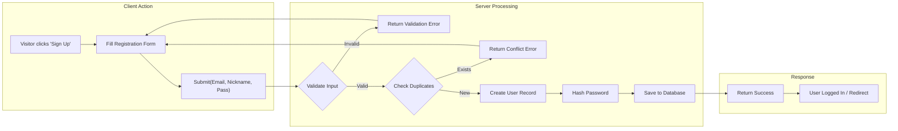
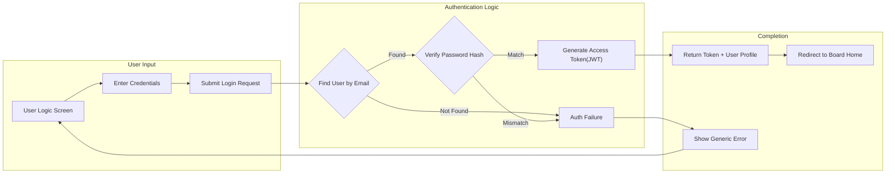

# Authentication & Identity Management Flow

## 1. Overview
This document defines the authentication and user identity management processes for the **ecoPoliDiscuss** platform. Given the project's goal of being a "simple" discussion board, the authentication system focuses on essential functionality: secure registration, login, and session management using standard email and password credentials without unnecessary complexity like social logins or multi-factor authentication.

### Purpose
To provide backend developers with clear specifications for implementing:
- User registration (Sign Up)
- User authentication (Sign In)
- Session management (JWT)
- Access control basics based on defined actors

## 2. User Actors & Authentication Context

The system recognizes three distinct interaction levels, determining authentication requirements.

| Actor | Authentication Status | Business Context |
|-------|----------------------|------------------|
| **Visitor** | Unauthenticated | Accesses public read-only content. No login required. |
| **General User** | Authenticated | **Registration**: Self-service via email/password. **Role**: Standard member permissions (post, comment). |
| **Board Admin** | Authenticated | **Registration**: System-provisioned or specific admin flag. **Role**: Elevated permissions for moderation. |

## 3. Functional Requirements

### 3.1 User Registration (General User)
The system allows new users to create accounts to participate in discussions.

#### Business Rules
- **Identity**: Unique Email and Nickname required.
- **Validation**: Email format must be valid; Password must meet minimum length (e.g., 8 chars).
- **Verification**: Email verification is recommended but optional for "minimal" MVP (we will assume immediate activation for simplicity unless specified otherwise, but strict email structure validation is required).

#### EARS Requirements
- **WHEN** a Guest submits a registration form with valid email, nickname, and password, **THE** System **SHALL** create a new "General User" account.
- **IF** the email or nickname is already in use, **THEN** **THE** System **SHALL** display a specific conflict error message.
- **WHEN** registration is successful, **THE** System **SHALL** automatically log the user in or redirect to the login page.
- **IF** the password is less than 8 characters, **THEN** **THE** System **SHALL** reject the request.

### 3.2 User Login
Users must authenticate to access write-features (posting, commenting).

#### Business Rules
- **Credentials**: Email and Password.
- **Feedback**: Clear success/failure states.
- **Security**: Account locking after excessive failed attempts (optional for MVP, but good practice).

#### EARS Requirements
- **WHEN** a User submits valid credentials, **THE** System **SHALL** issue a secure access token (JWT).
- **IF** authentication fails due to invalid credentials, **THEN** **THE** System **SHALL** return a generic "Invalid email or password" error to prevent enumeration.
- **WHEN** a User successfully logs in, **THE** System **SHALL** return the user's profile summary (nickname, role).

### 3.3 Session Management
The system uses a stateless authentication mechanism suitable for modern web applications.

#### Business Rules
- **Mechanism**: JSON Web Tokens (JWT).
- **Lifespan**: Access tokens should have a reasonable expiration (e.g., 2-24 hours) for a discussion board context.
- **Storage**: Client-side secure storage guideline (Developer discretion, e.g., HttpOnly cookies preferred).

#### EARS Requirements
- **UBIQUITOUS** **THE** System **SHALL** require a valid Access Token for any API endpoint classified as "Protected" or "Private".
- **WHEN** a token expires, **THE** System **SHALL** require re-authentication (or usage of a refresh token if implemented).
- **WHEN** a User initiates logout, **THE** System **SHALL** invalidate the session strictly on the client side (removing tokens).

## 4. User Flows & Diagrams

### 4.1 Registration Process
The flow for a visitor becoming a member.

### 4.2 Login Process
The standard authentication flow.

## 5. Password Management
To support user retention and security.

- **Password Update**: Authenticated users can change their password.
  - **Rule**: Must provide current password to set a new one.
- **Password Reset**: (Simplified)
  - **Process**: Since this is a "simple" board, we will implement a basic flow where an admin can reset a password OR a simple token-based email reset if email service is available. For the MVP:
  - **EARS**: **WHEN** a User requests a password reset, **THE** System **SHALL** generate a secure reset token and mock the email sending process (or send via SMTP if configured).

## 6. Security Constraints & Non-Functional Requirements
- **Password Hashing**: Passwords **MUST** never be stored in plain text. Use industry-standard algorithms (e.g., bcrypt, Argon2).
- **HTTPS**: All authentication traffic **MUST** occur over encrypted channels.
- **Sanitization**: Inputs (Email, Nickname) must be sanitized to prevent injection attacks.

---
> *Developer Note: This document defines **business requirements only**. All technical implementations (architecture, APIs, database design, etc.) are at the discretion of the development team.*
