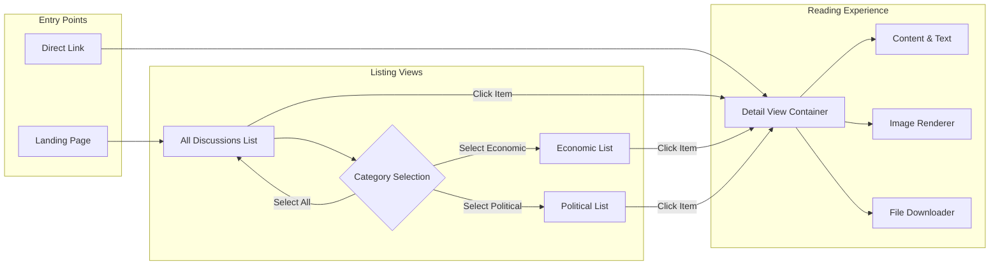

# Discussion Core Features

## 1. Introduction
This document details the core business requirements for the viewing and navigation features of the **ecoPoliDiscuss** platform. It focuses on how the system organizes, lists, and displays discussion content to users. The design philosophy adheres strictly to the project's goal of simplicity and minimalism.

The scope of this specific document is limited to:
- Defining the category structure (Economic vs. Political).
- Specifying the requirements for listing discussion threads.
- Specifying the user experience for reading individual discussion posts.

> *Note: This document focuses on the **consumption** of content. Content creation is covered in [Posting Workflow](./05-posting-workflow.md), and attachment handling specifics are in [Attachment System](./06-attachment-system.md).*

## 2. Category Management

The system operates on a rigid, two-category structure to maintain focus and simplicity.

### 2.1 Category Definitions
The platform consists of two distinct functional areas:
1.  **Economic Discussions**: Threads related to economy, finance, and markets.
2.  **Political Discussions**: Threads related to politics, policy, and governance.

### 2.2 Category Switching Requirements
- **Ubiquitous**: THE system SHALL provide persistent navigation options to switch between "Economic" and "Political" categories.
- **Ubiquitous**: THE system SHALL provide a "All Discussions" view that aggregates posts from both categories.
- **WHEN** a user selects a specific category, THE system SHALL filter the discussion list to show only threads belonging to that category.
- **WHEN** a user navigates to the root page, THE system SHALL default to the "All Discussions" aggregated view.

## 3. Discussion Listing Functionality

This section defines how users browse available discussions. The list view is the primary interface for content discovery.

### 3.1 List Information Hierarchy
Each item in the discussion list must present the following metadata to allow users to judge relevance before clicking:

1.  **Category Indicator**: (Visible only in "All Discussions" view)
2.  **Discussion Title**: The main subject line.
3.  **Author Name**: Username of the creator.
4.  **Publication Date**: Date/time of posting (formatted for readability).
5.  **Engagement Metrics**:
    - View count
    - Comment count

### 3.2 Listing Logic Requirements
- **Ubiquitous**: THE system SHALL order discussion lists chronologically, with the newest threads appearing first (descending order by creation time).
- **Ubiquitous**: THE system SHALL paginate discussion lists to ensure performance (e.g., 20 items per page).
- **WHEN** a user reaches the bottom of a list page, THE system SHALL provide navigation controls to access older discussions (Next/Previous Page).
- **IF** a category contains no posts, THEN THE system SHALL display a user-friendly "No discussions found" message.

### 3.3 Visual Distinction
- **Ubiquitous**: THE system SHALL visually distinguish between "Economic" and "Political" posts (e.g., via text labels or subtle color indicators) within the "All Discussions" list.

## 4. Discussion Reading Experience (Detail View)

This features the specific requirements for the page where a user reads a single discussion thread.

### 4.1 Content Display Requirements
- **WHEN** a user clicks on a discussion title from the list, THE system SHALL navigate to the specific Detail View for that thread.
- **Ubiquitous**: THE system SHALL display the full title and text content of the discussion.
- **Ubiquitous**: THE system SHALL display the author's username and the exact timestamp of publication.
- **Ubiquitous**: THE system SHALL increment the view count for the discussion upon successful loading of the Detail View.

### 4.2 Attachment Rendering
In alignment with the [Attachment System](./06-attachment-system.md), content consumption includes viewing attached media.

- **WHERE** a discussion includes image attachments, THE system SHALL embed and display these images directly within the post content area.
- **WHERE** a discussion includes non-image file attachments (e.g., PDFs, documents), THE system SHALL display these as clickable download links with the filename visible.

### 4.3 Navigation Context
- **Ubiquitous**: THE system SHALL provide a "Back to List" navigation control to return the user to their previous listing context (preserving category selection).

## 5. User Navigation Flow

The following diagram illustrates the simple navigation path for users consuming content.

## 6. Access Control & Permissions

Since simplicity is key, access control for **viewing** is open.

### 6.1 Read Access
- **Ubiquitous**: THE system SHALL allow the **Visitor** actor to view all discussion lists and detail pages.
- **Ubiquitous**: THE system SHALL allow the **General User** actor to view all discussion lists and detail pages.
- **Ubiquitous**: THE system SHALL allow the **Board Admin** actor to view all discussion lists and detail pages.

### 6.2 Interaction Restrictions (Display Only)
- **WHILE** a **Visitor** is viewing a post, THE system SHALL NOT display "Reply", "Edit", or "Delete" controls.
- **WHILE** a **General User** is viewing a post they did not create, THE system SHALL NOT display "Edit" or "Delete" controls.
- **WHILE** a **General User** is viewing their own post, THE system SHALL display "Edit" and "Delete" controls (subject to business rules in Moderation Policy).
- **WHILE** a **Board Admin** is viewing any post, THE system SHALL display "Delete" controls for moderation purposes.

## 7. Search Integration
While comprehensive search is detailed in [Search and Filter](./09-search-and-filter.md), basic requirements affect the core view.

- **Ubiquitous**: THE system SHALL include a search input field on all listing headers to allow quick access to the search function.

> *Developer Note: This document defines **business requirements only**. All technical implementations (architecture, APIs, database design, etc.) are at the discretion of the development team.*