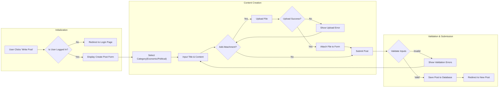

# Posting Workflow Requirements

## 1. Overview
This document defines the functional requirements and user flow for creating new discussion threads within the **ecoPoliDiscuss** platform. The focus is on a streamlined, minimal process that allows **General Users** to publish economic or political content effectively, including support for image and file attachments.

## 2. Prerequisites
To maintain quality and accountability in discussions, the following pre-condition must be met:

- **User Status**: The user must be authenticated as a **General User** or **Board Admin**.
- **Account Status**: The user's account must be active (not banned or suspended).
- **Guest Limitation**: **Visitors** (unauthenticated users) cannot access the posting interface.

## 3. Functional Requirements

### 3.1 Category Selection
The system must enforce a strict separation of topics to keep the board organized.

- **Ubiquitous**: THE system SHALL require the user to select exactly one category (Economic or Political) for every new post.
- **Ubiquitous**: THE system SHALL NOT allow a post to be created without a valid category selection.

### 3.2 Content Input
The core content consists of a title and the main body text.

- **Ubiquitous**: THE system SHALL provide a text input field for the post title.
- **Ubiquitous**: THE system SHALL provide a multiline text area for the post body content.
- **Unwanted Behavior**: IF the title is empty upon submission, THEN THE system SHALL prevent creation and display a "Title required" error.
- **Unwanted Behavior**: IF the body content is empty upon submission, THEN THE system SHALL prevent creation and display a "Content required" error.

### 3.3 Attachment Handling
As per the requirement to support images and files, the system must handle uploads during the posting process.

- **Optional Features**: WHERE a user chooses to upload files, THE system SHALL accept standard image formats (JPG, PNG) and document formats (PDF, TXT).
- **State-driven**: WHILE a file is uploading, THE system SHALL indicate progress to the user.
- **Business Rule**: THE system SHALL enforce a maximum file size limit (e.g., 5MB per file) to maintain performance.
- **Business Rule**: THE system SHALL limit the number of attachments per post (e.g., maximum 3 files) to keep the interface minimal.

## 4. Posting Process Flow

This diagram illustrates the step-by-step workflow for a logged-in user creating a new post.

## 5. Business Logic & Rules

### 5.1 Input Validation
The system must validate all inputs before processing the submission to ensure data integrity.

| Field | Requirement | Validation Failure Action |
|-------|-------------|---------------------------|
| **Category** | Must be selected (Values: Economic, Political) | Prevent submission, prompt selection |
| **Title** | Minimum 2 characters, Maximum 100 characters | Show specific length error |
| **Content** | Minimum 10 characters, Maximum 5000 characters | Show specific length error |
| **Attachments** | Max 5MB per file, Allowed types only | Show "File too large" or "Invalid type" error |

### 5.2 Submission Processing
- **Event-driven**: WHEN the user submits a valid form, THE system SHALL create a new discussion thread record.
- **Ubiquitous**: THE system SHALL record the creation timestamp and the author's user ID.
- **Ubiquitous**: THE system SHALL set the initial status of the post to "Published" (unless keyword filters trigger moderation).

## 6. User Scenarios

### 6.1 Successful Post Creation
**User Actor**: General User
1. User navigates to the board index.
2. User clicks the "Write Post" button.
3. System shows the composition form.
4. User selects "Economic" category.
5. User enters title: "Inflation Trends in 2024" and body text.
6. User attaches a graph image (PNG).
7. User clicks "Submit".
8. System validates content, uploads image, saves the post, and redirects the user to the newly created discussion thread.

### 6.2 Validation Failure (Missing Category)
**User Actor**: General User
1. User enters title and content but forgets to select a category.
2. User clicks "Submit".
3. System checks requirements and detects missing category.
4. System keeps the user on the form, preserves the entered title/content, and highlights the Category selector with a message "Please select a category".

### 6.3 Attachment Error
**User Actor**: General User
1. User attempts to upload a 50MB video file.
2. System immediately checks file metadata.
3. System displays an error: "File too large. Maximum limits are 5MB."
4. The file is rejected, but the rest of the form data remains intact.

## 7. Post-Creation Constraints
To ensure simplicity and minimal design overhead:
- The system does NOT need a "Draft" feature at this stage; posts are either created or cancelled.
- The system does NOT need rich text formatting (bold, italic) initially; plain text with line breaks is sufficient.
- The system does NOT need a "Preview" mode; the simple input fields serve as the preview.

## 8. Security & Moderation Notes
- **Antispam**: THE system SHALL implement a basic rate limit (e.g., a user cannot post more than once every 2 minutes) to prevent spam.
- **Sanitization**: THE system SHALL sanitize all text inputs to prevent XSS attacks, even though this document focuses on business logic, safety is a core business requirement.
