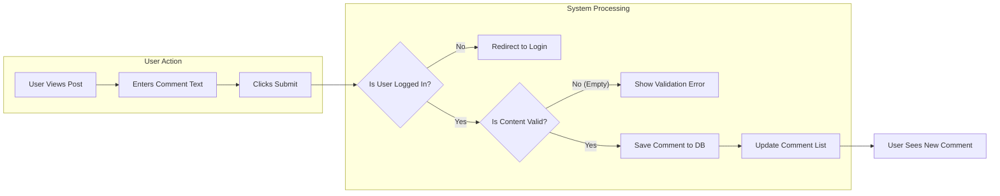
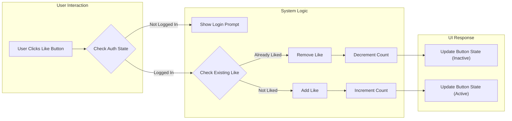

# Interaction Features Specification

## 1. Introduction
This document outlines the requirements for user interactions on the **ecoPoliDiscuss** platform. Specifically, it covers the functionality for users to comment on discussion threads and express engagement through a simple "Like" mechanism. These features are essential for fostering community dialogue and gauging the popularity of economic and political topics.

The design philosophy for these features is **functional minimalism**. We aim to provide robust core interactions without unnecessary complexity (e.g., no nested threading, no complex reaction systems).

## 2. User Actors and Permissions

The interaction features involve the following actors with specific permissions:

| Actor | Commenting Permissions | Engagement Permissions |
|-------|------------------------|------------------------|
| **Visitor** (Guest) | **Read-only**: Can view comments. | **Read-only**: Can view like counts. |
| **General User** (Member) | **Create**: Can post comments. **Delete**: Can delete their own comments. | **Interact**: Can Like/Unlike posts. |
| **Board Admin** | **Delete**: Can delete ANY user's comment for moderation. | **Interact**: Can Like/Unlike posts. |

## 3. Functional Requirements

All requirements are specified using the **EARS** (Easy Approach to Requirements Syntax) format.

### 3.1 Commenting System
The comment system allows for a linear discussion flow on strictly "Economic" or "Political" discussion threads.

#### 3.1.1 Viewing Comments
- **Ubiquitous**: THE system SHALL display comments in chronological order (oldest first) beneath the main article content.
- **Ubiquitous**: THE system SHALL display the author's name and timestamp for every comment.
- **WHEN** a `visitor` or `generalUser` access a discussion thread, THE system SHALL load the list of active comments associated with that thread.

#### 3.1.2 Posting Comments
- **WHEN** a `generalUser` submits a comment form with valid text, THE system SHALL save the comment and associate it with the current thread.
- **IF** the comment content is empty or contains only whitespace, THEN THE system SHALL reject the submission and return an input validation error.
- **WHEN** a comment is successfully posted, THE system SHALL refresh the comment list to show the new entry immediately.

#### 3.1.3 Deleting Comments
- **WHILE** a `generalUser` is viewing their own comment, THE system SHALL provide a "Delete" option.
- **WHEN** a `generalUser` confirms deletion of their own comment, THE system SHALL permanently remove the comment record.
- **WHILE** a `boardAdmin` is viewing any comment, THE system SHALL provide a "Delete" option for moderation purposes.
- **WHEN** a `boardAdmin` deletes a user's comment, THE system SHALL permanently remove the comment record.

### 3.2 Engagement (Like) System
A simple binary toggle (Like / No Interaction) to measure user agreement or appreciation.

- **WHEN** a `generalUser` clicks the "Like" button on a post they haven't liked yet, THE system SHALL increment the like count and mark the post as "Liked" by that user.
- **WHEN** a `generalUser` clicks the "Like" button on a post they have already liked, THE system SHALL decrement the like count and remove the "Liked" status (toggle off).
- **Ubiquitous**: THE system SHALL ensure a single user can contribute at most one "Like" per discussion thread.
- **Ubiquitous**: THE system SHALL display the total numeric count of likes to all actors (including `visitor`).

## 4. Interaction Workflows

### 4.1 Comment Submission Workflow
This process describes how a logged-in user adds a comment to a discussion.

### 4.2 Like Toggle Workflow
This process describes the immediate feedback loop for liking a post.

## 5. Business Rules and Validation

### 5.1 Data Constraints
- **Comment Length**:
    - Minimum: 1 character (non-whitespace).
    - Maximum: 1,000 characters (to keep discussions concise and prevent spam).
- **Comment Format**: Plain text only. No HTML, Markdown, or rich text formatting is supported to maintain simplicity.
- **Attachments**: Comments do NOT support image or file attachments (simplification). Attachments are limited to the main post only.

### 5.2 User Restrictions
- **Self-Liking**: Authors ARE permitted to like their own posts (simplifies logic).
- **Rate Limiting**: To prevent spam, users are limited to posting one comment every 10 seconds.

## 6. Error Handling

The backend must return specific error codes to the frontend to ensure a smooth user experience.

| Scenario | Trigger Condition | System Response | User Message |
|----------|-------------------|-----------------|--------------|
| **Empty Comment** | User submits a comment with 0 characters. | HTTP 400 Bad Request | "Comment cannot be empty." |
| **Unauthenticated** | Guest tries to like or comment. | HTTP 401 Unauthorized | "Please log in to participate." |
| **Delete Forbidden** | User tries to delete someone else's comment. | HTTP 403 Forbidden | "You do not have permission to delete this comment." |
| **Duplicate Like** | Race condition where user likes twice rapidly. | HTTP 409 Conflict | "You have already liked this post." |

## 7. Performance Expectations
- **Like Response**: The "Like" toggle should feel instantaneous. The UI should optimistically update while the backend processes the request.
- **Comment Loading**: Comments should load with the main post or strictly within 1 second of the post loading.

> *Developer Note: This document defines **business requirements only**. All technical implementations (architecture, APIs, database design, etc.) are at the discretion of the development team.*