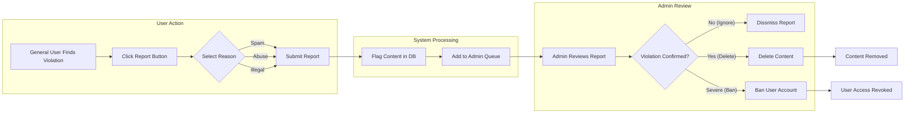
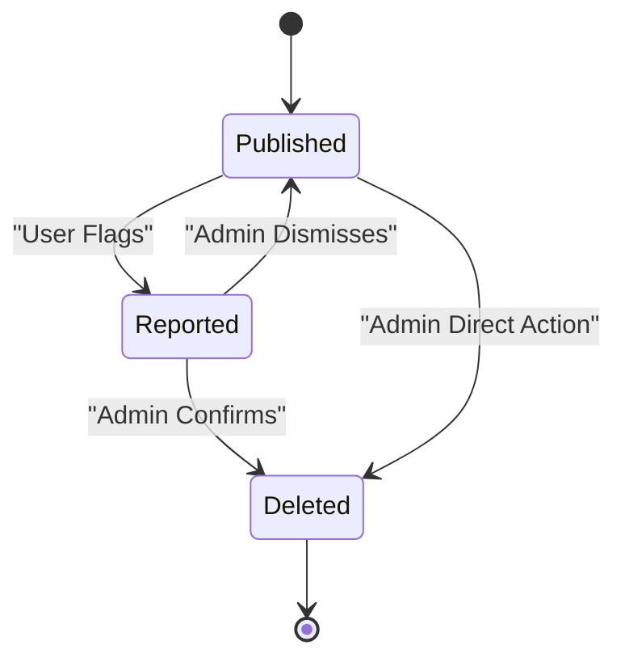

# Moderation Policy & Business Rules

## 1. Policy Overview and Business Justification

### Purpose
The `ecoPoliDiscuss` platform hosts discussions on sensitive Economic and Political topics. To maintain a healthy, constructive, and legal environment, a clear moderation policy is essential. This document outlines the business rules for content governance, identifying prohibited behaviors and defining the enforcement powers of administrators.

### Business Value
- **User Retention**: A toxic environment drives away users. Effective moderation ensures the platform remains welcoming for constructive debate.
- **Legal Compliance**: Hosting illegal content or hate speech poses liability risks.
- **Brand Integrity**: Maintaining a standard of discourse distinguishes the platform from unmoderated "junk" boards.

### Core Philosophy
- **Neutrality**: Moderation actions must be based on rule violations, not political or economic viewpoints.
- **Simplicity**: The process follows a straightforward "Report → Review → Act" workflow without complex bureaucracy.

---

## 2. User Actors in Moderation

| Actor | Role in Moderation |
|-------|-------------------|
| **Visitor** | Can view content but cannot report or moderate. |
| **General User** | Can flag/report inappropriate content. Must adhere to community guidelines. |
| **Board Admin** | Has full authority to review reports, delete content, and ban users. |

---

## 3. Prohibited Content Guidelines

The following categories of content are strictly prohibited on `ecoPoliDiscuss`. These rules serve as the baseline for all moderation actions.

### 3.1 Zero-Tolerance Violations (Immediate Removal)
- **Illegal Content**: Anything violating local or international laws.
- **Hate Speech**: Attacks based on race, religion, gender, or nationality.
- **Explicit Violence**: Graphic imagery or file attachments depicting gore or harm.
- **Malicious Files**: Uploads containing viruses, malware, or phishing links.

### 3.2 Community Disruptions (Discretionary Action)
- **Spam**: Repetitive promotional posts or "bot-like" behavior.
- **Off-Topic Derailling**: Posting purely entertainment or irrelevant content in serious economic/political threads.
- **Personal Attacks**: Direct insults towards other users (debating ideas is allowed; attacking individuals is not).

---

## 4. Functional Requirements (EARS)

These requirements define how the system supports the moderation policy.

### 4.1 Reporting Mechanism
- **WHEN** a General User identifies a policy violation, **THE** system **SHALL** allow them to submit a report ticket.
- **THE** system **SHALL** require the reporter to select a violation category (e.g., Spam, Hate Speech, Other).
- **WHEN** a report is submitted, **THE** system **SHALL** notify the Board Admin (via dashboard indicator).

### 4.2 Administrative Actions
- **WHERE** content is flagged, **THE** Board Admin **SHALL** be able to view the reported post/comment an the attached files.
- **IF** a Board Admin determines a violation has occurred, **THEN** **THE** system **SHALL** allow the Admin to permanently delete the content.
- **IF** a Board Admin determines a violation is severe, **THEN** **THE** system **SHALL** allow the Admin to suspect or ban the violator's account.
- **WHEN** an Admin deletes content, **THE** system **SHALL** remove the associated file attachments from public access immediately.

### 4.3 User Status Management
- **WHILE** a user is banned, **THE** system **SHALL** prevent them from logging in or creating new content.
- **THE** system **SHALL** record a log of moderation actions (Admin Name, Action Taken, Timestamp) for accountability.

---

## 5. Moderation Workflows

### 5.1 Report and Review Workflow

This diagram illustrates the standard process for handling content violations.

### 5.2 Content State Lifecycle

---

## 6. Enforcement & Penalties

The platform operates on a "Three Strike" principle for minor offenses, but reserves the right to immediate bans for severe infractions.

### 6.1 Hierarchy of Sanctions
1.  **Content Removal**: The post or comment is simply deleted. No widespread account limit.
    *   *Trigger*: Minor off-topic posts, slight rudeness.
2.  **Warning**: The user receives a system notification regarding the rule breach.
    *   *Trigger*: Repeat offenses, spamming.
3.  **Permanent Ban**: The user account is strictly locked. Email address is blacklisted.
    *   *Trigger*: Hate speech, illegal content, malware distribution, or 3+ warnings.

### 6.2 Appeals
- Due to the "Simple" nature of the platform, there is no automated appeal system.
- Banned users must contact support via external email if they wish to contest a ban (out of system scope).

---

## 7. Security and Privacy in Moderation

### 7.1 Privacy of Reporters
- **THE** system **SHALL** keep the identity of the reporting user confidential from the reported user.
- Only Board Admins can see who submitted a specific report.

### 7.2 Data Retention for Banned Accounts
- **IF** a user is banned, **THEN** **THE** system **SHALL** retain their posts unless specifically deleted by an Admin (to maintain context of other discussions).
- **IF** a user is banned for illegal content, **THEN** **THE** system **SHALL** support hard-deletion of all their historical data.

---

> *Developer Note: This document defines **business requirements only**. All technical implementations (architecture, APIs, database design, etc.) are at the discretion of the development team.*