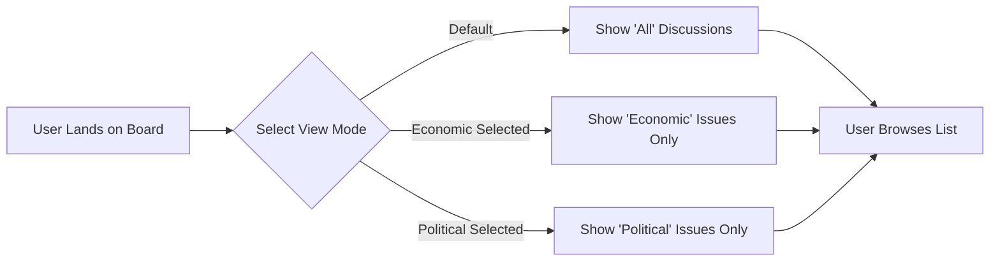
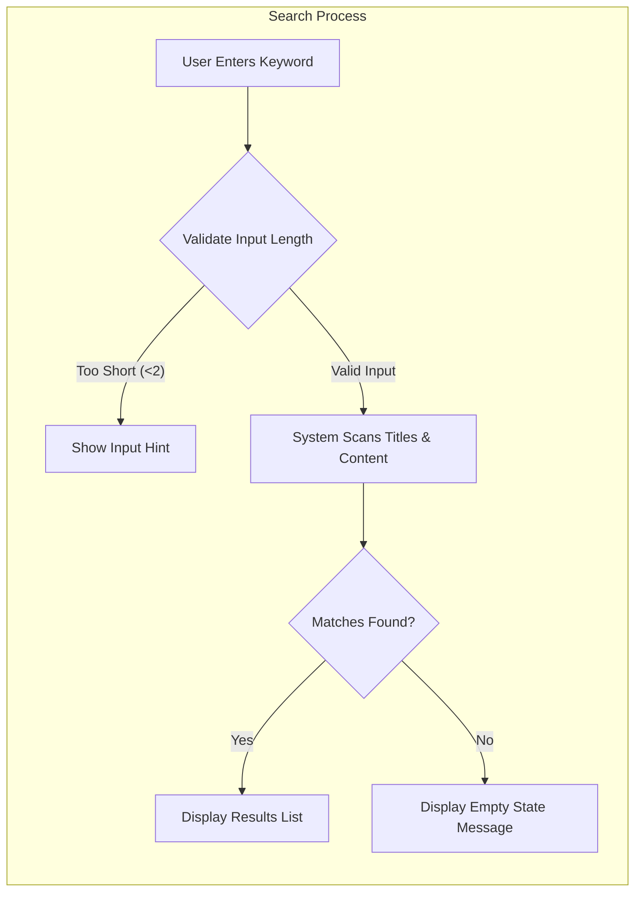

# Search and Filter Requirements
> *Developer Note: This document defines **business requirements only**. All technical implementations (architecture, APIs, database design, etc.) are at the discretion of the development team.*

## 1. Overview

### 1.1 Purpose
The purpose of the Search and Filter module is to allow users (Visitors, General Users, and Admins) to easily discover relevant content within the **ecoPoliDiscuss** platform. Given the platform's dual focus on Economic and Political topics, clear separation and easy retrieval of these topics are critical for user engagement.

### 1.2 Scope
This document covers:
- Filtering discussion lists by the main categories (Economic vs. Political)
- Basic keyword search functionality within discussion content
- Default sorting mechanisms for content presentation

### 1.3 Goals
- **Simplicity**: Implementation must remain minimal, avoiding complex parametric searches.
- **Discoverability**: Users must effortlessly distinguish between economic and political discussions.
- **Speed**: Search and filtering operations should feel immediate to the user.

## 2. User Actors

All defined actors interact with search and filter capabilities:

| Actor | Usage Context |
|-------|---------------|
| **Visitor** | Browses public discussions using filters to find topics of reading interest. |
| **General User** | Searches for existing topics before posting to prevent duplicates; filters to engage with specific interests. |
| **Board Admin** | Uses search to locate specific posts for moderation purposes. |

## 3. Functional Requirements

### 3.1 Category Filtering
The platform is built around two distinct pillars: Economics and Politics. The system must provide strict filtering between these domains.

#### Requirements (EARS)
- **Ubiquitous**: THE system SHALL allow users to view a global list of all discussions regardless of category ("All" view).
- **Event-driven**: WHEN a user selects the "Economic" filter, THE system SHALL display only discussions categorized as Economic.
- **Event-driven**: WHEN a user selects the "Political" filter, THE system SHALL display only discussions categorized as Political.
- **State-driven**: WHILE a category filter is active, THE system SHALL maintain this filter state during pagination.

### 3.2 Keyword Search
To maintain simplicity, search will be limited to text matching within discussion titles and content bodies.

#### Requirements (EARS)
- **Event-driven**: WHEN a user submits a search query, THE system SHALL retrieve posts where the keyword appears in either the Title or the Post Content.
- **Optional**: WHERE a search term is shorter than 2 characters, THE system SHALL ignore the request or prompt for a longer keyword.
- **Unwanted Behavior**: IF a search query returns no matches, THEN THE system SHALL display a clear "No results found" message to the user.
- **State-driven**: WHILE performing a keyword search, THE system SHALL apply the search within the currently selected category context (e.g., searching "tax" inside "Economic" category).

### 3.3 Sorting Logic
Content freshness is the primary value driver for a discussion board.

#### Requirements (EARS)
- **Ubiquitous**: THE system SHALL sort all discussion lists by creation date in descending order (newest first) by default.
- **Ubiquitous**: THE system SHALL display "sticky" or pinned administrative posts at the top of the list, overriding the standard date sort.

## 4. User Scenarios and Flows

### 4.1 Basic Navigation Flow
This flow illustrates how a user navigates between the two main topic areas.

### 4.2 Search Execution Flow
This flow describes the simplified search process.

## 5. Business Rules & Constraints

### 5.1 Search Constraints
To ensure the system remains lightweight and minimal as requested:
1.  **No Advanced Operators**: The system will not support Boolean operators (AND, OR, NOT) or wildcard * usage in the minimal viable product.
2.  **Scope Limitation**: Search is limited to textual content (Title, Body). It does not search within attached files (PDFs, Images) to keep infrastructure simple.
3.  **Results Display**: Search results will display the standard discussion card layout (Title, Author, Date) rather than highlighted snippets, to simplify the frontend logic.

### 5.2 Filtering Constraints
1.  **Mutually Exclusive Categories**: A single discussion thread belongs to exactly *one* category (Economic OR Political). While real-world topics overlap, the system enforces a single selection to keep the logic simple.
2.  **Persistence**: Filter selection does not need to persist after a session ends (no "saved searches" or "pinned filters").

## 6. Performance Requirements

- **Response Time**: WHEN a category filter is applied, THE system SHALL update the list view within 1 second suitable for a lightweight application.
- **Search Speed**: WHEN a keyword search is executed, THE system SHALL return results within 2 seconds under normal load.
