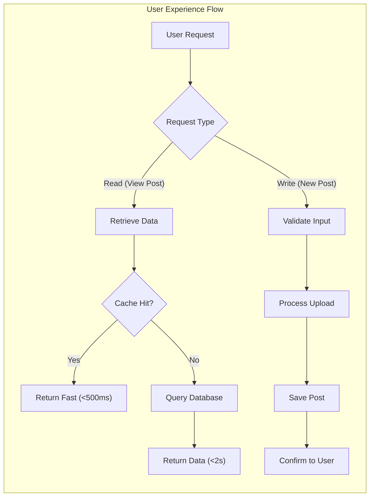
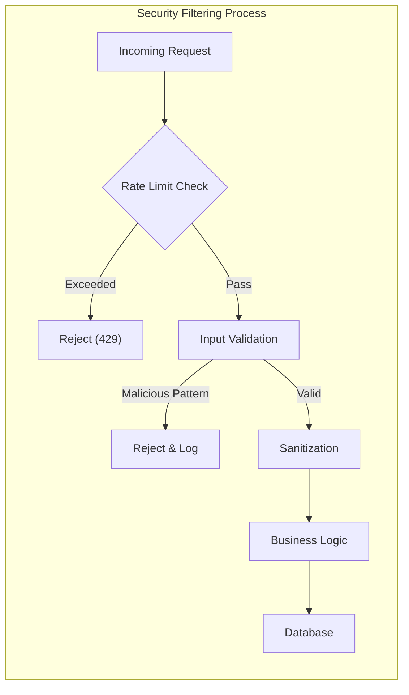

# Performance Standards and Security Protocols

## 1. Introduction
 This document defines the non-functional requirements regarding system performance and security for the **ecoPoliDiscuss** platform. While the system aims for simplicity, ensuring a responsive user experience and maintaining the integrity of user data and discussions is paramount. This document serves as a guideline for backend developers to ensure the application is robust, fast, and secure against common threats standard for a public discussion board.

## 2. Performance Requirements

### 2.1 Response Time Expectations
The discussion board must feel responsive to keep users engaged in economic and political debates. Delays can lead to frustration and abandonment.

*   **Ubiquitous**: THE system SHALL respond to read operations (viewing lists, reading posts) within 2 seconds under normal load conditions.
*   **Event-driven**: WHEN a user submits a new post or comment, THE system SHALL confirm receipt of the request within 1 second.
*   **State-driven**: WHILE the system is processing large file attachments, THE system SHALL provide visual feedback to the user indicating progress.
*   **Optional**: WHERE the network connection is slow, THE system SHALL attempt to load textual content before loading attached images.

### 2.2 Concurrent User Handling
Given the potential for viral political or economic topics, the system must handle moderate spikes in traffic without crashing.

*   **Ubiquitous**: THE system SHALL support simultaneous read access for at least 100 concurrent users without degradation of performance.
*   **Ubiquitous**: THE system SHALL queue write operations (posting/commenting) if the database load exceeds safety thresholds, ensuring data consistency over immediate execution.

### 2.3 File Upload Performance
Since the platform supports image and file attachments, upload performance is critical.

*   **Ubiquitous**: THE system SHALL support file uploads up to 10MB per file.
*   **Event-driven**: WHEN a file upload completes, THE system SHALL immediately associate the file with the draft or post.
*   **Unwanted Behavior**: IF a file upload takes longer than 60 seconds, THEN THE system SHALL timeout the request and notify the user to try again or reduce file size.

## 3. Security Requirements

### 3.1 Authentication and Authorization Security
Building upon the detailed flows in the [Authentication Flow Documentation](./03-authentication-flow.md), specific security measures must be enforced.

*   **Ubiquitous**: THE system SHALL hash all user passwords using industry-standard strong algorithms (e.g., bcrypt or Argon2) before storage.
*   **Ubiquitous**: THE system SHALL enforce HTTPS for all connections to protect data in transit.
*   **Event-driven**: WHEN a user logs in, THE system SHALL issue a secure, time-limited access token (JWT).
*   **State-driven**: WHILE a user has a valid session, THE system SHALL validate their permissions against the specific actions defined in the [User Actors Documentation](./02-user-actors.md).
*   **Unwanted Behavior**: IF a user attempts to access administrative functions without the 'boardAdmin' role, THEN THE system SHALL deny access and log the security event.

### 3.2 Input Validation and Sanitization
As a discussion board discussing potentially sensitive or heated topics (Economics/Politics), the platform is a target for injection attacks and XSS (Cross-Site Scripting).

*   **Ubiquitous**: THE system SHALL sanitize all user-generated text input (titles, posts, comments) to prevent XSS attacks.
*   **Ubiquitous**: THE system SHALL validate all API input against strict schemas to prevent SQL injection or command injection.
*   **Event-driven**: WHEN a user submits content containing HTML tags, THE system SHALL escape or strip unauthorized tags before storage.

### 3.3 Rate Limiting and Spam Protection
To prevent automated bots or malicious users from flooding the board with content.

*   **State-driven**: WHILE a user is posting comments, THE system SHALL limit the frequency to a maximum of 1 comment every 10 seconds.
*   **Event-driven**: WHEN a single IP address exceeds 100 requests per minute, THE system SHALL temporarily block requests from that IP address (HTTP 429).
*   **Ubiquitous**: THE system SHALL require authentication for all write operations (posting, commenting, liking) to deter anonymous spam.

## 4. File Attachment Security

The requirement to support attachments introduces specific security risks that must be mitigated. This complements the functional details in the [Attachment System Documentation](./06-attachment-system.md).

### 4.1 File Type Restrictions
*   **Ubiquitous**: THE system SHALL allow only specific safe file extensions for images (jpg, png, gif) and documents (pdf, txt).
*   **Event-driven**: WHEN a file is uploaded, THE system SHALL verify the file's MIME type matches its extension.
*   **Unwanted Behavior**: IF a user attempts to upload an executable file (.exe, .sh, .bat), THEN THE system SHALL reject the upload immediately and display a security warning.

### 4.2 Storage Security
*   **Ubiquitous**: THE system SHALL store uploaded files with generated unique names (UUIDs) rather than original filenames to prevent path traversal attacks.
*   **Ubiquitous**: THE system SHALL store files in a location that does not execute scripts (e.g., a dedicated storage bucket or non-executable directory).

### 4.3 Content Scanning
*   **Optional**: WHERE server resources allow, THE system SHALL scan uploaded files for basic malware signatures before making them public.

## 5. Data Protection and Privacy

### 5.1 User Data Privacy
*   **Ubiquitous**: THE system SHALL collect only the minimum necessary user data (Username, Email, Password hash).
*   **Ubiquitous**: THE system SHALL NOT expose user email addresses publically on the discussion board.
*   **Event-driven**: WHEN a `generalUser` requests account deletion, THE system SHALL soft-delete or anonymize their personal data as per business policy.

### 5.2 Logging and Auditing
*   **Ubiquitous**: THE system SHALL log all critical security events (failed logins, permission denials, administrative actions).
*   **Ubiquitous**: THE system SHALL NOT log sensitive information such as passwords or authentication tokens in plain text.

## 6. Availability and Reliability

### 6.1 System Stability
*   **Ubiquitous**: THE system SHALL be designed to recover automatically from temporary database connection failures.
*   **Event-driven**: WHEN the system encounters a critical server error (500), THE system SHALL display a generic "Service Unavailable" message to the user while logging detailed stack traces internally. For user-facing error details, refer to the [Error Management System](./11-error-management.md).

### 6.2 Backup Strategy
*   **Ubiquitous**: THE system SHALL support daily backups of the database containing user accounts and discussion threads.
*   **Ubiquitous**: THE system SHALL ensure uploaded files are persistent and backed up separately from the database.

## 7. Conclusion
This document outlines the baseline performance and security requirements for **ecoPoliDiscuss**. By adhering to these standards, the development team ensures a fast, secure, and trustworthy environment for users to discuss economic and political topics. These non-functional requirements lay the foundation for the features described in the [Service Overview](./01-service-overview.md) and [Discussion Core Features](./04-discussion-core-features.md) documents.