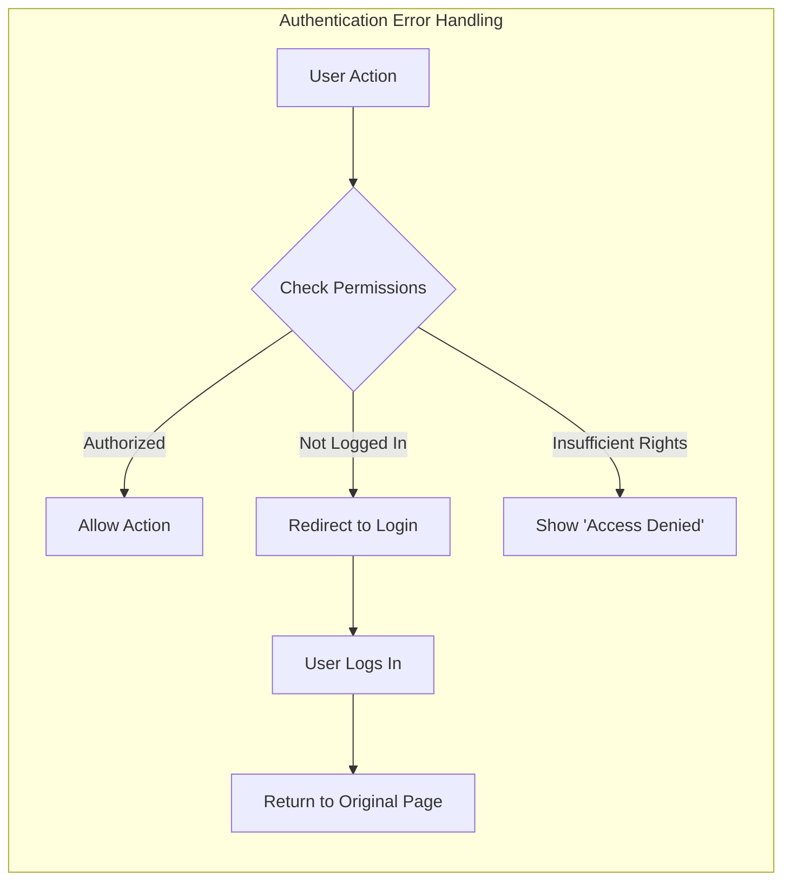
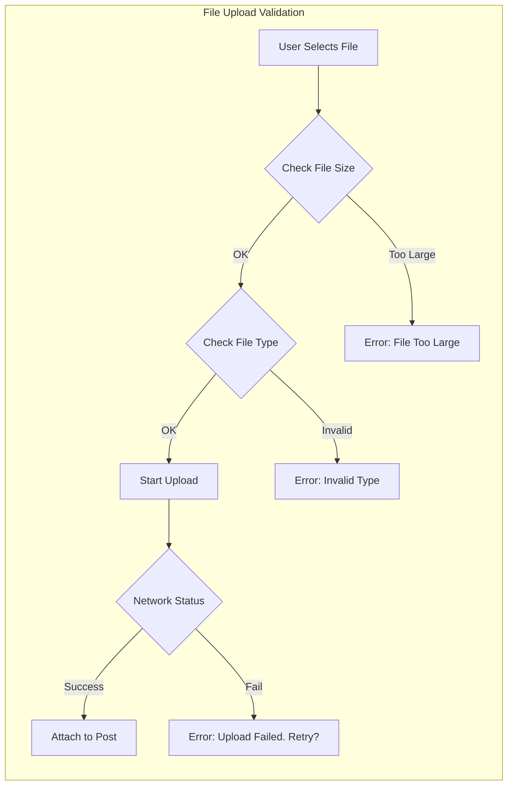

# Error Management & User Feedback Requirements

## 1. Introduction
This document outlines the requirements for handling errors and providing feedback to users within the **ecoPoliDiscuss** platform. The primary goal is to ensure that when things go wrong, users (Visitors, General Users, and Admins) receive clear, understandable, and actionable information, rather than cryptic technical codes.

Given the platform's focus on simplicity, error handling will prioritize straightforward communication and easy recovery.

## 2. General Principles
- **User-Centric Language**: Error messages must be written in plain language, avoiding technical jargon (e.g., "Database connection failed" -> "Service is temporarily unavailable").
- **Actionable Feedback**: Whenever possible, the error message should suggest how to fix the problem (e.g., "File too large" -> "Please upload a file smaller than 10MB").
- **Non-Intrusive**: Critical errors should block action, but minor warnings should not disrupt the user workflow unnecessarily.

## 3. Error Categories & Handling

### 3.1 Authentication & Authorization Errors
These errors occur during login, registration, or when accessing restricted areas.

#### Business Requirements (EARS)
- **IF** a user attempts to log in with an unregistered email, **THEN** the **system** **SHALL** display "Invalid email or password" (generic message for security).
- **IF** a user enters an incorrect password, **THEN** the **system** **SHALL** display "Invalid email or password."
- **IF** a **Visitor** attempts to access a URL valid only for **General Users** or **Admins**, **THEN** the **system** **SHALL** redirect them to the login page with a "Login required" notification.
- **IF** a **General User** attempts to perform an **Admin** action (e.g., delete another user's post), **THEN** the **system** **SHALL** deny the request and display "You do not have permission to perform this action."
- **WHEN** a user session expires while active, **THE system** **SHALL** prompt the user to log in again without losing their current input context if possible.

#### Error Flow Diagram

### 3.2 Content Creation & Posting Errors
These errors typically occur when submitting articles or comments.

#### Business Requirements (EARS)
- **IF** a **General User** submits a post without a title, **THEN** the **system** **SHALL** prevent submission and highlight the Title field with "Title is required."
- **IF** a **General User** submits a post with empty content, **THEN** the **system** **SHALL** prevent submission and display "Content cannot be empty."
- **IF** the submitted content exceeds the maximum character limit (e.g., 5000 characters), **THEN** the **system** **SHALL** display "Content exceeds the 5,000 character limit."

### 3.3 Attachment & File Upload Errors
Since file attachments are a core feature, specific handling for upload failures is critical.

#### Business Requirements (EARS)
- **IF** a user uploads a file larger than the defined limit (e.g., 10MB), **THEN** the **system** **SHALL** reject the file and display "File size exceeds the 10MB limit."
- **IF** a user uploads an unsupported file type (e.g., .exe, .bat), **THEN** the **system** **SHALL** reject the file and display "File type not supported. Allowed formats: JPG, PNG, PDF."
- **WHEN** a file upload fails due to network interruption, **THE system** **SHALL** allow the user to retry the upload without re-entering the entire post content.
- **IF** a user attempts to upload more than the maximum allowed files per post (e.g., 5 files), **THEN** the **system** **SHALL** prevent the selection and display "Maximum 5 files allowed per post."

#### Upload Validation Process

### 3.4 Search & Navigation Errors
Errors related to finding content that doesn't exist or system search limits.

#### Business Requirements (EARS)
- **IF** a user accesses a URL for a deleted or non-existent post (404), **THEN** the **system** **SHALL** display a friendly "Discussion not found" page with a link back to the list.
- **IF** a user submits a search query with no results, **THEN** the **system** **SHALL** display "No results found for [query]. Try different keywords."
- **IF** a user submits an empty search query, **THEN** the **system** **SHALL** prompt "Please enter search terms."

### 3.5 System & Critical Errors
Handling unexpected server-side or connectivity issues.

#### Business Requirements (EARS)
- **WHEN** the backend service is unreachable (500/502 errors), **THE system** **SHALL** display "Service is momentarily unavailable. Please try again later."
- **IF** a critical database error occurs during data saving (e.g., posting), **THEN** the **system** **SHALL** display "Failed to save your post. Please try again."
- **WHERE** the system is in maintenance mode, **THE system** **SHALL** display a "Scheduled Maintenance" banner to all visitors.

## 4. Error Message Dictionary (User-Facing)

The following table defines the standard phrasing for common error scenarios to ensure consistency.

| Error Code | Scenario | User Message |
|------------|----------|--------------|
| `AUTH_001` | Login failed | "Invalid email address or password." |
| `AUTH_002` | Access restricted page | "Please log in to access this page." |
| `AUTH_003` | Permission denied (Role) | "You do not have permission to perform this action." |
| `POST_001` | Missing required field | "This field is required." |
| `POST_002` | Content too long | "Content exceeds the character limit." |
| `FILE_001` | File too large | "File is too large. Maximum size is 10MB." |
| `FILE_002` | Invalid file format | "Format not supported. Please use JPG, PNG, or PDF." |
| `FILE_003` | Upload drop/fail | "Upload failed. Please check your connection and try again." |
| `SYS_001` | 404 Not Found | "The content you are looking for does not exist or has been removed." |
| `SYS_002` | 500 Server Error | "Something went wrong on our end. Please try again later." |

## 5. Recovery & UI Guidelines

### 5.1 Visual Feedback
- **Form Errors**: Highlight the specific field (e.g., red border) and place the error text immediately below the field.
- **Global Errors**: Use 'Toast' notifications or top-banner alerts for system-wide issues (e.g., "Upload Failed").
- **Safety Net**: Never clear a user's long text input if a submission fails. The text must be preserved so the user can copy it or try submitting again.

### 5.2 User Guidance
- Error messages should always be polite and blaming the system or neutral circumstances, not the user.
- Provide "Back" buttons or "Retry" links where appropriate.

> *Developer Note: This document defines **business requirements only**. All technical implementations (architecture, APIs, database design, error code structure, etc.) are at the discretion of the development team.*