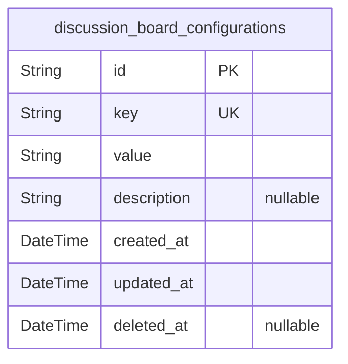
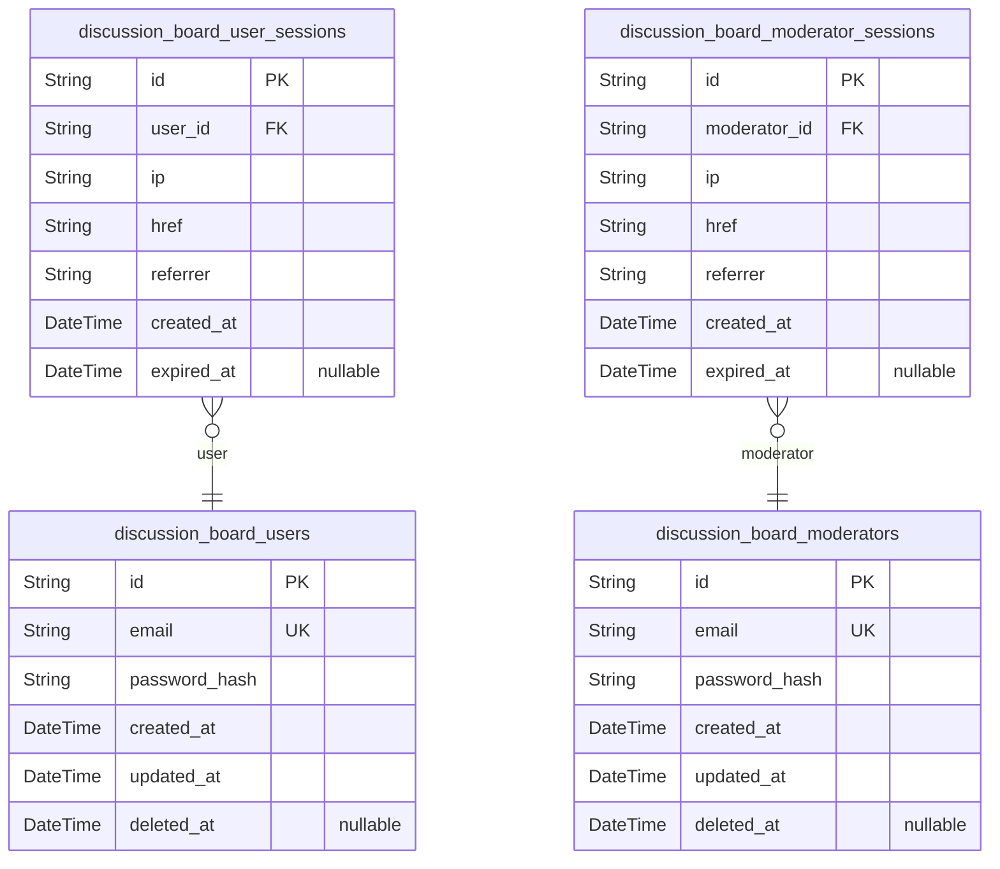
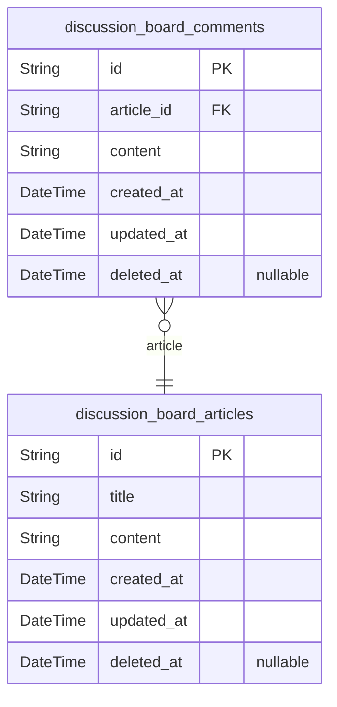
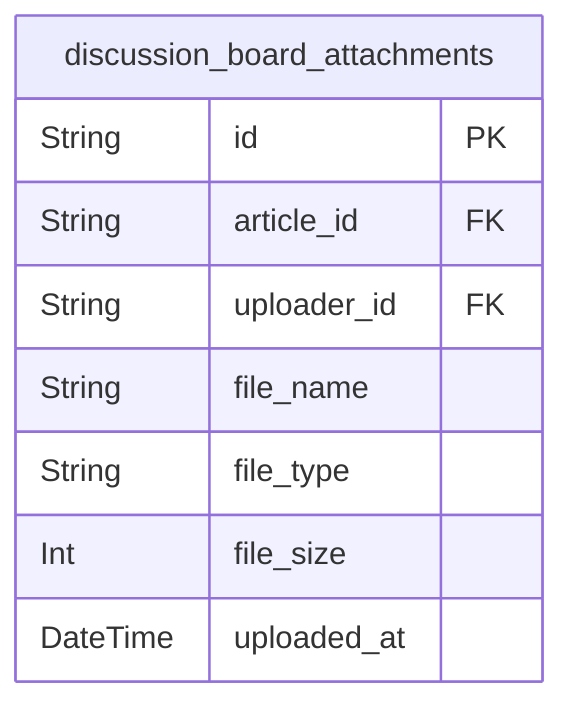
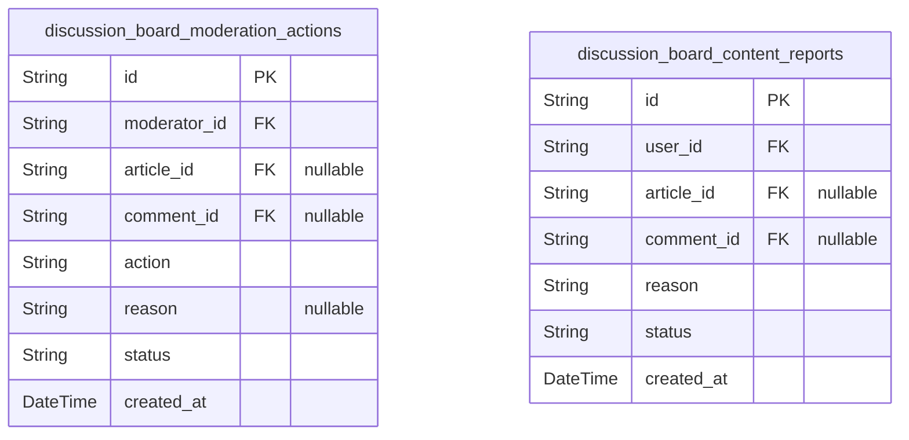

# Prisma Markdown

> Generated by [`prisma-markdown`](https://github.com/samchon/prisma-markdown)

- [Systematic](#systematic)
- [Actors](#actors)
- [Articles](#articles)
- [Attachments](#attachments)
- [Moderation](#moderation)

## Systematic

### `discussion_board_configurations`

Configuration table for storing system-wide settings as key-value pairs
with additional metadata.

Properties as follows:

- `id`: Primary Key.
- `key`: Configuration key representing the setting name.
- `value`: Configuration value associated with the key.
- `description`: Detailed description of the configuration setting and its purpose.
- `created_at`: Timestamp when the configuration was created.
- `updated_at`: Timestamp when the configuration was last updated.
- `deleted_at`: Timestamp when the configuration was soft-deleted.

## Actors

### `discussion_board_users`

This model represents the users of the discussion board. It contains
essential information such as email, password hash, and timestamps for
creation and updates. The model is correctly defined with appropriate
fields and constraints.

Properties as follows:

- `id`: Primary Key.
- `email`: User's email address for authentication and communication.
- `password_hash`: Hashed password for secure authentication.
- `created_at`: Timestamp when the user account was created.
- `updated_at`: Timestamp when the user account was last updated.
- `deleted_at`: Timestamp when the user account was soft-deleted.

### `discussion_board_user_sessions`

This model manages user sessions for authentication.

Properties as follows:

- `id`: Primary Key.
- `user_id`: Foreign key referencing discussion_board_users.id.
- `ip`: IP address of the user during session creation.
- `href`: URL of the user's current session.
- `referrer`: Referrer URL for the user's session.
- `created_at`: Timestamp when the session was created.
- `expired_at`: Timestamp when the session expires.

### `discussion_board_moderators`

This model represents the moderators of the discussion board. It contains
essential information such as email, password hash, and timestamps for
creation and updates. The model is correctly defined with appropriate
fields and constraints.

Properties as follows:

- `id`: Primary Key.
- `email`: Moderator's email address for authentication and communication.
- `password_hash`: Hashed password for secure authentication.
- `created_at`: Timestamp when the moderator account was created.
- `updated_at`: Timestamp when the moderator account was last updated.
- `deleted_at`: Timestamp when the moderator account was soft-deleted.

### `discussion_board_moderator_sessions`

This model manages moderator sessions for authentication.

Properties as follows:

- `id`: Primary Key.
- `moderator_id`: Foreign key referencing discussion_board_moderators.id.
- `ip`: IP address of the moderator during session creation.
- `href`: URL of the moderator's current session.
- `referrer`: Referrer URL for the moderator's session.
- `created_at`: Timestamp when the session was created.
- `expired_at`: Timestamp when the session expires.

## Articles

### `discussion_board_articles`

Main entity for article management in the discussion board.

Users can create, edit, and delete their own articles. The system tracks
creation and modification timestamps, and supports soft deletion to
maintain audit trails. Each article can have multiple comments.

Properties as follows:

- `id`: Primary Key.
- `title`: Title of the article created by the user.
- `content`: Main content of the article.
- `created_at`: Timestamp when the article was created.
- `updated_at`: Timestamp when the article was last updated.
- `deleted_at`: Timestamp when the article was soft deleted, if applicable.

### `discussion_board_comments`

Entity for managing comments on articles.

Users can comment on articles, and these comments are tracked with
creation and modification timestamps. The system supports soft deletion
of comments to maintain audit trails.

Properties as follows:

- `id`: Primary Key.
- `article_id`: Foreign key referencing the article this comment belongs to.
- `content`: Content of the comment.
- `created_at`: Timestamp when the comment was created.
- `updated_at`: Timestamp when the comment was last updated.
- `deleted_at`: Timestamp when the comment was soft deleted, if applicable.

## Attachments

### `discussion_board_attachments`

Attachment metadata for articles in the discussion board.

Stores information about files uploaded by users when creating or editing
articles.
Each record represents a single attachment associated with an article.

Key characteristics:
- Associated with a specific article via article_id foreign key
- Contains metadata about the uploaded file (name, type, size)
- Tracks uploader information for accountability
- Records upload timestamp
- Supports cascade delete when parent article is removed

Business rules:
1. Attachments are always linked to existing articles
2. File validation occurs before database entry creation
3. Multiple attachments allowed per article

Properties as follows:

- `id`: Primary Key.
- `article_id`: Article this attachment belongs to. [discussion_board_articles.id](#discussion_board_articles).
- `uploader_id`: User who uploaded this attachment. [discussion_board_users.id](#discussion_board_users).
- `file_name`: Original name of the uploaded file.
- `file_type`: MIME type of the uploaded file.
- `file_size`: Size of the file in bytes.
- `uploaded_at`: Timestamp when the file was uploaded.

## Moderation

### `discussion_board_moderation_actions`

Stores moderation actions taken by moderators on the discussion board
content.

Properties as follows:

- `id`: Unique identifier for the moderation action.
- `moderator_id`: The moderator who took the moderation action.
- `article_id`: The article on which the moderation action was taken, if applicable.
- `comment_id`: The comment on which the moderation action was taken, if applicable.
- `action`: The type of moderation action taken (e.g., approve, reject, edit).
- `reason`: The reason for the moderation action.
- `status`: The status of the moderation action (e.g., pending, resolved).
- `created_at`: Timestamp when the moderation action was taken.

### `discussion_board_content_reports`

Stores reports made by users on content that violates the discussion
board policies.

Properties as follows:

- `id`: Unique identifier for the content report.
- `user_id`: The user who made the report.
- `article_id`: The article being reported, if applicable.
- `comment_id`: The comment being reported, if applicable.
- `reason`: The reason for reporting the content.
- `status`: The status of the content report (e.g., pending, resolved).
- `created_at`: Timestamp when the report was made.
