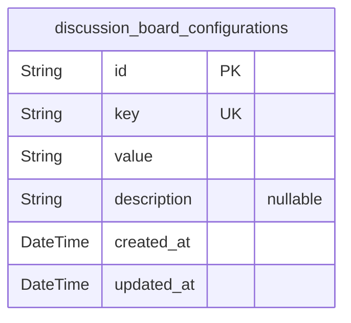
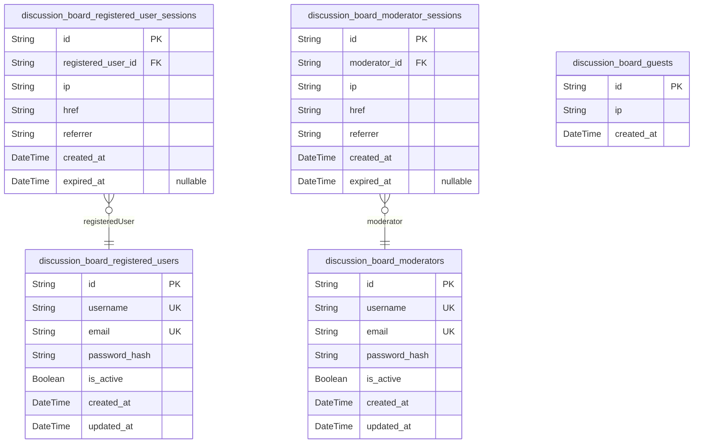
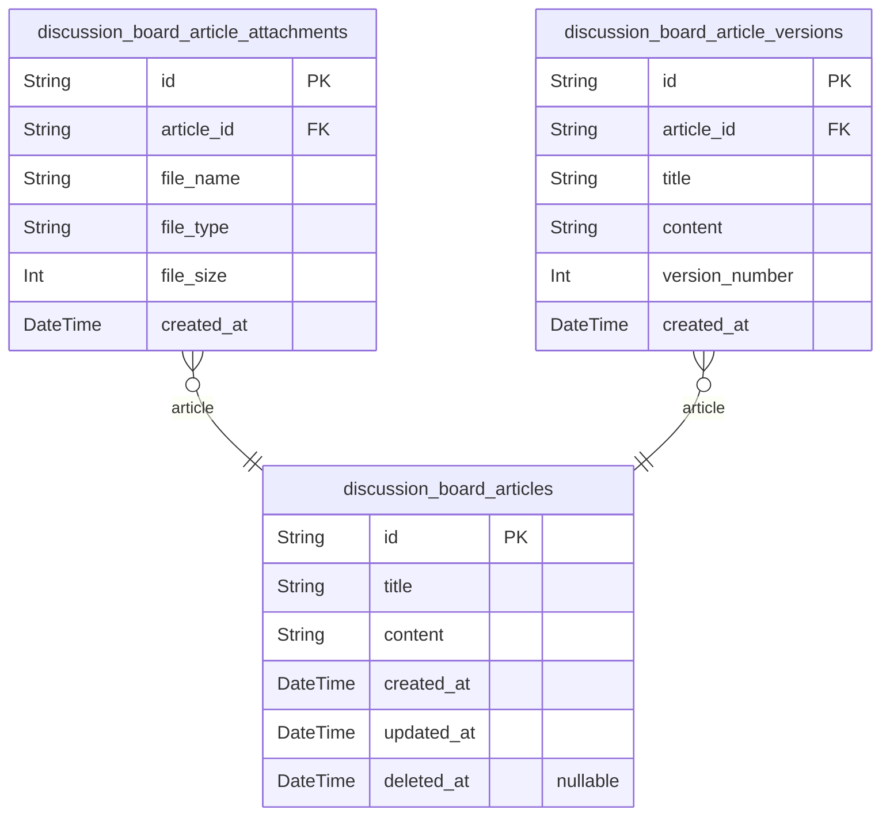
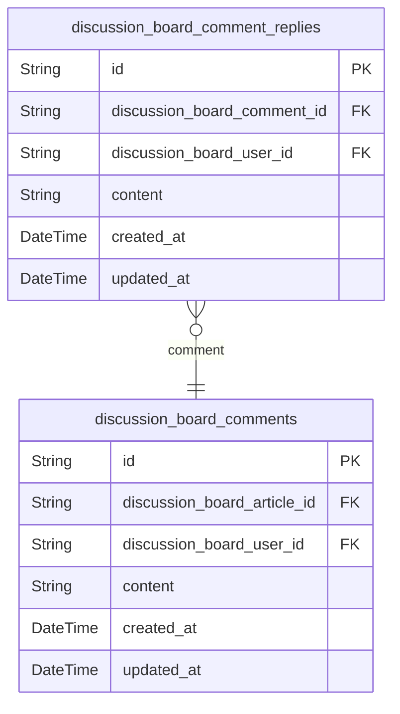
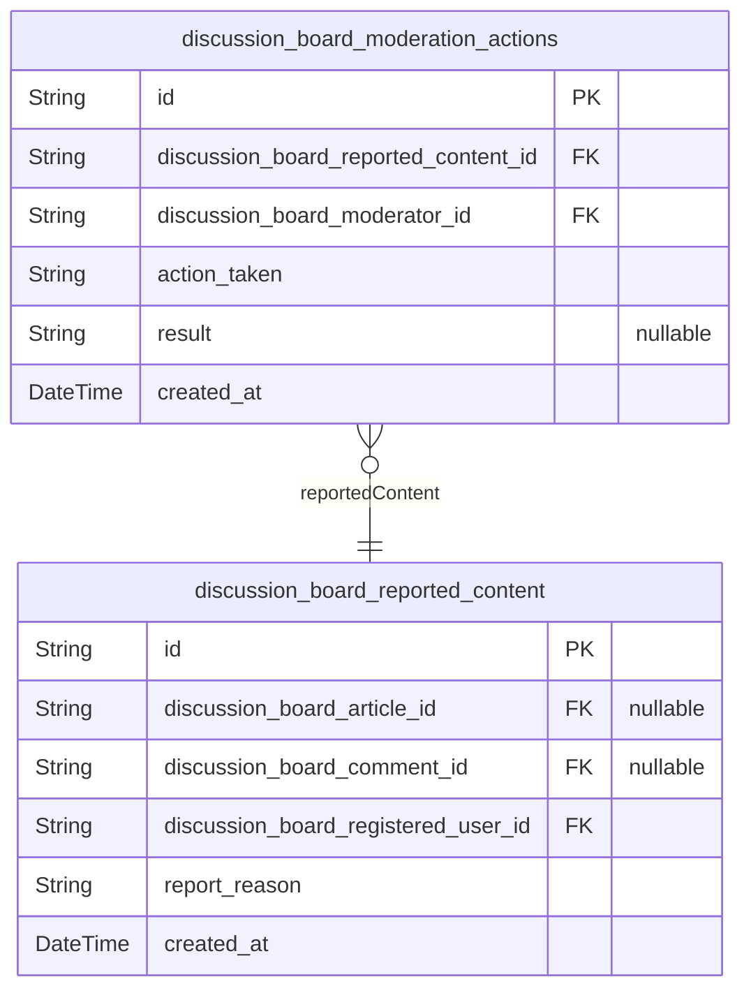

# Prisma Markdown

> Generated by [`prisma-markdown`](https://github.com/samchon/prisma-markdown)

- [Systematic](#systematic)
- [Actors](#actors)
- [Articles](#articles)
- [Comments](#comments)
- [Moderation](#moderation)

## Systematic

### `discussion_board_configurations`

Configuration settings for the discussion board system.

Properties as follows:

- `id`: Primary Key.
- `key`: Configuration key.
- `value`: Configuration value.
- `description`: Description of the configuration.
- `created_at`: Timestamp when the configuration was created.
- `updated_at`: Timestamp when the configuration was last updated.

## Actors

### `discussion_board_registered_users`

Table storing information about registered users on the discussion board.

Properties as follows:

- `id`: Primary key for the registered users table.
- `username`: Username chosen by the user during registration.
- `email`: Email address of the registered user.
- `password_hash`: Hashed password for the user's account.
- `is_active`: Indicates whether the user's account is active.
- `created_at`: Timestamp when the user account was created.
- `updated_at`: Timestamp when the user account was last updated.

### `discussion_board_registered_user_sessions`

Table storing session information for registered users.

Properties as follows:

- `id`: Primary key for the registered user sessions table.
- `registered_user_id`: Foreign key referencing the registered users table.
- `ip`: IP address of the user during session creation.
- `href`: URL from which the session was created.
- `referrer`: Referrer URL for the session.
- `created_at`: Timestamp when the session was created.
- `expired_at`: Timestamp when the session expires.

### `discussion_board_moderators`

Table storing information about moderators on the discussion board.

Properties as follows:

- `id`: Primary key for the moderators table.
- `username`: Username chosen by the moderator during registration.
- `email`: Email address of the moderator.
- `password_hash`: Hashed password for the moderator's account.
- `is_active`: Indicates whether the moderator's account is active.
- `created_at`: Timestamp when the moderator account was created.
- `updated_at`: Timestamp when the moderator account was last updated.

### `discussion_board_moderator_sessions`

Table storing session information for moderators.

Properties as follows:

- `id`: Primary key for the moderator sessions table.
- `moderator_id`: Foreign key referencing the moderators table.
- `ip`: IP address of the moderator during session creation.
- `href`: URL from which the session was created.
- `referrer`: Referrer URL for the session.
- `created_at`: Timestamp when the session was created.
- `expired_at`: Timestamp when the session expires.

### `discussion_board_guests`

Table storing information about guest users on the discussion board.

Properties as follows:

- `id`: Primary key for the guests table.
- `ip`: IP address of the guest user.
- `created_at`: Timestamp when the guest user was recorded.

## Articles

### `discussion_board_articles`

Main table for storing article information. Contains core details about
each article posted by users.

Properties as follows:

- `id`: Primary Key.
- `title`: Title of the article.
- `content`: Main content of the article in Markdown format.
- `created_at`: Timestamp when the article was created.
- `updated_at`: Timestamp when the article was last updated.
- `deleted_at`: Timestamp when the article was soft-deleted.

### `discussion_board_article_attachments`

Stores file attachments associated with articles. Each record represents
a file attached to an article.

Properties as follows:

- `id`: Primary Key.
- `article_id`: Foreign key referencing discussion_board_articles.id.
- `file_name`: Name of the attached file.
- `file_type`: MIME type of the attached file.
- `file_size`: Size of the attached file in bytes.
- `created_at`: Timestamp when the attachment was created.

### `discussion_board_article_versions`

Maintains version history of article changes. Each record represents a
snapshot of the article at a particular point in time.

Properties as follows:

- `id`: Primary Key.
- `article_id`: Foreign key referencing discussion_board_articles.id.
- `title`: Title of the article at this version.
- `content`: Content of the article at this version.
- `version_number`: Version number of this snapshot.
- `created_at`: Timestamp when this version was created.

## Comments

### `discussion_board_comments`

Main comment entity representing user comments on articles. Contains
essential information about the comment including content, creation
timestamp, and user reference.

Properties as follows:

- `id`: Primary key for the comment.
- `discussion_board_article_id`: Reference to the article this comment belongs to.
- `discussion_board_user_id`: Reference to the user who made the comment.
- `content`: Text content of the comment.
- `created_at`: Timestamp when the comment was created.
- `updated_at`: Timestamp when the comment was last updated.

### `discussion_board_comment_replies`

Reply entity representing responses to comments. Contains content and
reference to the parent comment.

Properties as follows:

- `id`: Primary key for the comment reply.
- `discussion_board_comment_id`: Reference to the parent comment this reply belongs to.
- `discussion_board_user_id`: Reference to the user who made the reply.
- `content`: Text content of the reply.
- `created_at`: Timestamp when the reply was created.
- `updated_at`: Timestamp when the reply was last updated.

## Moderation

### `discussion_board_reported_content`

Table storing reported content from the discussion board. Includes
information about the reported content, the user who reported it, and the
reason for reporting.

Properties as follows:

- `id`: Primary key for the reported content table.
- `discussion_board_article_id`
  > Foreign key referencing the article that was reported. {@link
  > discussion_board_articles.id}.
- `discussion_board_comment_id`
  > Foreign key referencing the comment that was reported. {@link
  > discussion_board_comments.id}.
- `discussion_board_registered_user_id`
  > Foreign key referencing the user who reported the content. {@link
  > discussion_board_registered_users.id}.
- `report_reason`: Reason why the content was reported.
- `created_at`: Timestamp when the report was made.

### `discussion_board_moderation_actions`

Table storing moderation actions taken on reported content. Includes
details about the action taken, the moderator who took it, and the
result.

Properties as follows:

- `id`: Primary key for the moderation actions table.
- `discussion_board_reported_content_id`
  > Foreign key referencing the reported content that this action is for.
  > [discussion_board_reported_content.id](#discussion_board_reported_content).
- `discussion_board_moderator_id`
  > Foreign key referencing the moderator who took the action. {@link
  > discussion_board_moderators.id}.
- `action_taken`: The moderation action taken (e.g., approved, rejected, edited).
- `result`: Result or additional information about the moderation action.
- `created_at`: Timestamp when the moderation action was taken.
