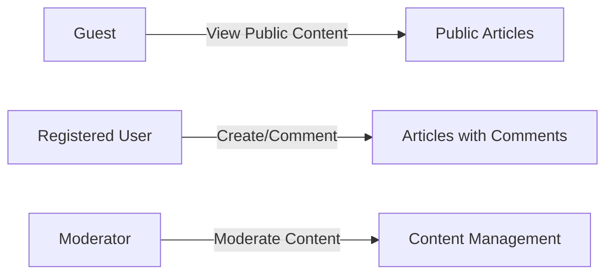

# Discussion Board Requirements Analysis Report

## 1. Service Overview
The discussion board service is designed to provide a platform for users to engage in economic and political discussions. The primary goal is to create a user-friendly and feature-rich environment that fosters meaningful interactions among its users.

## 2. User Actors and Authentication Requirements
The system will have three primary user actors: Guest, RegisteredUser, and Moderator. Guests can view public content, RegisteredUsers can create articles, comment, and upload attachments, while Moderators have elevated permissions to moderate content and manage user accounts.

## 3. Functional Requirements
### 3.1. Article Creation and Management
THE system SHALL allow registered users to create new articles.
WHEN a registered user submits a new article, THE system SHALL validate the input (title, content, attachments).
IF the input is valid, THEN THE system SHALL create the article and notify the user of success.

### 3.2. Comment System
THE system SHALL allow registered users to comment on articles.
WHEN a registered user submits a comment, THE system SHALL validate the input.
IF the input is valid, THEN THE system SHALL create the comment and display it with the article.

## 4. Attachment Management
THE system SHALL allow registered users to upload attachments when creating or editing articles.
THE system SHALL validate file types and sizes before upload.
Supported file types SHALL include common image formats (jpg, png, gif) and document formats (pdf, docx, txt).

## 5. Authentication and Authorization
THE system SHALL support email and password-based authentication.
WHEN a user logs in, THE system SHALL validate their credentials against the stored information.
IF valid, THEN THE system SHALL generate a JWT token.

## 6. Moderation
THE system SHALL allow moderators to review and manage all content (articles and comments).
WHEN a moderator reviews content, THE system SHALL provide options to approve, edit, or delete the content.

## 7. Performance and Scaling
THE system SHALL be designed to scale horizontally by adding more instances as needed.
THE system SHALL implement auto-scaling to add instances when CPU utilization exceeds 60% for 5 minutes.

## 8. Security Considerations
THE system SHALL protect against common web application vulnerabilities (e.g., SQL injection, XSS, CSRF).
THE system SHALL use HTTPS for all communications.

## 9. Testing Strategy
THE system SHALL implement comprehensive testing including unit tests, integration tests, and end-to-end tests.

## 10. Deployment and Maintenance
THE system SHALL be deployed on a cloud-based infrastructure with automated deployment pipelines.
THE system SHALL implement regular security patch application and system log monitoring.

This report provides a comprehensive overview of the discussion board requirements, covering user actors, functional requirements, attachment management, authentication and authorization, moderation, performance and scaling, security considerations, testing strategy, and deployment and maintenance.