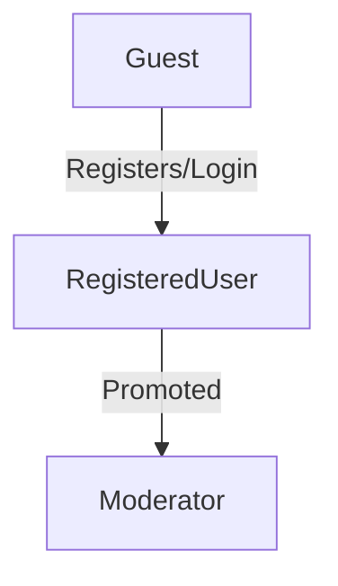
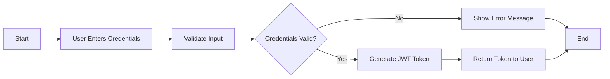

# User Actors and Authentication Requirements

## Introduction
This document defines the user actors that will interact with the discussion board system and outlines the authentication requirements for the application. Understanding these actors and their roles is crucial for implementing proper authentication and authorization mechanisms.

## User Actor Definitions
The discussion board system will have three primary user actors:

1. **Guest**: Unauthenticated users who can view public content but cannot interact with the system.
2. **RegisteredUser**: Authenticated users who can create articles, comment, and upload attachments.
3. **Moderator**: Users with elevated permissions to moderate content, manage user accounts, and perform administrative tasks.

### Actor Hierarchy

## Authentication Requirements
The system will implement the following authentication mechanisms:

1. **Registration**: Users can create an account by providing a valid email address and password.
2. **Login**: Registered users can log in using their email address and password.
3. **Logout**: Users can log out to end their session.
4. **Session Management**: The system will maintain user sessions securely.

### Authentication Flow

## Authorization Rules
The system will enforce the following authorization rules:

1. Guests can view public articles and comments.
2. RegisteredUsers can create articles, comment on articles, and upload attachments.
3. Moderators can moderate content, manage user accounts, and perform administrative tasks.
4. Users can only edit or delete their own content.
5. Moderators can delete any content.

### Permission Matrix

| Action | Guest | RegisteredUser | Moderator |
|--------|-------|----------------|-----------|
| View Public Content | ✅ | ✅ | ✅ |
| Create Article | ❌ | ✅ | ✅ |
| Comment on Article | ❌ | ✅ | ✅ |
| Upload Attachments | ❌ | ✅ | ✅ |
| Moderate Content | ❌ | ❌ | ✅ |
| Manage User Accounts | ❌ | ❌ | ✅ |

This document provides a comprehensive overview of the user actors and authentication requirements for the discussion board system. It serves as a foundation for implementing secure authentication and authorization mechanisms.