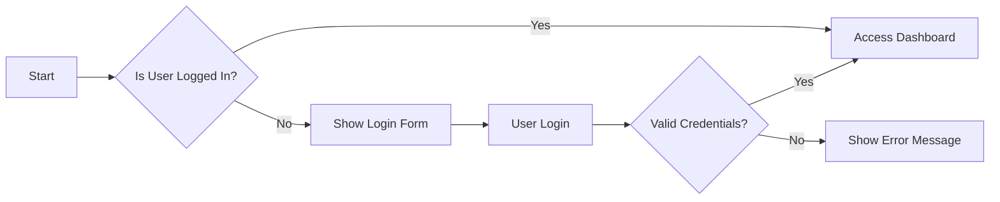

## Overview
The discussion board is designed to provide a platform for users to engage in economic and political discussions. The primary users include Guest Users, Registered Users, Moderators, and Administrators.

## Authentication Mechanisms
### Registration Process
1. WHEN a user registers, THE system SHALL validate the email address and password.
2. THE system SHALL send a verification email to the user's email address.

### Login Process
1. WHEN a user logs in, THE system SHALL validate the credentials.
2. IF valid, THEN THE system SHALL create a secure session.

### Session Management
1. THE system SHALL use JWT for session management.
2. WHILE user is logged in, THE system SHALL maintain session state.

## User Roles and Permissions
### Role Definitions
1. Guest: Unauthenticated users with limited access.
2. Registered User: Authenticated users who can create posts and comments.
3. Moderator: Trusted users with moderation capabilities.
4. Administrator: System administrators with full control.

## Permissions Matrix
| Action | Guest | Registered User | Moderator | Administrator |
| --- | --- | --- | --- | --- |
| View Discussions | ✅ | ✅ | ✅ | ✅ |
| Create Posts | ☑ | ✅ | ✅ | ✅ |
| Manage Posts | ☑ | ☑ | ✅ | ✅ |
| Manage Users | ☑ | ☑ | ☑ | ✅ |

## Authentication Flow Diagram

## Discussion Management
### Creating Discussions
1. WHEN a registered user creates a discussion, THE system SHALL validate the input data.
2. IF valid, THEN THE system SHALL create the discussion.

### Posting Comments
1. WHEN a registered user posts a comment, THE system SHALL validate the input data.
2. IF valid, THEN THE system SHALL post the comment.

## Moderation Capabilities
### Moderator Responsibilities
1. THE moderator SHALL manage user-generated content.
2. THE moderator SHALL ensure compliance with community guidelines.

## Search and Discovery Features
### Search Functionality
1. THE system SHALL provide a search bar on the main navigation bar.
2. WHEN a user enters search terms, THEN THE system SHALL return relevant discussions and comments.

## Notification System
### Notification Types
1. Discussion Updates: Notifications when someone replies to a discussion the user is following.
2. Mention Notifications: Alerts when a user is mentioned in a post or comment.

## User Profile Management
### Profile Information
1. THE system SHALL display user profile information including username, registration date, and profile description.

## Performance Requirements
### Response Times
1. THE system SHALL respond to user requests within 2 seconds.
2. THE system SHALL load user profiles within 2 seconds.

### Concurrent Users
1. THE system SHALL support a minimum of 1,000 concurrent users.

By following these requirements, we can ensure a robust and user-friendly discussion board that meets the needs of its users.