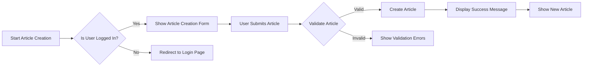

## Article Management Requirements

### Overview
The discussion board system must support robust article management features that enable users to create, edit, and manage content effectively. This document outlines the specific requirements for article management.

### Article Creation Process
1. WHEN a member user wants to create a new article,
2. THE system SHALL provide a simple article creation form with fields for:
   - Article title
   - Article content (supporting Markdown formatting)
   - Image attachments
   - File attachments
3. THE system SHALL validate that the title is not empty and is within a reasonable length (e.g., between 5 and 100 characters).
4. THE system SHALL allow image and file attachments as specified in the attachment management requirements.
5. THE system SHALL display a success message and show the new article upon successful creation.

### Article Editing
1. WHEN a member user wants to edit an article they have created,
2. THE system SHALL allow editing of the article's title, content, and attachments.
3. THE system SHALL preserve the original article's creation timestamp and author information.
4. THE system SHALL record edit history with timestamps and user information.
5. THE system SHALL display a clear indication that the article has been edited.

### Article Deletion
1. WHEN a moderator or the article's author wants to delete an article,
2. THE system SHALL remove the article and all associated attachments.
3. THE system SHALL log the deletion event with user information and timestamps.
4. THE system SHALL notify affected users (e.g., users who commented on the article).

### Additional Requirements
- SEARCHABILITY: Articles SHALL be searchable by title and content.
- VISIBILITY: Articles SHALL be visible to guest users unless restricted by moderation settings.
- PERMALINKS: Each article SHALL have a unique, stable URL for direct access.

### Diagram: Article Creation Flow
