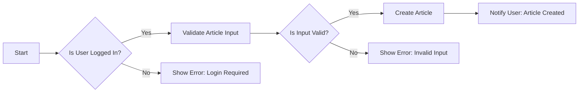

# Functional Requirements for Discussion Board

## 1. Article Creation and Management

### 1.1. Create Article
WHEN a registered user submits a new article, THE system SHALL validate the input (title, content, attachments).
IF the input is valid, THEN THE system SHALL create the article and notify the user of success.
IF the input is invalid, THEN THE system SHALL display an error message.

### 1.2. Edit Article
THE system SHALL allow registered users to edit their own articles.
WHEN a registered user attempts to edit an article, THE system SHALL check if the user is the article's author.
IF the user is the author, THEN THE system SHALL allow editing.
IF not, THEN THE system SHALL deny access and display an error message.

### 1.3. Delete Article
THE system SHALL allow registered users to delete their own articles.
WHEN a registered user attempts to delete an article, THE system SHALL check if the user is the article's author or has moderator permissions.
IF the user has permission, THEN THE system SHALL delete the article and notify the user.
IF not, THEN THE system SHALL deny access and display an error message.

## 2. Comment System

### 2.1. Create Comment
THE system SHALL allow registered users to comment on articles.
WHEN a registered user submits a comment, THE system SHALL validate the input.
IF the input is valid, THEN THE system SHALL create the comment and display it with the article.
IF the input is invalid, THEN THE system SHALL display an error message.

### 2.2. Display Comments
THE system SHALL display comments for an article in chronological order by default.

## 3. Attachment Management

### 3.1. Upload Attachments
THE system SHALL allow registered users to upload attachments when creating or editing articles.
WHEN a user uploads an attachment, THE system SHALL validate the file type and size.
IF the file is valid, THEN THE system SHALL store the attachment and associate it with the article.
IF the file is invalid, THEN THE system SHALL display an error message.

### 3.2. Display Attachments
THE system SHALL display attachments for an article.

## 4. Moderation

### 4.1. Content Moderation
THE system SHALL allow moderators to review and manage all content (articles and comments).
WHEN a moderator reviews content, THE system SHALL provide options to approve, edit, or delete the content.

### 4.2. User Management
THE system SHALL allow moderators to manage user accounts.

## EARS Format Requirements
All requirements in this document are written in EARS format, using the keywords WHEN, THE, SHALL, IF, THEN, WHERE, and WHILE in English, while the rest of the content is in the user's locale language.

## Mermaid Diagram for Article Creation Flow

This document provides detailed functional requirements for the discussion board, covering article creation and management, comment system, and attachment management. The EARS format is used throughout to ensure clarity and testability of the requirements.