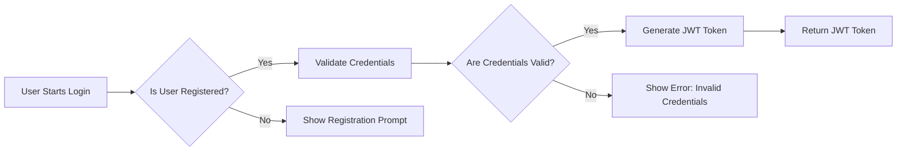

# Authentication and Authorization Requirements for Discussion Board

## Overview
The discussion board system requires a robust authentication and authorization mechanism to ensure secure access to its features and content. This document outlines the key requirements for implementing these security measures.

## Authentication Mechanisms

### Email and Password Authentication
1. THE system SHALL support email and password-based authentication.
2. WHEN a user logs in, THE system SHALL validate their credentials against the stored information.
3. IF the credentials are valid, THEN THE system SHALL generate a JWT token.
4. THE JWT token SHALL contain the user's ID, role, and permissions.
5. THE JWT token SHALL be required for all protected routes.

### JWT Token Requirements
1. THE JWT token SHALL be signed using a secure key.
2. THE JWT token SHALL have a reasonable expiration time (e.g., 15-30 minutes).
3. THE system SHALL support token refresh mechanisms.

## Authorization Rules

### Overview
The system will enforce granular authorization rules based on user roles and permissions.

### Key Requirements
1. WHEN a user attempts to perform an action, THEN THE system SHALL check their permissions.
2. IF the user has the required permission, THEN THE action SHALL be allowed.
3. IF the user lacks the required permission, THEN THE system SHALL return an appropriate error response.
4. THE system SHALL enforce different authorization rules for different user actors (e.g., registered users, moderators).

## User Actor Definitions

### Overview
The system will have three main user actors: guest, registeredUser, and moderator.

### Key Requirements
1. THE guest actor SHALL have read-only access to public content.
2. THE registeredUser actor SHALL be able to create articles, comment, and upload attachments.
3. THE moderator actor SHALL have elevated permissions to moderate content, manage user accounts, and perform administrative tasks.

## Authentication Flows

### Login Flow
1. WHEN a user submits login credentials, THE system SHALL validate them.
2. IF valid, THEN THE system SHALL generate a JWT token and return it to the user.
3. IF invalid, THEN THE system SHALL return an appropriate error response.

### Logout Flow
1. WHEN a user logs out, THE system SHALL invalidate their JWT token.
2. THE system SHALL ensure that the JWT token cannot be used again.

## Authorization Scenarios

### Article Creation
1. WHEN a registeredUser creates an article, THEN THE system SHALL associate it with their user ID.
2. THE system SHALL enforce authorization rules based on the user's permissions.

### Content Moderation
1. WHEN a moderator reviews content, THEN THE system SHALL allow them to approve, reject, or request changes.
2. THE system SHALL enforce authorization rules to ensure only authorized moderators can perform these actions.

## Security Considerations
1. THE system SHALL protect against common web application vulnerabilities (e.g., SQL injection, XSS, CSRF).
2. THE system SHALL use HTTPS for all communications.
3. THE system SHALL implement appropriate rate limiting for login attempts.

## Mermaid Diagram for Authentication Flow

This document provides comprehensive requirements for authentication and authorization in the discussion board system, ensuring secure access to features and content. It includes detailed user actor definitions, authentication mechanisms, authorization rules, and security considerations.