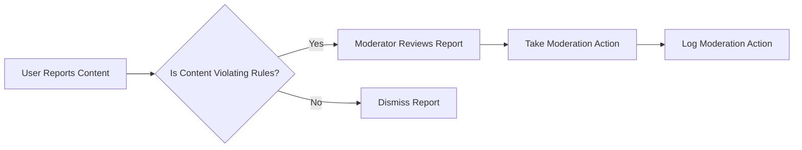

## Moderation Features

### Content Moderation

1. **Article Moderation**
   - Moderators can review and approve/reject articles before they become visible to public
   - Articles containing prohibited content shall be rejected
   - Moderators can edit articles to remove inappropriate content while approving

2. **Comment Moderation**
   - Moderators can review and manage comments on articles
   - Comments containing spam or abusive content shall be removed
   - Moderators can ban users who repeatedly post inappropriate comments

### User Management

1. **User Roles Management**
   - Moderators can assign/remove roles (member, moderator)
   - Moderators can temporarily ban or permanently ban users
   - System shall log all moderation actions for audit purposes

2. **User Reporting System**
   - Users can report articles/comments for moderation review
   - System shall notify moderators of new reports
   - Moderators can review reported content and take appropriate action

### Reporting Features

1. **Content Reports**
   - Users can report content for violating community guidelines
   - Reports shall include reason for reporting and supporting evidence
   - System shall track report status (pending, resolved)

2. **Moderation Logs**
   - System shall maintain logs of all moderation actions
   - Logs shall include action taken, moderator ID, and timestamp
   - Logs shall be accessible to administrators for audit purposes

### Implementation Requirements

1. **Performance Requirements**
   - Moderation actions shall be processed in real-time
   - System shall maintain performance during moderation activities
   - System shall support multiple moderators concurrently

2. **Security Requirements**
   - Moderation features shall be accessible only to authorized moderators
   - System shall log all moderation actions for accountability
   - System shall prevent unauthorized access to moderation features

### EARS Format Requirements

WHEN a user submits a report, THE system SHALL notify moderators immediately.

THE moderation log SHALL include the moderator's ID, action taken, and timestamp.

IF a user is banned, THEN the system SHALL prevent their access to the platform.

WHERE content is reported multiple times, THE system SHALL prioritize it for moderation review.

### Mermaid Diagram
